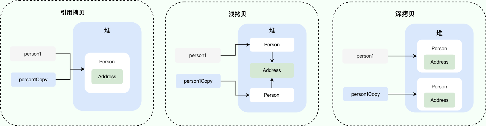
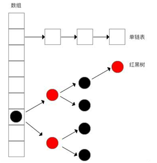

## String

String底层通过char[]实现，String类用final关键字修饰，是不可变的，每次改变String对象的值时，都会创建新的字符串，所以操作String比较耗时。

### 为什么String是final型的

- 安全性。final型不可被继承，String内部很多方法是直接调用的操作系统API，和操作系统交流频繁，如果String可以被继承，重写其方法会对操作系统带来安全威胁。
- 线程安全。在多线程中共享一个不可变对象而不用担心线程安全问题。
- 实现String常量池，效率更高。jdk1.6的String常量池在JVM方法区中，jdk1.7以后放入了JVM堆中。

## hashCode()

hashCode()方法是Native方法，返回一个int值。

>  hotSpot VM提供了6种hashCode()的实现方式，关于其默认实现是哪一种说法不一，有的说是根据内存地址计算得来，有的说是计算得到的随机数，感觉根据内存地址算出来这种说法比较靠谱一点。网上有的文章说hashCode()返回值是对象在内存的地址，这是不准确的，确实有些JVM是直接返回对象的存储地址，但大多数时候不是这样。

- 如果两个对象相同，那么它们的hashCode值一定要相同
- 如果两个对象的hashCode相同，它们并不一定相同，只能说明这两个对象在散列存储结构中，存放于同一个位置
- 如果对象的equals方法被重写，那么对象的hashCode()方法也尽量重写

### hashCode作用

- 比较对象，先比较hashCode，如果不一样说明两个对象肯定不相等，如果hashCode相等再用equals去比较。

- 主要作用是在基于hash的集合类中进行查找，包括HashMap, HashTable, HashSet。

### equals()，==

在Object类中equals()跟 == 是一样的，都是比较对象的内存地址

```java
public boolean equals(Object obj) {
        return (this == obj);
}
```

String类重写了equals()，先用==比较，==结果为false时比较两个字符串的值

可以根据实际需求重写自定义类的equals()，但最好同时重写hashCode()，如果只重写了equals()，可能造成两个对象hashCode不一样但equals()结果为true的情况。

## 深拷贝，浅拷贝



## HashMap

HashMap的实现，在jdk1.8之前是Entry[]+链表的形式，到1.8以后，改为Entry[]+链表+红黑树的形式。



### 1.7与1.8的区别

**计算hash码的方式不一样**

HashMap的put操作都是根据key的hashCode经过扰动运算得到hash码，再用h & (length-1) 计算得到key在数组中的下标。

> *为什么要先通过扰动运算得到hash码？*
>
> 加大hash码低位的随机性，使得分布更均匀，从而提高对应数组存储下标位置的随机性 & 均匀性，最终减少hash冲突

> *为什么要用hash & (length-1)计算数组下标，而不用直接使用取模运算%？*
>
> 等价于hash%length，但直接使用位运算效率更高，也因为这个操作，要求HashMap的table长度（即length）必须是2的n次方，因为2^n-1的二进制数每位都是1，与length-1进行&运算可以减少碰撞概率。

**数据插入方式不一样，1.7采用链表头插法，1.8采用尾插法**

1.7使用头插法，在多线程环境下可能会造成链表出现环路引发死循环，所以在1.8改用尾插法（虽然多线程环境下一般用ConcurrentHashMap），关于造成环路的解释可以看图：


**数据存储方式不一样（1.8红黑树策略，这也是1.7/1.8最大的区别）**

在1.8中，HashMap插入节点后，if (该节点所处链表长度 > 8 && HashMap的size >= 64)，则该节点所处的链表转换为红黑树存储，当链表长度 <= 6时，红黑树又转化为链表存储。当HashMap的size即存储的元素数量小于MIN_TREEIFY_CAPACITY = 64时，HashMap只会进行扩容操作，不会进行红黑树的转换。当size >= threshold时，也会进行扩容操作，threshold = table的长度 * 负载因子0.75。

**扩容后重新计算节点位置的方式不一样**

数组扩容后需要对所有的节点进行遍历，重新计算数组下标位置，在1.7中对每个节点重新计算hash码再确认数组下标，但在1.8中，数组扩容为两倍后，新length-1的二进制数相当于左移1位，根据节点hash码对应新增位的值为0或1，去判断扩容后的新位置。


**扩容**


## ConcurrentHashMap

参考：https://www.javadoop.com/post/hashmap

### 1.7

- 由一个Segment数组组成，数组长度concurrencyLevel默认为16
- 每个Segment内都定义了一个HashEntry的数组
- Segment 通过继承 ReentrantLock 来进行加锁
- 通过链地址法解决hash冲突


#### put操作

- 先定位到Segment数组的位置，再计算该Segment内HashEntry数组的位置
- Segment内部有独占锁，所以抢锁后直接put就可以，抢锁通过AQS进行实现
- ConcurrentHashMap在初始化时只会初始化Segment[0]，其他Segment数组位置都是null，在插入第一个值时才会通过ensureSegment方法进行初始化，ensureSegment方法内部通过CAS进行并发控制

```java
public V put(K key, V value) {
    Segment<K,V> s;
    if (value == null)
        throw new NullPointerException();
    // 1. 计算 key 的 hash 值
    int hash = hash(key);
    // 2. 根据 hash 值找到 Segment 数组中的位置 j
    //    hash 是 32 位，无符号右移 segmentShift(28) 位，剩下高 4 位，
    //    然后和 segmentMask(15) 做一次与操作，也就是说 j 是 hash 值的高 4 位，也就是槽的数组下标
    int j = (hash >>> segmentShift) & segmentMask;
    // 刚刚说了，初始化的时候初始化了 segment[0]，但是其他位置还是 null，
    // ensureSegment(j) 对 segment[j] 进行初始化
    if ((s = (Segment<K,V>)UNSAFE.getObject          // nonvolatile; recheck
         (segments, (j << SSHIFT) + SBASE)) == null) //  in ensureSegment
        s = ensureSegment(j);
    // 3. 插入新值到 槽 s 中
    return s.put(key, hash, value, false);
}
```

```java
final V put(K key, int hash, V value, boolean onlyIfAbsent) {
    // 在往该 segment 写入前，需要先获取该 segment 的独占锁
    //    先看主流程，后面还会具体介绍这部分内容
    HashEntry<K,V> node = tryLock() ? null :
        scanAndLockForPut(key, hash, value);
    V oldValue;
    try {
        // 这个是 segment 内部的数组
        HashEntry<K,V>[] tab = table;
        // 再利用 hash 值，求应该放置的数组下标
        int index = (tab.length - 1) & hash;
        // first 是数组该位置处的链表的表头
        HashEntry<K,V> first = entryAt(tab, index);

        // 下面这串 for 循环虽然很长，不过也很好理解，想想该位置没有任何元素和已经存在一个链表这两种情况
        for (HashEntry<K,V> e = first;;) {
            if (e != null) {
                K k;
                if ((k = e.key) == key ||
                    (e.hash == hash && key.equals(k))) {
                    oldValue = e.value;
                    if (!onlyIfAbsent) {
                        // 覆盖旧值
                        e.value = value;
                        ++modCount;
                    }
                    break;
                }
                // 继续顺着链表走
                e = e.next;
            }
            else {
                // node 到底是不是 null，这个要看获取锁的过程，不过和这里都没有关系。
                // 如果不为 null，那就直接将它设置为链表表头；如果是null，初始化并设置为链表表头。
                if (node != null)
                    node.setNext(first);
                else
                    node = new HashEntry<K,V>(hash, key, value, first);

                int c = count + 1;
                // 如果超过了该 segment 的阈值，这个 segment 需要扩容
                if (c > threshold && tab.length < MAXIMUM_CAPACITY)
                    rehash(node); // 扩容后面也会具体分析
                else
                    // 没有达到阈值，将 node 放到数组 tab 的 index 位置，
                    // 其实就是将新的节点设置成原链表的表头
                    setEntryAt(tab, index, node);
                ++modCount;
                count = c;
                oldValue = null;
                break;
            }
        }
    } finally {
        // 解锁
        unlock();
    }
    return oldValue;
}
```

```java
private Segment<K,V> ensureSegment(int k) {
    final Segment<K,V>[] ss = this.segments;
    long u = (k << SSHIFT) + SBASE; // raw offset
    Segment<K,V> seg;
    if ((seg = (Segment<K,V>)UNSAFE.getObjectVolatile(ss, u)) == null) {
        // 这里看到为什么之前要初始化 segment[0] 了，
        // 使用当前 segment[0] 处的数组长度和负载因子来初始化 segment[k]
        // 为什么要用“当前”，因为 segment[0] 可能早就扩容过了
        Segment<K,V> proto = ss[0];
        int cap = proto.table.length;
        float lf = proto.loadFactor;
        int threshold = (int)(cap * lf);

        // 初始化 segment[k] 内部的数组
        HashEntry<K,V>[] tab = (HashEntry<K,V>[])new HashEntry[cap];
        if ((seg = (Segment<K,V>)UNSAFE.getObjectVolatile(ss, u))
            == null) { // 再次检查一遍该槽是否被其他线程初始化了。

            Segment<K,V> s = new Segment<K,V>(lf, threshold, tab);
            // 使用 while 循环，内部用 CAS，当前线程成功设值或其他线程成功设值后，退出
            while ((seg = (Segment<K,V>)UNSAFE.getObjectVolatile(ss, u))
                   == null) {
                if (UNSAFE.compareAndSwapObject(ss, u, null, seg = s))
                    break;
            }
        }
    }
    return seg;
}
```
#### get操作

- 直接根据hash计算位置获取即可

```java
public V get(Object key) {
    Segment<K,V> s; // manually integrate access methods to reduce overhead
    HashEntry<K,V>[] tab;
    // 1. hash 值
    int h = hash(key);
    long u = (((h >>> segmentShift) & segmentMask) << SSHIFT) + SBASE;
    // 2. 根据 hash 找到对应的 segment
    if ((s = (Segment<K,V>)UNSAFE.getObjectVolatile(segments, u)) != null &&
        (tab = s.table) != null) {
        // 3. 找到segment 内部数组相应位置的链表，遍历
        for (HashEntry<K,V> e = (HashEntry<K,V>) UNSAFE.getObjectVolatile
                 (tab, ((long)(((tab.length - 1) & h)) << TSHIFT) + TBASE);
             e != null; e = e.next) {
            K k;
            if ((k = e.key) == key || (e.hash == h && key.equals(k)))
                return e.value;
        }
    }
    return null;
}
```

#### 扩容

- 扩容是指Segment内部的HashEntry数组进行扩容，每次扩容后容量x2
- 扩容时会创建一个2倍空间的数组，重新计算元素在新数组的位置
- 扩容结束后才会将table指向最新的数组
- 只有put操作会引发扩容操作，所以扩容时会阻塞其他put操作

```java
private void rehash(HashEntry<K,V> node) {
    HashEntry<K,V>[] oldTable = table;
    int oldCapacity = oldTable.length;
    // 2 倍
    int newCapacity = oldCapacity << 1;
    threshold = (int)(newCapacity * loadFactor);
    // 创建新数组
    HashEntry<K,V>[] newTable =
        (HashEntry<K,V>[]) new HashEntry[newCapacity];
    // 新的掩码，如从 16 扩容到 32，那么 sizeMask 为 31，对应二进制 ‘000...00011111’
    int sizeMask = newCapacity - 1;

    // 遍历原数组，老套路，将原数组位置 i 处的链表拆分到 新数组位置 i 和 i+oldCap 两个位置
    for (int i = 0; i < oldCapacity ; i++) {
        // e 是链表的第一个元素
        HashEntry<K,V> e = oldTable[i];
        if (e != null) {
            HashEntry<K,V> next = e.next;
            // 计算应该放置在新数组中的位置，
            // 假设原数组长度为 16，e 在 oldTable[3] 处，那么 idx 只可能是 3 或者是 3 + 16 = 19
            int idx = e.hash & sizeMask;
            if (next == null)   // 该位置处只有一个元素，那比较好办
                newTable[idx] = e;
            else { // Reuse consecutive sequence at same slot
                // e 是链表表头
                HashEntry<K,V> lastRun = e;
                // idx 是当前链表的头结点 e 的新位置
                int lastIdx = idx;

                // 下面这个 for 循环会找到一个 lastRun 节点，这个节点之后的所有元素是将要放到一起的
                for (HashEntry<K,V> last = next;
                     last != null;
                     last = last.next) {
                    int k = last.hash & sizeMask;
                    if (k != lastIdx) {
                        lastIdx = k;
                        lastRun = last;
                    }
                }
                // 将 lastRun 及其之后的所有节点组成的这个链表放到 lastIdx 这个位置
                newTable[lastIdx] = lastRun;
                // 下面的操作是处理 lastRun 之前的节点，
                //    这些节点可能分配在另一个链表中，也可能分配到上面的那个链表中
                for (HashEntry<K,V> p = e; p != lastRun; p = p.next) {
                    V v = p.value;
                    int h = p.hash;
                    int k = h & sizeMask;
                    HashEntry<K,V> n = newTable[k];
                    newTable[k] = new HashEntry<K,V>(h, p.key, v, n);
                }
            }
        }
    }
    // 将新来的 node 放到新数组中刚刚的 两个链表之一 的 头部
    int nodeIndex = node.hash & sizeMask; // add the new node
    node.setNext(newTable[nodeIndex]);
    newTable[nodeIndex] = node;
    table = newTable;
}
```


### 1.8

- 不再采用分段锁，改由数组+链表+红黑树来实现
- 定义了Node与TreeNode不同的数据结构，链表用Node存储，红黑树用TreeNode


#### put操作

- 数组位置为空时，通过CAS进行put操作
- 数组位置不为空，则通过synchronized获取头节点的监视器锁进行操作，因为1.8采用的是尾插法，所以头节点不会变化
- 在插入元素时，根据当前所处位置的元素是链表或红黑树进行不同的插入操作
- 如果数组在扩容，则协助一起扩容
- 插入完成后，再判断是否需要转换成红黑树或扩容
- 桶上链表长度达到 8 个或者以上，并且数组长度为 64 以下时只会触发扩容而不会将链表转为红黑树 

```java
public V put(K key, V value) {
    return putVal(key, value, false);
}

final V putVal(K key, V value, boolean onlyIfAbsent) {
    if (key == null || value == null) throw new NullPointerException();
    // 得到 hash 值
    int hash = spread(key.hashCode());
    // 用于记录相应链表的长度
    int binCount = 0;
    for (Node<K,V>[] tab = table;;) {
        Node<K,V> f; int n, i, fh;
        // 如果数组"空"，进行数组初始化
        if (tab == null || (n = tab.length) == 0)
            // 初始化数组，后面会详细介绍
            tab = initTable();

        // 找该 hash 值对应的数组下标，得到第一个节点 f
        else if ((f = tabAt(tab, i = (n - 1) & hash)) == null) {
            // 如果数组该位置为空，
            //    用一次 CAS 操作将这个新值放入其中即可，这个 put 操作差不多就结束了，可以拉到最后面了
            //          如果 CAS 失败，那就是有并发操作，进到下一个循环就好了
            if (casTabAt(tab, i, null,
                         new Node<K,V>(hash, key, value, null)))
                break;                   // no lock when adding to empty bin
        }
        // hash 居然可以等于 MOVED，这个需要到后面才能看明白，不过从名字上也能猜到，肯定是因为在扩容
        else if ((fh = f.hash) == MOVED)
            // 帮助数据迁移，这个等到看完数据迁移部分的介绍后，再理解这个就很简单了
            tab = helpTransfer(tab, f);

        else { // 到这里就是说，f 是该位置的头结点，而且不为空

            V oldVal = null;
            // 获取数组该位置的头结点的监视器锁
            synchronized (f) {
                if (tabAt(tab, i) == f) {
                    if (fh >= 0) { // 头结点的 hash 值大于 0，说明是链表
                        // 用于累加，记录链表的长度
                        binCount = 1;
                        // 遍历链表
                        for (Node<K,V> e = f;; ++binCount) {
                            K ek;
                            // 如果发现了"相等"的 key，判断是否要进行值覆盖，然后也就可以 break 了
                            if (e.hash == hash &&
                                ((ek = e.key) == key ||
                                 (ek != null && key.equals(ek)))) {
                                oldVal = e.val;
                                if (!onlyIfAbsent)
                                    e.val = value;
                                break;
                            }
                            // 到了链表的最末端，将这个新值放到链表的最后面
                            Node<K,V> pred = e;
                            if ((e = e.next) == null) {
                                pred.next = new Node<K,V>(hash, key,
                                                          value, null);
                                break;
                            }
                        }
                    }
                    else if (f instanceof TreeBin) { // 红黑树
                        Node<K,V> p;
                        binCount = 2;
                        // 调用红黑树的插值方法插入新节点
                        if ((p = ((TreeBin<K,V>)f).putTreeVal(hash, key,
                                                       value)) != null) {
                            oldVal = p.val;
                            if (!onlyIfAbsent)
                                p.val = value;
                        }
                    }
                }
            }

            if (binCount != 0) {
                // 判断是否要将链表转换为红黑树，临界值和 HashMap 一样，也是 8
                if (binCount >= TREEIFY_THRESHOLD)
                    // 这个方法和 HashMap 中稍微有一点点不同，那就是它不是一定会进行红黑树转换，
                    // 如果当前数组的长度小于 64，那么会选择进行数组扩容，而不是转换为红黑树
                    //    具体源码我们就不看了，扩容部分后面说
                    treeifyBin(tab, i);
                if (oldVal != null)
                    return oldVal;
                break;
            }
        }
    }
    // 
    addCount(1L, binCount);
    return null;
}
```

#### get操作

- 计算hash值进行查找
- 如果位置节点的hash值小于0，说明正在扩容，或者是红黑树，则通过find方法查找

```java
public V get(Object key) {
    Node<K,V>[] tab; Node<K,V> e, p; int n, eh; K ek;
    int h = spread(key.hashCode());
    if ((tab = table) != null && (n = tab.length) > 0 &&
        (e = tabAt(tab, (n - 1) & h)) != null) {
        // 判断头结点是否就是我们需要的节点
        if ((eh = e.hash) == h) {
            if ((ek = e.key) == key || (ek != null && key.equals(ek)))
                return e.val;
        }
        // 如果头结点的 hash 小于 0，说明 正在扩容，或者该位置是红黑树
        else if (eh < 0)
            // 参考 ForwardingNode.find(int h, Object k) 和 TreeBin.find(int h, Object k)
            return (p = e.find(h, key)) != null ? p.val : null;

        // 遍历链表
        while ((e = e.next) != null) {
            if (e.hash == h &&
                ((ek = e.key) == key || (ek != null && key.equals(ek))))
                return e.val;
        }
    }
    return null;
}
```

#### 扩容

参考：https://blog.csdn.net/ZOKEKAI/article/details/90051567


```java
//调用该扩容方法的地方有：
//java.util.concurrent.ConcurrentHashMap#addCount        向集合中插入新数据后更新容量计数时发现到达扩容阈值而触发的扩容
//java.util.concurrent.ConcurrentHashMap#helpTransfer    扩容状态下其他线程对集合进行插入、修改、删除、合并、compute 等操作时遇到 ForwardingNode 节点时触发的扩容
//java.util.concurrent.ConcurrentHashMap#tryPresize      putAll批量插入或者插入后发现链表长度达到8个或以上，但数组长度为64以下时触发的扩容
private final void transfer(Node<K,V>[] tab, Node<K,V>[] nextTab) {
    int n = tab.length, stride;
    //计算每条线程处理的桶个数，每条线程处理的桶数量一样，如果CPU为单核，则使用一条线程处理所有桶
    //每条线程至少处理16个桶，如果计算出来的结果少于16，则一条线程处理16个桶
    if ((stride = (NCPU > 1) ? (n >>> 3) / NCPU : n) < MIN_TRANSFER_STRIDE)
        stride = MIN_TRANSFER_STRIDE; // subdivide range
    if (nextTab == null) {            // 初始化新数组(原数组长度的2倍)
        try {
            @SuppressWarnings("unchecked")
            Node<K,V>[] nt = (Node<K,V>[])new Node<?,?>[n << 1];
            nextTab = nt;
        } catch (Throwable ex) {      // try to cope with OOME
            sizeCtl = Integer.MAX_VALUE;
            return;
        }
        nextTable = nextTab;
        //将 transferIndex 指向最右边的桶，也就是数组索引下标最大的位置
        transferIndex = n;
    }
    int nextn = nextTab.length;
    //新建一个占位对象，该占位对象的 hash 值为 -1 该占位对象存在时表示集合正在扩容状态，key、value、next 属性均为 null ，nextTable 属性指向扩容后的数组
    //该占位对象主要有两个用途：
    //   1、占位作用，用于标识数组该位置的桶已经迁移完毕，处于扩容中的状态。
    //   2、作为一个转发的作用，扩容期间如果遇到查询操作，遇到转发节点，会把该查询操作转发到新的数组上去，不会阻塞查询操作。
    ForwardingNode<K,V> fwd = new ForwardingNode<K,V>(nextTab);
    //该标识用于控制是否继续处理下一个桶，为 true 则表示已经处理完当前桶，可以继续迁移下一个桶的数据
    boolean advance = true;
    //该标识用于控制扩容何时结束，该标识还有一个用途是最后一个扩容线程会负责重新检查一遍数组查看是否有遗漏的桶
    boolean finishing = false; // to ensure sweep before committing nextTab
    //这个循环用于处理一个 stride 长度的任务，i 后面会被赋值为该 stride 内最大的下标，而 bound 后面会被赋值为该 stride 内最小的下标
    //通过循环不断减小 i 的值，从右往左依次迁移桶上面的数据，直到 i 小于 bound 时结束该次长度为 stride 的迁移任务
    //结束这次的任务后会通过外层 addCount、helpTransfer、tryPresize 方法的 while 循环达到继续领取其他任务的效果
    for (int i = 0, bound = 0;;) {
        Node<K,V> f; int fh;
        while (advance) {
            int nextIndex, nextBound;
            //每处理完一个hash桶就将 bound 进行减 1 操作
            if (--i >= bound || finishing)
                advance = false;
            else if ((nextIndex = transferIndex) <= 0) {
                //transferIndex <= 0 说明数组的hash桶已被线程分配完毕，没有了待分配的hash桶，将 i 设置为 -1 ，后面的代码根据这个数值退出当前线的扩容操作
                i = -1;
                advance = false;
            }
            //只有首次进入for循环才会进入这个判断里面去，设置 bound 和 i 的值，也就是领取到的迁移任务的数组区间
            else if (U.compareAndSwapInt(this, TRANSFERINDEX, nextIndex, nextBound = (nextIndex > stride ? nextIndex - stride : 0))) {
                bound = nextBound;
                i = nextIndex - 1;
                advance = false;
            }
        }
        if (i < 0 || i >= n || i + n >= nextn) {
            int sc;
            //扩容结束后做后续工作，将 nextTable 设置为 null，表示扩容已结束，将 table 指向新数组，sizeCtl 设置为扩容阈值
            if (finishing) {
                nextTable = null;
                table = nextTab;
                sizeCtl = (n << 1) - (n >>> 1);
                return;
            }
            //每当一条线程扩容结束就会更新一次 sizeCtl 的值，进行减 1 操作
            if (U.compareAndSwapInt(this, SIZECTL, sc = sizeCtl, sc - 1)) {
                //(sc - 2) != resizeStamp(n) << RESIZE_STAMP_SHIFT 成立，说明该线程不是扩容大军里面的最后一条线程，直接return回到上层while循环
                if ((sc - 2) != resizeStamp(n) << RESIZE_STAMP_SHIFT)
                    return;
                //(sc - 2) == resizeStamp(n) << RESIZE_STAMP_SHIFT 说明这条线程是最后一条扩容线程
                //之所以能用这个来判断是否是最后一条线程，因为第一条扩容线程进行了如下操作：
                //    U.compareAndSwapInt(this, SIZECTL, sc, (rs << RESIZE_STAMP_SHIFT) + 2)
                //除了修改结束标识之外，还得设置 i = n; 以便重新检查一遍数组，防止有遗漏未成功迁移的桶
                finishing = advance = true;
                i = n; // recheck before commit
            }
        }
        else if ((f = tabAt(tab, i)) == null)
            //遇到数组上空的位置直接放置一个占位对象，以便查询操作的转发和标识当前处于扩容状态
            advance = casTabAt(tab, i, null, fwd);
        else if ((fh = f.hash) == MOVED)
            //数组上遇到hash值为MOVED，也就是 -1 的位置，说明该位置已经被其他线程迁移过了，将 advance 设置为 true ，以便继续往下一个桶检查并进行迁移操作
            advance = true; // already processed
        else {
            synchronized (f) {
                if (tabAt(tab, i) == f) {
                    Node<K,V> ln, hn;
                    //该节点为链表结构
                    if (fh >= 0) {
                        int runBit = fh & n;
                        Node<K,V> lastRun = f;
                        //遍历整条链表，找出 lastRun 节点
                        for (Node<K,V> p = f.next; p != null; p = p.next) {
                            int b = p.hash & n;
                            if (b != runBit) {
                                runBit = b;
                                lastRun = p;
                            }
                        }
                        //根据 lastRun 节点的高位标识(0 或 1)，首先将 lastRun设置为 ln 或者 hn 链的末尾部分节点，后续的节点使用头插法拼接
                        if (runBit == 0) {
                            ln = lastRun;
                            hn = null;
                        }
                        else {
                            hn = lastRun;
                            ln = null;
                        }
                        //使用高位和低位两条链表进行迁移，使用头插法拼接链表
                        for (Node<K,V> p = f; p != lastRun; p = p.next) {
                            int ph = p.hash; K pk = p.key; V pv = p.val;
                            if ((ph & n) == 0)
                                ln = new Node<K,V>(ph, pk, pv, ln);
                            else
                                hn = new Node<K,V>(ph, pk, pv, hn);
                        }
                        //setTabAt方法调用的是 Unsafe 类的 putObjectVolatile 方法
                        //使用 volatile 方式的 putObjectVolatile 方法，能够将数据直接更新回主内存，并使得其他线程工作内存的对应变量失效，达到各线程数据及时同步的效果
                        //使用 volatile 的方式将 ln 链设置到新数组下标为 i 的位置上
                        setTabAt(nextTab, i, ln);
                        //使用 volatile 的方式将 hn 链设置到新数组下标为 i + n(n为原数组长度) 的位置上
                        setTabAt(nextTab, i + n, hn);
                        //迁移完成后使用 volatile 的方式将占位对象设置到该 hash 桶上，该占位对象的用途是标识该hash桶已被处理过，以及查询请求的转发作用
                        setTabAt(tab, i, fwd);
                        //advance 设置为 true 表示当前 hash 桶已处理完，可以继续处理下一个 hash 桶
                        advance = true;
                    }
                    //该节点为红黑树结构
                    else if (f instanceof TreeBin) {
                        TreeBin<K,V> t = (TreeBin<K,V>)f;
                        //lo 为低位链表头结点，loTail 为低位链表尾结点，hi 和 hiTail 为高位链表头尾结点
                        TreeNode<K,V> lo = null, loTail = null;
                        TreeNode<K,V> hi = null, hiTail = null;
                        int lc = 0, hc = 0;
                        //同样也是使用高位和低位两条链表进行迁移
                        //使用for循环以链表方式遍历整棵红黑树，使用尾插法拼接 ln 和 hn 链表
                        for (Node<K,V> e = t.first; e != null; e = e.next) {
                            int h = e.hash;
                            //这里面形成的是以 TreeNode 为节点的链表
                            TreeNode<K,V> p = new TreeNode<K,V>
                                (h, e.key, e.val, null, null);
                            if ((h & n) == 0) {
                                if ((p.prev = loTail) == null)
                                    lo = p;
                                else
                                    loTail.next = p;
                                loTail = p;
                                ++lc;
                            }
                            else {
                                if ((p.prev = hiTail) == null)
                                    hi = p;
                                else
                                    hiTail.next = p;
                                hiTail = p;
                                ++hc;
                            }
                        }
                        //形成中间链表后会先判断是否需要转换为红黑树：
                        //1、如果符合条件则直接将 TreeNode 链表转为红黑树，再设置到新数组中去
                        //2、如果不符合条件则将 TreeNode 转换为普通的 Node 节点，再将该普通链表设置到新数组中去
                        //(hc != 0) ? new TreeBin<K,V>(lo) : t 这行代码的用意在于，如果原来的红黑树没有被拆分成两份，那么迁移后它依旧是红黑树，可以直接使用原来的 TreeBin 对象
                        ln = (lc <= UNTREEIFY_THRESHOLD) ? untreeify(lo) :
                        (hc != 0) ? new TreeBin<K,V>(lo) : t;
                        hn = (hc <= UNTREEIFY_THRESHOLD) ? untreeify(hi) :
                        (lc != 0) ? new TreeBin<K,V>(hi) : t;
                        //setTabAt方法调用的是 Unsafe 类的 putObjectVolatile 方法
                        //使用 volatile 方式的 putObjectVolatile 方法，能够将数据直接更新回主内存，并使得其他线程工作内存的对应变量失效，达到各线程数据及时同步的效果
                        //使用 volatile 的方式将 ln 链设置到新数组下标为 i 的位置上
                        setTabAt(nextTab, i, ln);
                        //使用 volatile 的方式将 hn 链设置到新数组下标为 i + n(n为原数组长度) 的位置上
                        setTabAt(nextTab, i + n, hn);
                        //迁移完成后使用 volatile 的方式将占位对象设置到该 hash 桶上，该占位对象的用途是标识该hash桶已被处理过，以及查询请求的转发作用
                        setTabAt(tab, i, fwd);
                        //advance 设置为 true 表示当前 hash 桶已处理完，可以继续处理下一个 hash 桶
                        advance = true;
                    }
                }
            }
        }
    }
}
```

