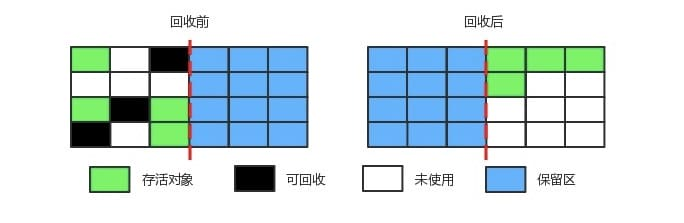
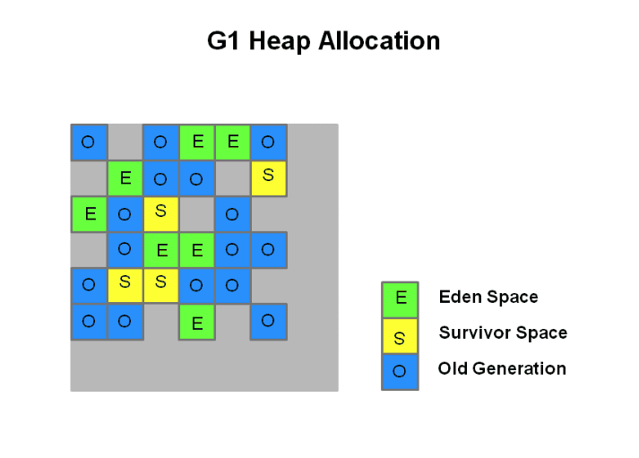

## 内存结构

### 堆

**线程共享**

内存分配 垃圾回收

### 栈

**线程私有**

> 由栈帧组成，栈帧内包括：局部变量表、操作数栈、动态链接、方法出口信息

#### 虚拟机栈

> 局部变量表：基本数据类型、对象引用

> 为Java方法服务

#### 本地方法栈

> 存储的数据类型与虚拟机栈一样

> 为Native方法服务

### 方法区

**线程共享**

> 存储类信息、常量、静态变量、即时编译器编译后的代码

> 运行时常量池
>
> 1.8 方法区实现由永久代改为元空间

### 程序计数器

**线程私有**

> 流程控制

> 记录线程当前执行位置，以便线程切换

------

## 常量池

### class文件常量池/类文件常量池/静态常量池

> Java文件编译为class文件时生成class文件常量池，每个class都有一个

> 类相关信息、字面量、符号引用

### 运行时常量池（元空间）

> 类加载进内存中时生成运行时常量池，每个class都有一个

> 用于动态加载类信息，在解析阶段将符号引用替换为直接引用

1.6 在方法区，包含String常量池

1.7 在方法区，不包含String常量池

**1.8 在方法区，方法区实现由永久代改为元空间**

### String常量池（堆）

1.6 在方法区

1.7 在堆中

**1.8 在堆中**

**String.internl()**

1.6 检查常量池，当字符串在常量池中存在，返回该串的引用，若不存在，在常量池中创建该串，并返回该串的引用

**1.7 检查常量池，当字符串在常量池中存在，返回该串的引用，若不存在，将堆中该串的引用复制到常量池中，并返回该引用**

### 基本数据类型常量池

> 除了Float、Double外的六种基本数据类型都实现了常量池

> Byte、Integer、Short、Long范围[-128, 127]

> Character范围[0, 127]

> Boolean范围{True, False}

------

```
字面量：文本字符串、被声明为final的常量值、基本数据类型的值、其他

符号引用：类和结果的完全限定名、字段名称和描述符、方法名称和描述符
```

## 内存溢出

### 堆溢出（OutOfMemoryError: Java heap space）

堆溢出发生在 JVM 无法为新对象分配足够的内存时

- 频繁创建大量对象（特别是大对象）且无法及时回收内存，导致堆内存耗尽
- 内存泄漏，某些对象被不必要地持有引用，导致这些对象无法被垃圾回收机制清理，从而堆内存占用不断增加
- 堆设置过小，JVM 默认的堆大小可能不适合内存需求高的应用程序，导致内存不足

### 栈溢出（StackOverflowError）

栈用于存储方法调用的局部变量、参数等。栈溢出发生在递归调用太深或方法调用层次太多时，栈帧超出 JVM 为每个线程分配的栈空间

- 递归过深，递归函数调用没有终止条件或递归层次太深，导致栈帧不断增加，最终栈内存耗尽
- 方法调用过多，应用程序中存在大量方法的嵌套调用，可能导致栈空间不够

### 方法区溢出（OutOfMemoryError: PermGen / Metaspace）

方法区溢出通常是由于 JVM 在加载大量类，或不断生成新的类，导致方法区无法为新类分配内存

- 大量类的动态生成，如使用字节码框架（如 CGLIB）动态生成大量的代理类或动态创建类，每个动态生成的类都需要在方法区中存储其元数据
- 频繁的类加载和卸载，在类加载器的错误使用场景下，频繁地加载类但未能有效卸载，导致方法区逐渐被占满
- 大量持有常量池中的数据，方法区中还存储着常量池，比如运行时常量池中的字符串常量，如果系统中生成大量的字符串常量并持续占用内存空间，可能导致方法区溢出

## GC

### 可达性分析

通过一系列的成为"GC Roots"的对象作为起始点，从这些节点开始向下搜索，搜索所走过的路径称为引用链，当一个对象到GC Roots没有任何引用链相连时，则证明此对象是不可用的。

#### 引用计数法的缺点

- 需要额外的空间来存储计数器，更新计数操作频繁
- 无法处理循环引用对象

#### GC Roots

可作为GC Roots的对象包含以下几种：

- 虚拟机栈中引用的对象

> 虚拟机栈帧中本地变量表引用的对象，即正常在堆中创建的实例对象

- 方法区中类静态属性引用的对象

> 静态对象，位于方法区中，随着类的加载而加载

- 方法区中常量引用的对象

> 常量对象，位于方法区中

- 本地方法栈中Native方法引用的对象

> 使用JNI技术时，JVM会在Native方法栈中保存这些对象的引用，这些引用的对象也可以作为GC Roots

#### 引用的类型

**强引用 （Strong Reference）**

即平常new创建对象时的引用。如果一个对象具有强引用，那垃圾回收器绝不会回收它。当内存空间不足，Java虚拟机宁愿抛出OutOfMemoryError错误，也不会靠随意回收具有强引用的对象来解决内存不足的问题。

**软引用（Soft Reference）**

描述一些还有用但并非必须的对象。如果内存空间足够，垃圾回收器就不会回收它，如果内存空间不足了，就会回收这些对象的内存。

> 软引用可以和引用队列（referenceQueue）联用，我们可以调用ReferenceQueue的poll()方法来检查是否有它所关心的对象被回收。如果队列为空，将返回一个null,否则该方法返回队列中前面的一个Reference对象。

应用场景：软引用一般用来实现内存敏感的缓存，如果有空闲内存就可以保留缓存，当内存不足时就清理掉，这样就保证使用缓存的同时不会耗尽内存，如图片缓存框架中缓存图片就是通过软引用实现。

**弱引用（Weak Reference）**

如果一个对象只具有弱引用，那就类似于可有可无的生活用品。弱引用与软引用的区别在于：只具有弱引用的对象拥有更短暂的生命周期。在垃圾回收器线程扫描它所管辖的内存区域的过程中，一旦发现了只具有弱引用的对象，不管当前内存空间足够与否，都会回收它的内存。不过，由于垃圾回收器是一个优先级很低的线程， 因此不一定会很快发现那些只具有弱引用的对象。

> 弱引用也可以和引用队列（referenceQueue）联用

**虚引用（Phantom Reference）**

“虚引用”顾名思义，就是形同虚设，与其他几种引用都不同，虚引用并不会决定对象的生命周期。如果一个对象仅持有虚引用，那么它就和没有任何引用一样，在任何时候都可能被垃圾回收器回收。
虚引用主要用来跟踪对象被垃圾回收器回收的活动。

> 虚引用与软引用、弱引用的一个区别在于：虚引用必须和引用队列 （ReferenceQueue）联合使用。

**程序设计中一般很少使用弱引用与虚引用，使用软引用的情况较多，这是因为软引用可以加速 JVM 对垃圾内存的回收速度，可以维护系统的运行安全，防止内存溢出（OutOfMemory）等问题的产生。**

### 垃圾回收算法

- 标记-清除算法
  - 标记出所有需要回收的对象（标记活对象），然后直接清除未标记的对象
  - 效率不高，且，容易产生内存碎片


- 标记-整理（压缩）算法
  - 标记出存活对象，然后将存活对象向一端移动，最后清理掉边界外的内存
  - 能够避免内存碎片的问题，适用于老年代


- 复制算法
  - 将内存分为两块区域，每次只使用其中一块。当这块区域用满时，将存活的对象复制到另一块区域，然后清理当前区域
  - 没有内存碎片问题，回收效率高，适用于新生代



- 分代回收算法
  - 将堆分为新生代和老年代，针对不同区域的对象采用不同的回收算法
  - 现代 JVM 默认采用分代回收，适用于大多数应用场景

### Full GC的触发条件

- 老年代空间不足（大对象在老年代分配、长期存活的对象晋升至老年代空间不足），可能触发Major GC，也可能触发Full GC，根据收集器和具体情况而定

  - Parallel在老年代空间不足时触发Full GC
  - CMS通常会触发Major GC，但GC过程中出现并发失败（Concurrent Mode Failure）则会触发Full GC

  > CMS在清理老年代时，年轻代有对象要晋升到老年代，或有大对象要在老年代进行分配，而此时老年代空间不足，则会抛出Concurrent Mode Failure

  - G1通常会触发Mixed GC，但如果回收效果不足，仍然无法腾出足够的老年代空间，则会进行Full GC

- 分配担保失败

>  在Minor GC时，只要老年代的连续空间大于新生代对象总大小或者历次晋升的平均大小，就会进行 Minor GC，否则将进行 Full GC

- 方法区（永久代 / 元空间）空间不足
- 显式调用`System.gc()`，调用此方法只是建议虚拟机可以执行Full GC，但不一定会真正执行

### 垃圾收集器

#### Parallel（Parallel Scavenge）

Java8默认收集器，设计的目标是提高应用程序的吞吐量，即应用程序处理任务的时间与垃圾收集的时间之比。Parallel的收集过程是并发执行的，但会触发STW

**年轻代收集（Minor GC）**

Parallel使用分代收集，年轻代的Minor GC使用的是复制算法。

Parallel将堆分为**Eden** 区和两个**Survivor** 区（**S0** 和 **S1**），Eden 中分配新对象，两个 Survivor 区轮流使用。每次垃圾收集时，存活的对象从Eden区和一个Survivor区（From Space）复制到另一个Survivor区（To Space），不需要的对象直接清理掉。当Eden区满时触发Minor GC，GC期间会**暂停所有应用线程**（**STW**）

- 标记存活对象，扫描 Eden 区和当前使用的 Survivor 区，标记存活的对象
- 复制存活对象，将存活的对象复制到另一个 Survivor 区（To Space），未存活的对象将被回收
- 对象晋升，如果对象已经经过一定次数的 GC（如超过某个年龄阈值，默认为 15），则晋升到老年代

**老年代收集（Major GC / Full GC）**

老年代使用的是标记-整理算法，同样也会STW，相比于新生代的 Minor GC，老年代的 Full GC 触发频率较低，但开销更大

- 标记存活对象，并行扫描整个老年代，标记存活的对象。

- 整理存活对象，将存活的对象压缩到堆的一端，腾出连续的内存空间，避免内存碎片化问题

#### CMS

**第一款真正意义上的并发收集器，它第一次实现了让垃圾收集线程与用户线程（基本上）同时工作**

- 初始标记（initial mark），仅标记GC Roots能直接关联到的对象（活对象），STW

- 并发标记（concurrent mark），同时开启GC和用户线程，对初始标记所标记过的对象进行追踪，对所有关联的对象进行标记（活对象）

  > 由于并发标记期间用户线程会继续运行，所以标记期间可能会导致部分标记的对象发生变动，变动可分为两种：
  >
  > - 本来可达的对象，变得不可达（浮动垃圾）
  > - 本来不可达的内存，变得可达

- 重新标记（remark），对并发标记期间产生的变动进行修正，停顿时间比初始标记稍长，但远远短于并发标记，STW

  > remark阶段标记的也是活对象，修正的是并发标记期间的第二种变动，所以第一种变动就成了浮动垃圾
  >
  > 由于第二种变动产生了新的可达对象，如果没有重新标记，则会对其进行错误地回收

- 并发清除（concurrent sweep），开启用户线程，同时GC线程开始对未标记的区域做清扫


**缺点**

- “标记-清除”算法会产生内存碎片

- 对CPU资源敏感（GC线程与用户线程抢占CPU）
- 产生浮动垃圾

#### G1


##### 相关概念

**Region（分区）**

G1将整个堆空间分成若干个大小相等的内存区域，新生代和老年代不再物理隔离，每个小空间都可以单独进行垃圾回收。



**LAB**

每个线程都可以认领一个Region用于线程本地的内存分配，进而减少同步时间，提升GC效率，这个Region称为本地分配缓冲区（LAB）

- 应用线程本地缓冲区（TLAB）：每个线程独占的LAB，位于eden区
- GC线程本地缓冲区（GCLAB）：GC时GC线程独占的LAB，用来将对象**复制**到survivor区或老年代
- 晋升本地缓冲区（PLAB）：GC时GC线程独占的LAB，用来将eden/survivor的对象**晋升**到survivor区/老年代

**Humongous Object（巨型对象）**

一个大小达到或超过Region 50%对象称为巨型对象，其会占用一个或多个连续的分区，巨型对象直接分配在老年代，防止反复拷贝移动。

**Card（卡片）**

在每个Region内部又被分成若干个512 Byte的卡片，标识堆内存使用的最小粒度，所有Region的Card都记录在全局卡表（Global Card Table）中，当查找Region中的对象时，便可根据记录卡片来进行查找，每次对内存的回收，都是对指定Region的Card进行回收。

**RSet（Remember Set 已记忆集合）**

每个Region内都保存了一个RSet，里面记录了引用该Region内对象的Card索引，当要回收某个Region时，通过扫描该Region的RSet，来确定**引用**该分区的对象是否存活，进而确定该分区的对象是否存活（类似于从GC Root向下扫描）。

>  如Region A Card 1中的X对象引用了Region B Card 1中的Y对象，则Region B中的RSet记录了Region A Card 1的索引。当要回收Region B时，扫描Region B的RSet，先去确认Region A Card 1 X对象是否存活，进而确认Region B Card 1 Y对象是否存活。

由于G1每次GC时都会对年轻代进行整体收集，所以年轻代中的对象引用不需要记录在RSet中，因此年轻代和老年代Region中的RSet只记录了来自老年代的引用（记录的引用关系old -> old，old -> young）。

>  因为RSet中记录了引用关系，所以在GC时，不需要扫描全部老年代（老年代中只需要扫描引用了对象的Region），从而减少了GC的工作量。

**Per Region Table（PRT）**

RSet内部使用PRT记录Region的引用情况，引用越多，RSet占用的空间也越大，为此G1中的PRT有三种不同的数据结构：

- 稀疏表：hash表存储，key为Region的索引，value为引用Card的索引数组
- 细粒度：位图，每一位对应一个Card索引
- 粗粒度：位图，每一位对应一个Region索引

**CSet（Collection Set 收集集合）**

CSet代表每次GC需要收集的目标Region，每次GC都会释放CSet内记录的所有Region，存活的对象转移到其他空闲Region。

YGC（年轻代收集）时CSet只容纳年轻代分区，Mixed GC（混合收集）会在老年代中筛选出回收收益最高的Region加入到CSet中。

YGC和Mixed GC工作机制是一样的。

##### 回收机制

**年轻代收集**

- 当JVM在Eden区分配内存失败或Eden区已满，则触发一次YGC，STW
- 所有的年轻代Region都会被扫描，故所有的年轻代Region都会加入到CSet中
- Eden区的活对象拷贝到Survivor区中，原有Survivor区中的活对象根据年龄拷贝到新的Survivor区或晋升到老年代分区

**混合收集（年轻代与部分老年代收集）**

当YGC不断活动，老年代的空间也逐渐填充，当老年代占用堆空间达到阈值（默认45%）时，则会触发并发标记周期（Concurrent Marking Cycle），并发标记周期包含以下步骤，类似于CMS：

- 初始标记（Initial Marking），标记GC Roots，这一阶段在YGC的STW时间段完成，STW

> 标记GC Roots

- 根分区扫描（Root region scanning），初始标记结束后，YGC也完成了活对象的复制工作，此阶段在初始标记的存活区扫描对老年代的引用，并标记被引用的对象，该阶段与应用程序同时运行，并且只有完成该阶段后，才能开始下一次 STW 年轻代垃圾回收，非STW

> 标记老年代中的GC Roots

- 并发标记（Concurrent Marking），在整个堆中查找可访问的（存活的）对象，该阶段与应用程序同时运行，可以被 STW 年轻代垃圾回收中断。

> 标记活对象

- 最终标记（Remark），标记那些在并发标记阶段发生变化的对象，这一步跟CMS类似，标记那些未被标记到的活对象，STW

> 处理并发标记阶段发生变化的对象（不可达变为可达的对象）

- 清除（Cleanup），清理CSet中的Region

> 清理

并发标记周期内会将部分老年代分区加入到CSet中，选择老年代分区的策略是垃圾多的优先（回收收益高），YGC只回收老年代，Mixed GC会回收年轻代和部分老年代，所以叫混合收集。

**并发标记阶段使用的算法**

**三色标记法**

黑色：自身和成员变量都已经被GC Roots扫描过

灰色：自身被GC Roots扫描过，但成员变量还没有扫描完

白色：没有被GC Roots扫描过，可能是垃圾对象


>  标记步骤：
>
>  - 初始阶段，所有对象都是白色
>
>  
>
>  - 初始标记阶段，GC Roots关联的对象标记为灰色
>
>  
>
>  - 并发标记阶段，继续向下扫描，自身和成员变量扫描完成的标记为黑色，否则为灰色
>
>  

三色标记法保证了在遍历完对象树之后，所有被标记上颜色（黑/灰）的对象，都是活对象，但是由于并发阶段GC线程与用户线程是同时运行的，可能会出现多标或漏标的情况

- 多标，上图如果在扫描完C -> E之后，C中的属性变化为C.E = null，断开了C -> E的引用，但GC线程此时已经扫描C结束，认为E是可达对象，则出现E多标的情况，可达对象变为不可达，即产生了浮动垃圾E，E在这次的GC中无法回收，需要在下一次GC中处理
- 漏标，上图C中的属性变化为C.E = null，随后GC线程扫描到C，认为E为不可达对象，但随后B -> E，则出现E漏标的情况，这种情况必须要修正，否则E会被错误回收

**CMS处理漏标**

**Incremental update（增量更新）**

增加了新引用的对象会被重新标记为灰色，在重新标记（remark）阶段对其重新进行扫描，上面的例子会将B标记为灰色，然后从B开始向下重新开始扫描，这种方式效率不高，因为一个引用需要将整个引用链重新扫描。

**G1处理漏标**

**SATB（Snapshot At The Beginning）**

- 在GC开始时对堆做一次快照，生成一个所有对象的快照图
- 并发标记阶段，如果发生了引用更新，则将这个更新推送到一个标记栈内
- 在最终标记阶段，对这个栈内的所有引用进行扫描

由于有RSet存在，所以重新扫描引用时，只需要扫描对象的RSet就能知道其被引用的情况，而不需要扫描整个堆

**Full GC**

当混合回收无法跟上内存分配的速度，导致老年代也满了，就会进行Full GC对整个堆进行回收。G1中的Full GC也是单线程串行的，而且是STW，使用的是标记-整理算法，代价非常高。

**优势**

- **空间整合**，对比CMS的标记-清除算法，G1使用的是标记-整理算法
- **可预测的停顿**，用户可以指定GC的最大停顿时间，GC时的停顿时间不会超过该值（不完全保证）

**缺点**

- 仍然会产生浮动垃圾
- GC时的内存占用和CPU负载都比CMS要高

## 类加载

### 类加载过程


- 加载

> 通过类的全限定名将类的`.class`文件加载到JVM的内存中，并创建一个`java.lang.Class`对象来表示该类
>
> 加载步骤：
>
> - 查找并加载类的二进制数据（`.class` 文件）到内存中。
> - 将该类的字节码数据解析为 JVM 可以理解的数据结构。
> - 为该类在内存中创建一个 `Class` 对象

- 连接

  - 验证

  > 验证阶段确保加载的类的字节码文件符合 JVM 规范，并且不会危害虚拟机安全。主要包括以下检查：
  >
  > - 文件格式验证：检查 `.class` 文件是否符合Class文件格式的规范，确保是合法的 Java 类文件。
  > - 元数据验证：检查类的元数据（如类、字段、方法等的描述），确保合法性。
  > - 字节码验证：检查字节码是否符合 Java 语言规范，防止指令的非法操作，如非法的数据类型转换。
  > - 符号引用验证：确保类中使用的符号引用是合法的，如方法、字段、类等的引用是否可以解析

  - 准备

  > 为类的静态变量分配内存，并初始化为默认值（如 `0`、`false`、`null`）

  - 解析

  > 解析阶段是将常量池中的符号引用替换为直接引用的过程。符号引用是指 `.class` 文件中的逻辑引用，解析时 JVM 会将它转换为内存地址或直接引用的具体内容。

- 初始化

> 执行类的静态初始化块、为静态变量赋予指定值
>
> 只有当对类的主动使用的时候才会导致类的初始化，类的主动使用包括以下六种:
>
> - 创建类的实例，也就是new的方式
> - 访问某个类或接口的静态变量，或者对该静态变量赋值
> - 调用类的静态方法
> - 反射（如`Class.forName("com.pdai.jvm.Test")`）
> - 初始化某个类的子类，则其父类也会被初始化
> - Java虚拟机启动时被标明为启动类的类（Java Test），直接使用`java.exe`命令来运行某个主类

### 类加载器

JVM 中内置了三个重要的 ClassLoader，除了 BootstrapClassLoader 其他类加载器均由 Java 实现且全部继承自`java.lang.ClassLoader`：

- **BootstrapClassLoader(启动类加载器)** ：最顶层的加载类，由 C++实现，负责加载 `%JAVA_HOME%/lib`目录下的 jar 包和类或者被 `-Xbootclasspath`参数指定的路径中的所有类。

- **ExtensionClassLoader(扩展类加载器)** ：主要负责加载 `%JRE_HOME%/lib/ext` 目录下的 jar 包和类，或被 `java.ext.dirs` 系统变量所指定的路径下的 jar 包。

- **AppClassLoader(应用程序类加载器)** ：面向我们用户的加载器，负责加载当前应用 classpath 下的所有 jar 包和类。

**双亲委派模型**

每一个类都有一个对应它的类加载器。系统中的 ClassLoader 在协同工作的时候会默认使用 **双亲委派模型** 。即在类加载的时候，系统会首先判断当前类是否被加载过。已经被加载的类会直接返回，否则才会尝试加载。加载的时候，首先会把该请求委派给父类加载器的 `loadClass()` 处理，因此所有的请求最终都应该传送到顶层的启动类加载器 `BootstrapClassLoader` 中。当父类加载器无法处理时，才由自己来处理。当父类加载器为 null 时，会使用启动类加载器 `BootstrapClassLoader` 作为父类加载器。


**双亲委派模型的优点**

- 保证 Java 程序的稳定运行，可以避免类的重复加载
- 保证 Java 的核心 API 不被篡改，比如我们编写一个称为 `java.lang.Object` 类，那么程序运行的时候，系统就会出现多个不同的 `Object` 类

**打破双亲委派**

自定义加载器的话，需要继承 `ClassLoader` 。如果我们不想打破双亲委派模型，就重写 `ClassLoader` 类中的 `findClass()` 方法即可，无法被父类加载器加载的类最终会通过这个方法被加载。但是，如果想打破双亲委派模型则需要重写 `loadClass()` 方法