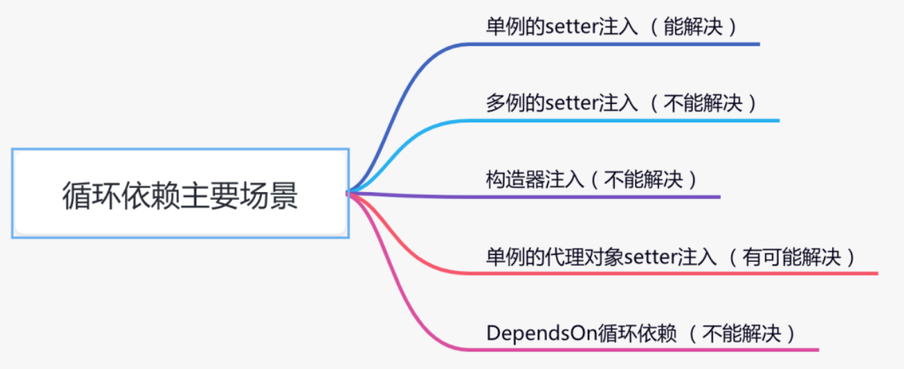
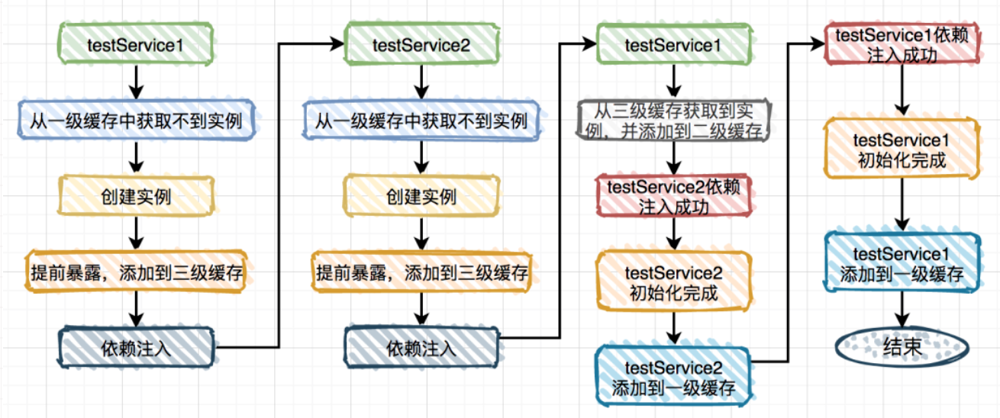
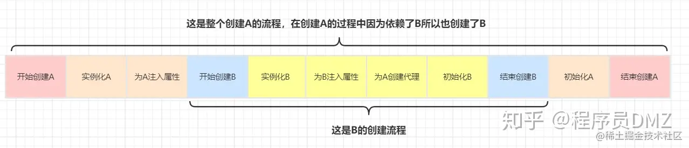
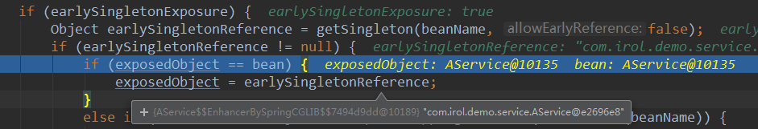
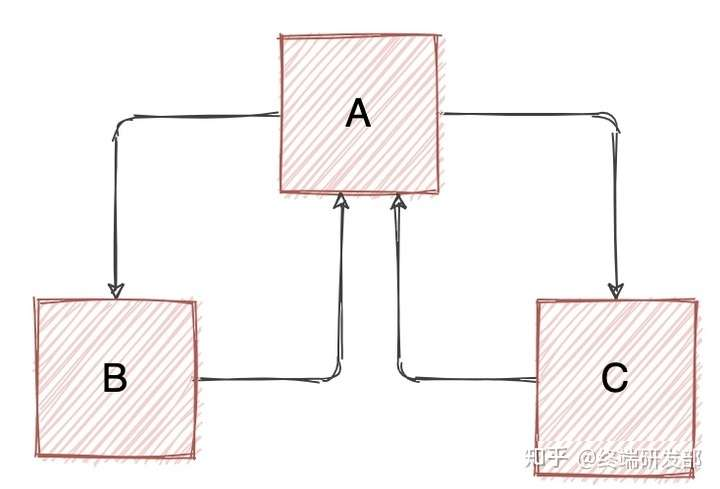
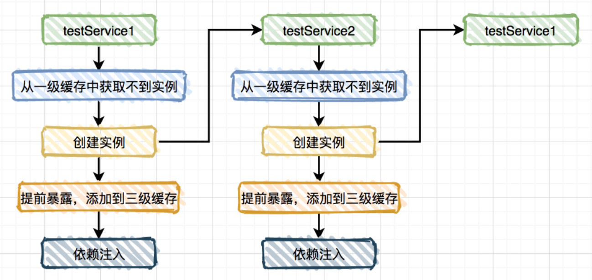
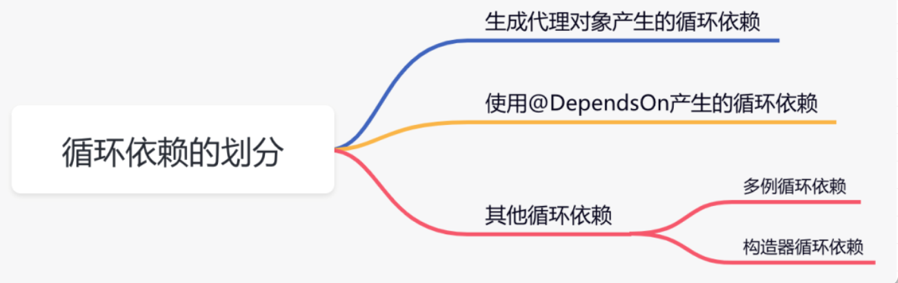

## IOC

### Bean的生命周期

Spring中Bean的生命周期主要可以分为以下几个节点：

- 实例化
- 属性填充
- 初始化
- 销毁

整个生命周期中还有多个扩展点，完整的生命周期如下：

实例化前置处理，InstantiationAwareBeanPostProcessor.**postProcessBeforeInstantiation**

- **实例化**，AbstractAutowireCapableBeanFactory.**createBeanInstance**
- **属性填充**
  - 实例化后置处理，InstantiationAwareBeanPostProcessor.**postProcessAfterInstantiation**
  - 检查和修改属性，AutowiredAnnotationBeanPostProcessor.**postProcessProperties**
- **初始化**
  - 调用aware方法，AbstractAutowireCapableBeanFactory.**invokeAwareMethods**
    - 传入bean的名称，BeanNameAware.**setBeanName**
    - 传入bean的ClassLoader实例，BeanClassLoaderAware.**setBeanClassLoader**
    - 传入bean的BeanFactory实例，BeanFactoryAware.setBeanFactory
  - 调用BeanPostProcessor的后置方法，BeanPostProcessor.**postProcessBeforeInitialization**
  - 调用init初始化方法，AbstractAutowireCapableBeanFactory.**invokeInitMethods**
    - 调用afterPropertiesSet方法，InitializingBean.**afterPropertiesSet**
    - 调用xml中init-methond方法和注解@PostContruct方法，this.**invokeCustomInitMethod**
  - 调用BeanPostProcessor的后置方法，BeanPostProcessor.**postProcessAfterInitialization**
- **销毁**
  - 调用DisposableBean.destroy方法，和@PreDestroy方法
  - 调用bean自定义的bean方法，和xml中的destroy-method方法


### 循环依赖问题

Spring循环依赖的主要场景：



#### 单例的setter注入

通过三级缓存解决循环依赖问题

DefaultSingletonBeanRegistry类中定义：

- singletonObjects：一级缓存也叫单例池，存放已经经历了完整生命周期的Bean对象。
- earlySingletonObjects：二级缓存，存放早期暴露出来的Bean，Bean可能只经过实例化，属性还未填充。
- singletonFactories：三级缓存，存放早期暴露的Bean的工厂，以便于后面扩展有机会创建代理对象。

Spring在创建bean时，其流程如下：




```java
@Service
public class TestService1 {
    @Autowired
    private TestService2 testService2;
}

@Service
public class TestService2 {
    @Autowired
    private TestService1 testService1;

}
```

- spring获取bean1时先去缓存中查找，如果查找不到则创建实例，并将新建完还未进行属性装配的bean1放入三级缓存中，该步骤称为提前暴露
- 装配bean1属性时发现其依赖了别的bean2，则去获取bean2，先去缓存中查找bean2，发现不存在，则创建bean2，并将其提前暴露到三级缓存
- 随后装配bean2属性时发现其依赖了bean1，则去获取bean1，在缓存中查找到bean1后，将bean1从三级缓存移入二级缓存，并将bean1注入到bean2的属性中，bean2的创建完成，并将自己移入一级缓存
- bean2创建完后，bean1将bean2的注入自己的属性中，bean1创建完成，并移入一级缓存



只有单例的bean会通过三级缓存提前暴露来解决循环依赖的问题，而非单例的bean，每次从容器中获取都是一个新的对象，都会重新创建，所以非单例的bean是没有缓存的，不会将其放到三级缓存中。

**为什么要使用三级缓存？**

***只使用一级缓存***

上述bean的创建流程为：spring获取bean1 -> 缓存中没找到则创建bean1 -> bean1放入缓存中 -> 装配bean1时发现依赖bean2，获取bean2 -> 缓存中没找到则创建bean2 -> bean2放入缓存 -> 装配bean2时发现依赖bean1，缓存中获取bean1 -> bean1注入bean2属性中 -> bean2创建完成，并将成品bean2放入缓存 -> bean2准入bean1 -> bean1创建完成，并将成品bean1放入缓存

理论上一级缓存也可以解决循环依赖问题，但是回顾上面的过程，缓存中既会存放半成品bean，又会存放成品bean，系统设计上比较混乱，实际使用时也容易出问题，实际项目中遇到这种情况，比较清晰的做法是使用二级缓存，一级存放成品bean，二级存放半成品bean

***只使用二级缓存***

如果只使用二级缓存，也可以解决循环依赖的问题，但是在处理AOP逻辑的时候就不是很方便了，Spring创建bean时的主要步骤有：**实例化、填充属性、初始化**，循环依赖是在填充属性时处理，在只有二级缓存的情况下，如果要同时处理AOP逻辑和循环依赖，由于执行AOP逻辑后生成代理对象是一个新的对象，所以在填充属性前就要对bean执行AOP逻辑，这时有两种做法：

1. 无论是否出现循环依赖，都提前创建好代理对象，将代理对象放入二级缓存
2. 出现循环依赖时，才去按需实时生成代理对象

第一种做法，是将AOP代理对象的创建放进了Spring的创建过程里，这与Spring的设计原则是相违背的，早期Spring并没有处理循环依赖的流程，其设计原则是对bean完成实例化、填充属性、初始化后，再执行AOP逻辑，将AOP与bean的创建过程分离，在尽量不打破这个设计原则下，Spring采取的是第二种做法

第二种做法，Spring在实例化bean之后以lambda表达式的形式定义了一个匿名内部类，将其放入第三级缓存中，

```addSingletonFactory(beanName, () -> getEarlyBeanReference(beanName, mbd, bean));```

当出现循环依赖需要获取该bean时，会调用singletonFactory.getObject()方法实时生成一个代理对象，将代理对象放入第二级缓存，并将第三级缓存中的bean移除掉。当有其他类需要获取该bean时，会在二级缓存中获取到其增强后的代理对象。由于在处理循环依赖时，提前对bean进行AOP处理是不可避免的，Spring采取的方式是将代理的逻辑放入第三级缓存，这样当出现循环依赖时才会按需触发执行AOP逻辑。

```java
// 定义A, B类
@Service
public class AService {
    @Autowired
    private BService bService;
    
    public void methodA(){}
}

@Service
public class BService {
    @Autowired
    private AService aService;

    public void methodB(){}
}

// 为A, B类定义AOP逻辑
@Aspect
@Component
public class AspectA {
    @Before("execution(public void com.irol.demo.service.AService.methodA())")
    public void beforeA() {
        System.out.println("beforeA 执行");
    }
}

@Aspect
@Component
public class AspectB {
    @Before("execution(public void com.irol.demo.service.BService.methodB())")
    public void beforeB() {
        System.out.println("beforeB 执行");
    }
}
```



debug启动过程可以看到在从缓存中获取到的AService是个新对象

***三级缓存***

singletonObjects，一级存放成品bean

earlySingletonObjects，二级存放半成品bean，增强后的代理对象或原始bean

singletonFactories，三级存放bean对象工厂，出现循环依赖时提前触发AOP逻辑

三级缓存解决的是循环依赖时的AOP问题，当出现循环依赖时去三级缓存中获取工厂对象，如果bean定义了AOP逻辑，则提前触发AOP生成代理对象，否则直接返回实例化后的原始bean，并将三级缓存中返回的对象移入二级缓存，由此看二级缓存是与三级缓存配合使用的。

> 同一个名称的bean在三级缓存中只会存在一个实例，所以感觉只使用两层缓存甚至一层缓存也可以实现上述的效果，比如将二级和三级缓存中存放的对象合并到一层缓存中，应该也可以解决AOP和循环依赖的问题，只是这种方式在一层缓存中存放了不同类型的对象，在实现上会增加很多难度，流程和设计上不清晰也会给编码和后续扩展带来其他问题。


**如果在三级缓存的设计基础上只使用其中两级缓存会有什么问题？**

由于一级缓存是存放成品bean，Spring要实现单例就必须依赖一级缓存，所以只使用二级缓存的情况只有singletonObjects + earlySingletonObjects，singletonObjects + singletonFactories两种

***singletonObjects + earlySingletonObjects***

只用一级与二级缓存，由于二级缓存需要存放AOP增强后的对象，这就要求所有的bean在实例化后，都要提前执行AOP逻辑，这种实现前面说过是破坏了Spring对于bean的设计原则，而且对所有的bean都判断其是否需要AOP也会影响效率

***singletonObjects + singletonFactories***

只用一级和三级缓存，三级缓存中存放的是对象工厂，每次从三级缓存中获取bean时都是一个新的对象，这种情况下属性注入肯定会有问题，如下图所示，B与C都去获取A，如果获取到的A不是同一个对象，则属性注入会出错



#### 多例的setter注入

```java
@Scope(ConfigurableBeanFactory.SCOPE_PROTOTYPE)
@Service
public class TestService1 {
    @Autowired
    private TestService2 testService2;
}

@Scope(ConfigurableBeanFactory.SCOPE_PROTOTYPE)
@Service
public class TestService2 {
    @Autowired
    private TestService1 testService1;
}
```

这种多例的情况启动不会报错，因为上述2.11.9步骤中初始化bean时，只有非抽象类 & 单例 & 非懒加载才会去初始化，所以容器可以正常启动，但是实际调用的时候会报错

```java
public void preInstantiateSingletons() throws BeansException {
	...
        // 不是抽象类、是单例的且不是懒加载的
		if (!bd.isAbstract() && bd.isSingleton() && !bd.isLazyInit()) {
            ...
        }
```

如果定义一个单例的bean注入则可以在启动时看到错误 ```Requested bean is currently in creation: Is there an unresolvable circular reference?```

```java
@Service
public class TestService3 {
    @Autowired
    private TestService1 testService1;
}
```

**多例情况下没有使用缓存，每次请求都会生成一个新的bean，因此无法解决循环依赖问题**

#### 构造器注入

```java
@Service
public class TestService1 {

    public TestService1(TestService2 testService2) {
    }
}

@Service
public class TestService2 {

    public TestService2(TestService1 testService1) {
    }
}
```



构造器注入的流程是在实例化bean的时候进行属性的注入，整个过程只是简单将bean放入三级缓存，实际并没有使用缓存来进行bean的创建，所以构造器注入也无法解决循环依赖问题

> 这里没有阅读实例化相关的源码，只是简单复制网上的结论

**参考文章中还讲到一种单例的代理对象setter注入，我对文章中的描述存疑，用其中的例子没有出现启动报错的情况，文章中描述的bean创建流程应该是错的，在处理循环依赖时如果bean定义了AOP逻辑，会为其提前进行AOP处理**

#### DependsOn循环依赖

```java
@DependsOn(value = "testService2")
@Service
public class TestService1 {

    @Autowired
    private TestService2 testService2;

    public void test1() {
    }
}

@DependsOn(value = "testService1")
@Service
public class TestService2 {

    @Autowired
    private TestService1 testService1;

    public void test2() {
    }
}
```

程序启动的时候会报错，因为在上述2.11.9中doGetBean方法会检查bean是否有dependson依赖，如果有则直接抛出异常

#### 循环依赖的解决方式



**生成代理对象产生的循环依赖**

这类循环依赖问题解决方法很多，主要有：

- 使用@Lazy注解，延迟加载
- 使用@DependsOn注解，指定加载先后关系
- 修改文件名称，改变循环依赖类的加载顺序

 **使用@DependsOn产生的循环依赖**

这类循环依赖问题要找到@DependsOn注解循环依赖的地方，迫使它不循环依赖就可以解决问题。

**多例循环依赖**

这类循环依赖问题可以通过把bean改成单例的解决。

**构造器循环依赖**

这类循环依赖问题可以通过使用@Lazy注解解决。

当然最好的解决循环依赖问题最佳方案是从代码设计上规避，但是复杂的系统中有可能没法避免。


**参考文章：**

[Spring为什么不使用二级缓存](https://zhuanlan.zhihu.com/p/377878056)

[spring为什么使用三级缓存而不是二级缓存](https://www.cnblogs.com/tiancai/p/16092145.html)

[spring: 我是如何解决循环依赖的？](https://www.cnblogs.com/12lisu/p/14218432.html)

[Spring 解决循环依赖为什么使用三级缓存，而不是二级缓存](https://www.cnblogs.com/grey-wolf/p/13034371.html)


## AOP

| 目标(Target)              | 被通知的对象                                                 |
| ------------------------- | ------------------------------------------------------------ |
| Proxy Object（代理对象）  | 向目标对象应用通知之后创建的代理对象                         |
| Target Object（目标对象） | 被代理的对象                                                 |
| JoinPoint（连接点）       | 允许使用通知的地方，类初始化、方法执行前后、处理异常时等都是连接点 |
| Pointcut（切入点）        | 定义哪些方法需要应用通知，通常使用明确的类、方法名或正则表达式来匹配 |
| Advice（通知）            | 增强的逻辑 / 代码，也即拦截到目标对象的连接点之后要做的事情  |
| Aspect（切面）            | 切入点（Pointcut） + 通知（Advice），在Spring中Adivisor是一种特殊的Aspect，其定义的切面里只有一个Pointcut + 一个Advice |
| Introduction（引入）      | 在不改变被代理类代码的前提下，为其增加新的属性与方法，不常用。<br>使用@DeclareParents注解或aop:declare-parents文件配置即可引入新的接口功能(该接口必须有一个实现类) |
| Weaving（织入）           | 将通知应用到目标对象进而生成代理对象的过程，简单理解为创建代理对象的过程 |

### AspectJ

- 实际意义的AOP标准
- 基于字节码
- 静态织入（编译期织入、编译后织入、类加载后织入）
- 性能更好
- 需要使用特定编译器

### Spring AOP

- 基于代理
- 动态织入（JDK动态代理、CGLIB）

**Spring 2.0引入了AspectJ 5的注解语法，虽然包名和注解都带了AspectJ字样，但实际还是Spring AOP，只是把AspectJ的注解方式搬过来了，要在项目中真正使用AspectJ需要使用特定的编译器** [SpringBoot中AspectJ的使用](https://www.cnblogs.com/iven98/p/15410659.html)

### 静态代理与动态代理

#### 静态代理的实现

静态代理即设计模式中的代理模式，需要手动编写代理类，并在代理类中对目标对象的方法进行包装和增强。代理类在编译时就已经存在了，也就是说代理类是静态的，因此称之为静态代理。

定义基本接口与接口实现类

```java
public interface UserService {
    User getUser(String username);
}

public class UserServiceImpl implements UserService {
    
    @Override
    public User getUser(String username) {
        System.out.println("getUser");
        return new User(username, "123456");
    }
}
```

定义代理类

```java
public class UserServiceProxy implements UserService {
    private UserService userService;
    
    public UserServiceProxy(UserService userService) {
        this.userService = userService
    }
    
    @Override
    public User getUser(String username) {
        System.out.println("before getUser");
        User user = userService.getUser(username);
        System.out.println("after getUser");
        return user;
    }
}
```

验证代理类功能

```java
public static void main(String[] args) {
    UserService userService = new UserServiceImpl();
    UserService proxy = new UserServiceProxy(userService);
    userService.getUser("abc");
}
```

#### JDK动态代理的实现

静态代理的代理类在编译期间就已经确定，而动态代理是在运行期间根据接口或者类动态生成代理类，因此叫动态代理。

基本接口与接口实现类同上，定义代理类

```java
public class UserServiceHandler implements InvocationHandler {
    private UserService userService;
    
    public UserServiceHandler(UserService userService) {
        this.userService = userService
    }
    
    @Override
    public Object invoke(Object proxy, Method method, Object[] args) throws Throwable {
        System.out.println("Before request");
        Object result = method.invoke(userService, args);
        System.out.println("After request");
        return result;
    }
}
```

验证代理类功能

```java
public static void main(String[] args) {
    UserService userService = new UserServiceImpl();
    UserService proxy = (UserService) Proxy.newProxyInstance(
            UserService.class.getClassLoader(),
            new Class[] {UserService.class},
            new UserServiceHandler(userService));
    proxy.getUser("abc");
}
```

#### Cglib动态代理的实现

对UserServiceImpl定义MethodInterceptor代理类

```java
public class UserServiceInterceptor implements MethodInterceptor {
    private UserService userService;
    
    public UserServiceInterceptor(UserService userService) {
        this.userService = userService
    }
    
    @Override
    public Object intercept(Object proxy, Method method, Object[] args, MethodProxy methodProxy) throws Throwable {
        System.out.println("before getUser");
        Object result = methodPorxy.invokeSuper(proxy, args);
      //  Object result = method.invoke(userService, args);
        System.out.println("after getUser");
        return result;
    }
}
```

验证代理类功能

```java
public static void main(String[] args) {
    UserService userService = new UserServiceImpl();
    UserServiceInterceptor interceptor = new UserServiceInterceptor(userService);
    // 创建Enhancer对象
    Enhancer enhancer = new Enhancer();
    // 设置Enhancer对象的父类
    enhancer.setSuperclass(UserService.class);
    // 设置Enhancer对象的回调对象
    enhancer.setCallback(interceptor);
    // 创建代理对象
    UserService proxy = (UserService) enhancer.create();
    // 调用目标方法，实际是调用回调对象的interceptor方法
    proxy.getUser("abc");
}
```


#### 静态代理与动态代理的比较

静态代理的代理类在编译期间就已经确定，而动态代理是在运行期间根据接口或者类动态生成代理类。

**静态代理**

优点

- 明确，代码结构清晰
- 编译时检查错误，效率高

缺点

- 静态代理的扩展性不好，因为代理类需要实现与被代理类相同的接口或者继承相同的父类，所以需要为每个被代理的类编写一个代理类，如果被代理类的接口或者父类发生了变化，代理类也需要随之变化。
- 代码冗余，如果有多个类需要进行代理，那么每个类都需要编写一个代理类，代码会显得比较冗余。

**动态代理**

优点

- 动态代理的扩展性比较好，可以通过一个代理类实现多个被代理类的代理操作。
- 动态代理可以在运行时根据需求动态地创建代理对象，不需要手动编写代理类，提高了代码的可维护性和可扩展性。

缺点：

- 动态代理的实现比较复杂，需要使用反射等技术来实现，效率相对较低。

### JDK 动态代理

#### 源码解析

阅读Spring的源码，可以知道Spring中AOP的逻辑在`AbstractAutoProxyCreator.wrapIfNecessary`方法中执行，继续往下看

```java
// 找到bean对应的增强器，为bean创建代理
AbstractAutoProxyCreator.wrapIfNecessary
↓
// 创建代理
this.createProxy
↓
// 创建代理
ProxyFactory.getProxy
↓
// 创建AopProxyFactory实例，这里会根据被代理类的情况创建不同的AopProxyFactory实例
DefaultAopProxyFactory.createAopProxy
```

`AopProxyFactory`有两种实现，`JdkDynamicAopProxy`与`ObjenesisCglibAopProxy`，代表JDK动态代理与Cglib动态代理，选择哪种代理方式的取决于被代理类是否实现接口与系统配置。

- 如果代理的类实现了接口，或代理的类本身就是接口，则返回JdkDynamicAopProxy实例，代表使用JDK动态代理
- 如果代理的类没有实现接口，或显式设置了proxy-target-class=true，则返回ObjenesisCglibAopProxy实例，代表使用Cglib动态代理

**`JdkDynamicAopProxy.getProxy`**生成代理类的核心在于

**`Proxy.newProxyInstance(classLoader, proxiedInterfaces, this)`方法**

该方法是 JDK 动态代理的核心代码，也是 Spring AOP 基于 JDK 动态代理实现的关键，方法作用是创建一个动态代理实例。该方法需要传递三个参数：

- classLoader参数：指定生成代理类的ClassLoader

- proxiedInterfaces参数：一个 Class 数组，指定代理类要实现的接口

- InvocationHandler参数：指定一个实现了InvocationHandler接口的对象，该对象中的invoke()方法将会在代理对象的方法调用时委托调用。this代表JdkDynamicAopProxy自身，**代理对象的方法调用时会委托到`JdkDynamicAopProxy.invoke()`**

**InvocationHandler**是JDK动态代理的核心接口，只有一个invoke方法，我们可以在这个方法中编写我们想要的增强逻辑。

代理对象的所有方法都会被重定向到 invoke方法上，该方法会根据被调用的方法信息以及代理对象信息，在运行时动态地确定具体的方法调用，并返回该方法调用的结果。

```java
public interface InvocationHandler {
    // proxy: 代理对象
	// method: 被代理的方法
	// args: 被代理方法的参数
    public Object invoke(Object proxy, Method method, Object[] args) throws Throwable;
}
```

在 invoke方法中，我们需要实现对被代理方法的处理逻辑，也就是在调用被代理方法前后进行一些操作，例如打印日志、计算执行时间等。

> 通常，invoke方法的实现可以分为以下几步（示例）：
>
> 1. 判断调用的方法是否是需要拦截的方法，如果不是，则直接调用被代理对象的对应方法；
> 2. 在调用被代理方法前进行前置处理，例如打印日志、校验参数等；
> 3. 调用被代理方法，并获取返回值；
> 4. 在调用被代理方法后进行后置处理，例如计算执行时间、处理返回值等；
> 5. 将处理结果返回。

`JdkDynamicAopProxy.invoke()`是JDK代理的核心方法，JDK动态代理生成的代理对象在方法执行时都是调用此方法

```java
@Override
@Nullable
public Object invoke(Object proxy, Method method, Object[] args) throws Throwable {
	MethodInvocation invocation;
	Object oldProxy = null;
	boolean setProxyContext = false;

	TargetSource targetSource = this.advised.targetSource;
	Object target = null;

	try {
        // 判断调用的方法是否为代理类自身的方法(equals, hashCode, toString等)，是则直接调用此方法
		if (!this.equalsDefined && AopUtils.isEqualsMethod(method)) {
			return equals(args[0]);
		}
		else if (!this.hashCodeDefined && AopUtils.isHashCodeMethod(method)) {
			return hashCode();
		}
		else if (method.getDeclaringClass() == DecoratingProxy.class) {
			return AopProxyUtils.ultimateTargetClass(this.advised);
		}
		else if (!this.advised.opaque && method.getDeclaringClass().isInterface() &&
				method.getDeclaringClass().isAssignableFrom(Advised.class)) {
			// Service invocations on ProxyConfig with the proxy config...
			return AopUtils.invokeJoinpointUsingReflection(this.advised, method, args);
		}

		Object retVal;

        // 如果配置了 exposeProxy，则将代理对象暴露到 ThreadLocal 中
		if (this.advised.exposeProxy) {
			oldProxy = AopContext.setCurrentProxy(proxy);
			setProxyContext = true;
		}

		// Get as late as possible to minimize the time we "own" the target,
		// in case it comes from a pool.
		target = targetSource.getTarget();
		Class<?> targetClass = (target != null ? target.getClass() : null);

		// 获取 AOP 拦截器链
		List<Object> chain = this.advised.getInterceptorsAndDynamicInterceptionAdvice(method, targetClass);

		// 如果没有拦截器，则直接调用被代理对象的对应方法
		if (chain.isEmpty()) {
			Object[] argsToUse = AopProxyUtils.adaptArgumentsIfNecessary(method, args);
			retVal = AopUtils.invokeJoinpointUsingReflection(target, method, argsToUse);
		}
		else {
			// 创建 ReflectiveMethodInvocation 对象
			invocation = new ReflectiveMethodInvocation(proxy, target, method, args, targetClass, chain);
			// 调用拦截器链
			retVal = invocation.proceed();
		}

		// Massage return value if necessary.
		Class<?> returnType = method.getReturnType();
		if (retVal != null && retVal == target &&
				returnType != Object.class && returnType.isInstance(proxy) &&
				!RawTargetAccess.class.isAssignableFrom(method.getDeclaringClass())) {
			// Special case: it returned "this" and the return type of the method
			// is type-compatible. Note that we can't help if the target sets
			// a reference to itself in another returned object.
			retVal = proxy;
		}
		else if (retVal == null && returnType != Void.TYPE && returnType.isPrimitive()) {
			throw new AopInvocationException(
					"Null return value from advice does not match primitive return type for: " + method);
		}
        // 返回结果
		return retVal;
	}
	finally {
		if (target != null && !targetSource.isStatic()) {
			// Must have come from TargetSource.
			targetSource.releaseTarget(target);
		}
		if (setProxyContext) {
			// Restore old proxy.
			AopContext.setCurrentProxy(oldProxy);
		}
	}
}
```

**方法解读**

`JdkDynamicAopProxy.invoke()`主要实现如下：

- 判断调用的方法是否为Object类本身的方法（equals, hashCode, toString等），是则直接调用此方法
- 获取当前方法的拦截器链
- 如果拦截器链为空，则直接调用被代理对象的对应方法
- 拦截器链不为空，创建一个`MethodInvocation`对象，对象封装了被拦截的方法、代理对象、代理方法、参数等信息
- 调用拦截器链，返回结果

```java
// 获取拦截器链
List<Object> chain = this.advised.getInterceptorsAndDynamicInterceptionAdvice(method, targetClass);
↓
// 检查缓存
AdvisedSupport.getInterceptorsAndDynamicInterceptionAdvice
↓
// 获取拦截器链
DefaultAdvisorChainFactory.getInterceptorsAndDynamicInterceptionAdvice
```

**获取拦截器链**

- 首先会去`AdvisedSupport` 对象中获取已经解析的拦截器链，若拦截器链已被缓存则直接返回查询的结果
- 缓存中查询不到，则获取所有的Advisor（即通过注解或配置文件配置的所有通知）
- 遍历Advisor，如果是`PointcutAdvisor`，检查该Advisor能否应用到目标方法Method 上
- 如果是`IntroductionAdvisor`，检查该Advisor能否应用到目标类targetClass上
- 不属于这两种类型的Advisor直接添加到拦截器列表中
- 拦截器列表放入缓存，返回拦截器列表

**执行拦截器链**

```java
// 执行拦截器链
retVal = invocation.proceed();
```

- 判断当前指针位置是否为-1，-1即代表当前所有的拦截器都已执行完毕，则直接执行JoinPoint，通过反射调用被代理方法
- 指针右移，获取到当前拦截器，判断是否为`InterceptorAndDynamicMethodMatcher`，是则代表该拦截器需要动态匹配，在执行时需要匹配运行时参数是否满足条件，满足则调用拦截器，不满足则跳过
- 如果不需要动态匹配，则直接执行当前拦截器中的方法
- 拦截器链是**倒序**的，在拦截器内部会递归调用下一个拦截器，直到所有的拦截器执行结束，再递归返回结果

> 有关具体的通知类型(before, after等)执行逻辑可以参考[SpringAop源码分析（基于注解）四：拦截器链](https://cloud.tencent.com/developer/inventory/657/article/1526899)

#### 简单总结

JDK动态代理的执行逻辑为：

- `Proxy.newProxyInstance(classLoader, proxiedInterfaces, this)`创建代理对象
- 调用被代理对象的目标方法时，会委托到调用代理对象的invoke方法
- 获取目标方法的拦截器链
- 递归调用拦截器链，返回执行结果


### Cglib动态代理

#### 源码解析

在上面的实现例子中，创建一个Enhancer对象，并设置代理类的父类与回调对象（拦截器）后，通过`Enhancer.create()`方法创建代理对象

```java
public Object create() {
	classOnly = false;
	argumentTypes = null;
	return createHelper();
}

private Object createHelper() {
    // 检查callbackTypes、filter是否为空
	preValidate();
    // 创建一个EnhancerKey对象
	Object key = KEY_FACTORY.newInstance((superclass != null) ? superclass.getName() : null,
			ReflectUtils.getNames(interfaces),
			filter == ALL_ZERO ? null : new WeakCacheKey<CallbackFilter>(filter),
			callbackTypes,
			useFactory,
			interceptDuringConstruction,
			serialVersionUID);
	this.currentKey = key;
    // 调用父类AbstractClassGenerator.create方法创建代理对象
	Object result = super.create(key);
	return result;
}

protected Object create(Object key) {
	try {
        // 获取类加载器
		ClassLoader loader = getClassLoader();
        // 搜索map缓存
		Map<ClassLoader, ClassLoaderData> cache = CACHE;
		ClassLoaderData data = cache.get(loader);
		if (data == null) {
            // 缓存里没有，单例模式写法创建一个ClassLoaderData对象并放入缓存
			synchronized (AbstractClassGenerator.class) {
				cache = CACHE;
				data = cache.get(loader);
				if (data == null) {
					Map<ClassLoader, ClassLoaderData> newCache = new WeakHashMap<ClassLoader, ClassLoaderData>(cache);
					data = new ClassLoaderData(loader);
					newCache.put(loader, data);
					CACHE = newCache;
				}
			}
		}
		this.key = key;
        // 生成代理类的Class字节码，这里会用到ASM框架
		Object obj = data.get(this, getUseCache());
		if (obj instanceof Class) {
			return firstInstance((Class) obj);
		}
        // 根据字节码实例化与初始化代理类
		return nextInstance(obj);
	}
	catch (RuntimeException | Error ex) {
		throw ex;
	}
	catch (Exception ex) {
		throw new CodeGenerationException(ex);
	}
}
```

**方法解读**

Cglib在生成代理类时主要步骤为：

- 生成代理类Class对象
  - 生成代理类的Class对象字节数组
  - Class对象字节数组转换为Class对象
  - Class.forName()将Class对象装载到JVM
- 根据Class对象实例化与初始化代理类对象，其中会用到反射

**拦截调用**

Cglib对类进行增强后，方法调用都会代理到Cglib代理对象的`MethodInterceptor.intercept()`方法`（类似于JDK动态代理的InvocationHandler.invoke()方法）`

```java
public Object intercept(Object o, Method method, Object[] objects, MethodProxy methodProxy) throws Throwable {}
```

该方法有4个参数：

- Object o：代理对象
- Method method：目标方法，即被代理的方法
- Object[] objects：目标方法参数
- MethodProxy methodProxy：MethodProxy对象，目标方法的代理对象，用于调用目标方法

在intercept()方法中，可以自定义增强逻辑，在目标方法调用前后进行前置/后置处理，在上面的实现实例中调用目标方法有三个可调用方法，参数obj可以传代理对象，也可以传被代理对象，则有6种调用方式：

```java
// target为被代理对象，对应上面实现实例中的userService，o为代理对象
- method.invoke(Object obj, Object[] args)
  - method.invoke(target, args)		// 成功
  - method.invoke(o, args)			// 死循环

- methodProxy.invoke(Object obj, Object[] args)
  - methodProxy.invoke(target, args)	// 成功
  - methodProxy.invoke(o, args)			// 死循环

- methodProxy.invokeSuper(Object obj, Object[] args)
  - methodProxy.invokeSuper(target, args)	// 抛异常ClassCastException
  - methodProxy.invokeSuper(o, args)		// 成功，推荐使用
```

上面不同的调用方式会有不同的接口，是因为Cglib是基于继承实现的代理方法，可理解target为父类，o为子类

- method是父类（被代理的类）中的方法，所以`method.invoke`入参必须传父类参数target

- `methodProxy.invoke`中是用被代理类进行方法调用，传入被代理对象target，则是直接调用被代理类的目标方法，而如果传入代理对象o，则等于是将子类强转为父类进行方法调用，实际调用的是代理类的代理方法，而代理方法的调用会被intercept()拦截，本来这里methodProxy.invoke就是在intercept()中调用触发的，从而出现intercept() -> methodProxy.invoke(o, args) ->intercept() 进入死循环

  ```java
  public Object invoke(Object obj, Object[] args) throws Throwable {
      // 创建fastclass信息
      init();
      FastClassInfo fci = fastClassInfo;
      // f1是被代理类的fastclass，i1是目标方法在f1中的index
  	return fci.f1.invoke(fci.i1, obj, args);
  }
  ```

- `methodProxy.invokeSuper`是用代理类进行方法调用，只能传入代理对象o，传入被代理对象target，等于把父类强转为子类，比如会抛异常ClassCastException

  ```java
  public Object invoke(Object obj, Object[] args) throws Throwable {
      // 创建fastclass信息
      init();
      FastClassInfo fci = fastClassInfo;
      // f2是代理类的fastclass，i2是代理方法在f2中的index
  	return fci.f2.invoke(fci.i2, obj, args);
  }
  ```

**FastClass机制**

使用Cglib进行代理增强时，除了生成代理类外，还会额外生成代理类的FastClass类、被代理类的FastClass类，在FastClass类中会为对应原类中的方法分配索引，通过方法签名进行方法调用时先根据FastClass获取到方法索引，然后根据索引直接调用方法对比反射效率更高。

反射：getClass获取类 -> clazz.getDeclaredMethod("targetMethod") -> targetMethod.invoke

FastClass：fastclass.getIndex("targetMethod") -> fastclass.invoke(index) -> targetMethod.invoke

FastClass并不是和代理类一起生成的，而是在第一次执行`MethodProxy.invoke/invokeSuper`时生成，并将其放入缓存，所以在第一次调用方法时因为要生成FastClass类，效率会比JDK动态代理慢，但后续与整体方法调用效率更高

简单来讲就是多生成了一个映射方法签名的类文件，运行时可以快速进行方法调用

> 有关FastClass介绍可以参考[动态代理系列Cglib的FastClass机制（四）](https://www.cnblogs.com/lyhero11/p/15557389.html)

#### 简单总结

Cglib动态代理的执行逻辑为：

- `Enhancer.create()`方法创建代理对象
- 调用被代理对象的目标方法时，会委托到调用代理对象的intercept方法

- 执行自定义的增强逻辑
- 执行被代理方法

### JDK与Cglib动态代理对比

| 动态代理方式  | 实现机制 | 效率              | 适用场景                             |
| ------------- | -------- | ----------------- | ------------------------------------ |
| JDK动态代理   | 基于接口 | 反射效率稍慢      | 目标类实现了接口                     |
| Cglib动态代理 | 基于继承 | FastClass机制更快 | 目标类非final类，目标方法非final方法 |

