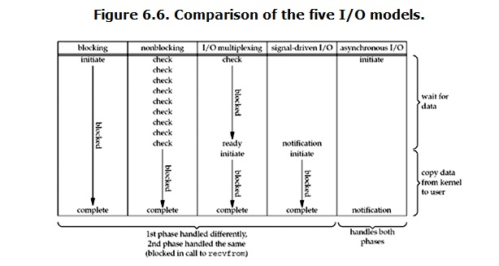
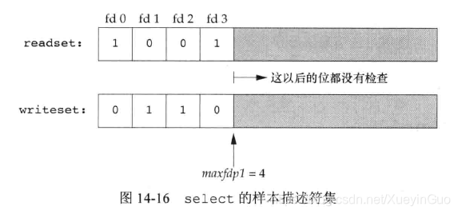
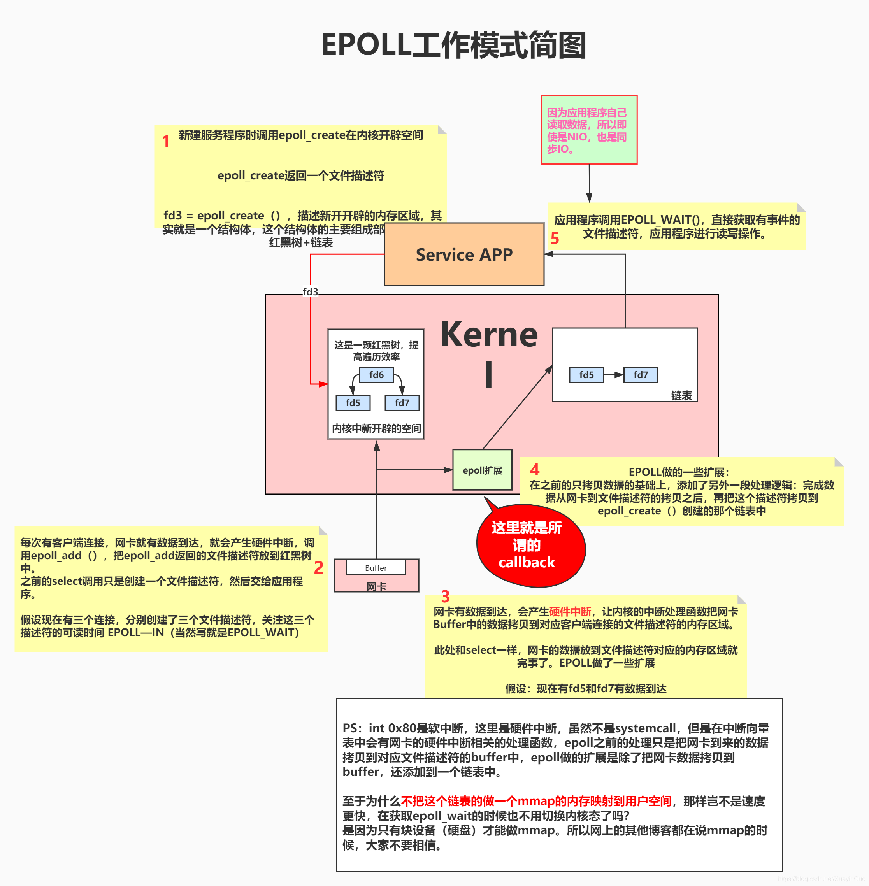

## 数据结构

### 对应关系

```
String:  SDS + 常量(int)

List: QuickList

Hash: ZipList + HashTable

Set: HashTable + IntSet

Sorted Set: ZipList + ZSkipList

Stream: Radix Tree of listpack
```


### SDS (simple dynamic string)

``` 
flags + buf[]

len + alloc + flags + buf[] (len, alloc有uint8、uint16、uint32、uint64四种长度) 
```


**len + alloc + flags 组成头部**

len: 字符串长度

alloc: 整个SDS除了头部与末位\0的字节数

flags: 1字节，前五位未使用，后三位表示头部类型

**buf [ ] : **保存实际字符串元素，以\0结尾

**优势**

- 根据len直接获取字符串长度，O(1)

- 字符串拼接前检查内存空间，防止溢出

- 修改字符串时减少重新分配空间次数

- 以空字符结尾但不以空字符串来判断结束，且以二进制方式处理buf元素，二进制安全

- 兼容部分C字符串函数


### ZipList (压缩列表)

```
zlbytes +zltail + zllen + entry + entry + ... + entry + zlend
4字节     4字节     2字节                                 1字节
```


**zlbytes: ** uint32_t，整个ziplist占用的字节数

**zltail:** uint32_t，最后一个entry的偏移量，用于快速定位最后一个entry，以进行快速pop等操作

**zllen:** uint16_t，所有entry数量，最大65535 (2^16)，entry超过65535时，需要遍历entry才知道实际数量

**zlend:** 终止字符，0xff，故entry不能以255开头

**entry: **

```
prevlen + encoding + entry-data

prevlen + encoding (存储int)
```

**prevlen:** 前一个entry的长度，其小于255时prevlen为1字节，等于255时prevlen为5字节

**encoding:** 当前entry的类型与长度

**entry-data:** entry的实际存储的数据

**encoding前两位表示类型，为11时表示存储int类型，其他表示存储String，当存储int时，没有entry-data，实际存储的int值也放入encoding中**

```
以上为entry的逻辑结构，实际zlentry的实现有7个字段
prevrawlensize: previous_entry_length字段的长度
prevrawlen: previous_entry_length字段存储的内容
lensize: encoding字段的长度
len: 数据内容长度
headersize: 当前元素的首部长度，即previous_entry_length字段长度与encoding字段长度之和
encoding: 数据类型
p: 当前元素首地址
```

**优势**

- 节省内存，尽量让每个元素按照实际的内容大小存储，通过encoding细化存储大小
- 因为数组元素不定长，所以每个元素还需要记录上一个元素的大小

**缺点**

- 不预留内存空间，每次写操作都会有内存分配
- 节点扩容时若内存增长至超过254字节，其后一个节点的prevlen需要从1字节扩容至5字节，极端情况下可能导致链式反应，使得整个ziplist的后续所有节点prevlen字段都要扩容


### QuickList (快表)

```
quicklist 链表定义
	head: 头结点
	tail: 尾结点
	count: 所有entry总数
	fill: 影响节点中ziplist的最大占用空间
	compress: 影响ziplist是否压缩

quicklistNode 链表节点
	prev: 前一个节点
	next: 后一个节点
	zl: ziplist实例
	sz: ziplist占用字节数
	count: ziplist内元素个数

quicklistLZF 压缩ziplist后的结构
quicklistBookmark quicklist尾部书签
quicklistIter quicklist迭代器
quicklistEntry 处理ziplist中entry时的封装结构

```


### Dict (哈希表)

```
dictht
	table: 哈希表
	size: 哈希表大小
	sizemark: 哈希表大小掩码，用于计算索引值
	used: 已有节点的数量

dictEntry table节点
	key
	val
	next
```

相同hash值的dictEntry以链表形式存储，next指向下一个dictEntry


**扩容**

渐进式rehash，**即扩容和收缩操作不是一次性、集中式完成的，而是分多次、渐进式完成的**。如果保存在Redis中的键值对只有几个几十个，那么 rehash 操作可以瞬间完成，但是如果键值对有几百万，几千万甚至几亿，那么要一次性的进行 rehash，势必会造成Redis一段时间内不能进行别的操作。所以Redis采用渐进式 rehash,这样在进行渐进式rehash期间，字典的删除查找更新等操作可能会在两个哈希表上进行，第一个哈希表没有找到，就会去第二个哈希表上进行查找。但是进行增加操作，一定是在新的哈希表上进行的。

### IntSet (整数集)

```
encoding + length + contents
```


**encoding: **编码方式，INTSET_ENC_INT16, INTSET_ENC_INT32, INTSET_ENC_INT64

**length:** 整数个数

**contents:** 存储数值的数组，从小到大排序

```
元素类型的升级：当在一个int16类型的整数集合中插入一个int32类型的值，集合的所有元素都会转换成int32

1.根据新元素的类型（比如int32），扩展整数集合底层数组的空间大小，并为新元素分配空间。
2.将底层数组现有的所有元素都转换成与新元素相同的类型，并将类型转换后的元素放置到正确的位上，而且在放置元素的过程中，需要继续维持底层数组的有序性质不变。
3.最后改变encoding的值，length+1。
4.元素类型只会升级，不会降级。
```


### ZSkipList (跳表)


**头结点**不持有任何数据, 且其level[]的长度为32

**每个结点**

- `ele`字段，持有数据，是sds类型

- `score`字段, 其标示着结点的得分, 结点之间凭借得分来判断先后顺序, 跳跃表中的结点按结点的得分升序排列.

- `backward`指针, 这是原版跳跃表中所没有的. 该指针指向结点的前一个紧邻结点

- `level`字段, 用以记录所有结点(除过头结点外)；每个结点中最多持有32个zskiplistLevel结构. 实际数量在结点创建时, 按幂次定律随机生成(不超过32). 每个zskiplistLevel中有两个字段 
- `forward`字段指向比自己得分高的某个结点(不一定是紧邻的), 并且, 若当前zskiplistLevel实例在level[]中的索引为X, 则其forward字段指向的结点, 其level[]字段的容量至少是X+1. 这也是上图中, 为什么forward指针总是画的水平的原因.
  - `span`字段代表forward字段指向的结点, 距离当前结点的距离. 紧邻的两个结点之间的距离定义为1.


- **skiplist与平衡树、哈希表的比较**

  来源于：https://www.jianshu.com/p/8ac45fd01548

  skiplist和各种平衡树（如AVL、红黑树等）的元素是有序排列的，而哈希表不是有序的。因此，在哈希表上只能做单个key的查找，不适宜做范围查找。所谓范围查找，指的是查找那些大小在指定的两个值之间的所有节点。

  在做范围查找的时候，平衡树比skiplist操作要复杂。在平衡树上，我们找到指定范围的小值之后，还需要以中序遍历的顺序继续寻找其它不超过大值的节点。如果不对平衡树进行一定的改造，这里的中序遍历并不容易实现。而在skiplist上进行范围查找就非常简单，只需要在找到小值之后，对第1层链表进行若干步的遍历就可以实现。

  平衡树的插入和删除操作可能引发子树的调整，逻辑复杂，而skiplist的插入和删除只需要修改相邻节点的指针，操作简单又快速。

  从内存占用上来说，skiplist比平衡树更灵活一些。一般来说，平衡树每个节点包含2个指针（分别指向左右子树），而skiplist每个节点包含的指针数目平均为1/(1-p)，具体取决于参数p的大小。如果像Redis里的实现一样，取p=1/4，那么平均每个节点包含1.33个指针，比平衡树更有优势。

  查找单个key，skiplist和平衡树的时间复杂度都为O(log n)，大体相当；而哈希表在保持较低的哈希值冲突概率的前提下，查找时间复杂度接近O(1)，性能更高一些。所以我们平常使用的各种Map或dictionary结构，大都是基于哈希表实现的。

  从算法实现难度上来比较，skiplist比平衡树要简单得多。
  
  

## 持久化

### RDB

**生成数据快照**

- 手动触发
  - `save命令 ` 阻塞redis服务器，直到RDB进程结束，不推荐
  - `bgsave命令` 创建fork子进程进行RDB持久化，fork进程阻塞，但不阻塞主进程
- 自动触发
  - redis.conf中配置save m n，m秒内有n次操作，自动触发bgsave
  - 主从进行全量复制，自动触发bgsave
  - 执行debug reload命令重新加载redis，自动触发bgsave
  - 执行shutdown命令，如果没有开启AOF，则会触发bgsave

**生成快照时继续响应请求**

生成快照时的数据变化以副本形式存放在新的内存区域，快照操作结束后再同步到原来的内存区域

**生成快照时崩溃**

只要没有将快照写入磁盘就算本次操作失败，以上一次RDB生成的快照为参考恢复数据

**频繁生成快照带来的问题**

- 频繁写入磁盘，增加磁盘压力
- 子进程不影响主进程，但fork创建操作本身阻塞主进程，频繁fork出新的bgsave进程，会阻塞主进程

**优势**

- LZF算法压缩快照，适用于备份复制
- 通过RDB恢复数据比AOF快

**缺点**

- 实时性不够
- 频繁执行fork子进程成本较高
- 二进制文件无法修改或补全
- RDB文件版本兼容问题

### AOF

**同步过程**

- 服务器在执行完一个写命令后，将写命令追加到服务器的 aof_buf 缓冲区
- 将缓冲区的内容写入AOF文件中，有三种策略
  - `always` 写命令执行完立刻写入磁盘
  - `everysec` 每隔一秒将缓冲区内容写入磁盘
  - `no` 由操作系统控制何时将缓存区内容写入磁盘

**AOF重写**

> AOF会记录每个写命令到AOF文件，随着时间越来越长，AOF文件会变得越来越大。如果不加以控制，会对Redis服务器，甚至对操作系统造成影响，而且AOF文件越大，数据恢复也越慢。为了解决AOF文件体积膨胀的问题，Redis提供AOF文件重写机制来对AOF文件进行“瘦身”。


**重写时主进程继续响应请求**

AOF重写时主进程将接受到的命令写入AOF缓冲区，重写完成后子进程通知主进程，主进程将缓冲区的数据追加到子进程的AOF文件中。在高并发时AOF缓冲区内容可能很多导致阻塞，redis使用linux管道技术在AOF重写期间就可以回放缓冲区数据，这样在AOF重写结束后只需回放少量数据。

重写完后用新的AOF文件替换旧的。

**何时触发AOF重写**

两个参数进行控制

- `auto-aof-rewrite-min-size` AOF重写时文件的最小大小，默认为64MB

- `auto-aof-rewrite-percentage` aof增长比例，当前aof文件对比上一次aof文件的增量大小/上一次aof文件大小的比值

**AOF重写时阻塞主线程**

- fork子进程时，需要拷贝虚拟页表，会对主线程阻塞。

- 主进程有bigkey写入时，操作系统会创建页面的副本，并拷贝原有的数据，会对主线程阻塞。

- 子进程重写日志完成后，主进程追加aof重写缓冲区时可能会对主线程阻塞。

### 混合模式

两次RDB快照之间用AOF记录修改，持久化文件以AOF日志文件存储，RDB数据在日志开头，新增命令以AOF格式追加在日志末尾

### 数据恢复

### 降低fork操作阻塞

- 降低fork的频率，比如可以手动来触发RDB生成快照、与AOF重写；

- 控制Redis最大使用内存，防止fork耗时过长；

- 使用更牛逼的硬件；

- 合理配置Linux的内存分配策略，避免因为物理内存不足导致fork失败。

### 线上优化

- 如果Redis中的数据并不是特别敏感或者可以通过其它方式重写生成数据，可以关闭持久化，如果丢失数据可以通过其它途径补回；

- 自己制定策略定期检查Redis的情况，然后可以手动触发备份、重写数据；

- 单机如果部署多个实例，要防止多个机器同时运行持久化、重写操作，防止出现内存、CPU、IO资源竞争，让持久化变为串行；

- 可以加入主从机器，利用一台从机器进行备份处理，其它机器正常响应客户端的命令；

- RDB持久化与AOF持久化可以同时存在，配合使用。


## Copy on Write（写时复制）

#### Linux中的Copy on Write

- `fork()` 创建子进程，子进程是父进程的副本
- `exec()` 在进程中装载一个新的程序（映像），覆盖进程内存空间中的映像，执行时会替换掉进程的内存空间

由于创建子进程一般用于执行与父进程不同的功能，如果按传统做法，在fork时直接复制父进程的数据，随后exec又覆盖子进程的数据，会导致很多时候复制给子进程的数据是无效的，于是有了Copy on Write技术：

- fork()之后，kernel将父进程中所有的内存页都设为read-only
- 子进程的地址空间指向父进程，两者使用的是一个物理空间
- 当父子进程中任意一个要进行写操作时，CPU硬件检测到内存页是read-only的，于是触发页异常中断（page-fault），进入kernel的一个中断例程，中断例程中kernel会把触发的异常的页复制一份专用副本给该进程，其他进程所读到的资源保持不变

**Copy on Write的优点**

- 提升性能，避免了不必要的复制操作，在进程创建时可以显著减少内存分配和复制带来的开销
- 减少内存占用，多个进程共享内存空间，只有需要时才进行复制，减少了内存的消耗
- 适用于读多写少的场景

**Copy on Write的缺点**

- 在频繁写入的场景中，父子进程都需要进行内存的复制，反而可能出现性能下降的情况

#### Redis中的Copy on Write

**RDB**

Redis在进行RDB备份时，会fork一个子进程，子进程负责将内存中的数据写入到磁盘生成 RDB 文件，在这个过程中使用了copy on write机制，主进程与子进程共享相同的内存数据。在执行RDB的过程中，主进程依然正常响应客户端的请求，当需要进行写操作时，则会将内存页复制一份给主进程，子进程继续读取原有的内存数据进行备份

**AOF**

Redis在进行AOF日志重写时，也是通过fork子进程来完成，这个步骤中也用到了copy on write机制


## 发布订阅

### 基于channel

通过字典(哈希表)实现，key为channel，val为订阅该channel的客户端，结构为链表


### 基于pattern

实际上也是通过channel发布消息，只是客户端订阅的channle是以模式记录的。通过链表记录被订阅的模式，链表节点结构为pubsub_patterns ，每个节点包含被订阅的模式与客户端，往channel发布消息时，匹配对应的模式，再把消息发送给客户端


## 批量命令、事务、pipeline (管道)

### 批量命令 (mset、mget)

- 原子性
- 大部分命令不支持批量操作
- 一个命令对应多个key
- 服务端支持实现

### 事务

- 非原子性
- 语法错误会全部回滚，运行时类型错误会跳过错误命令
- multi命令后，每个操作都会放入队列，exec才一次执行
- 可以通过watch监控key
- 连接断开自动清除事务与watch，exec、discard、unwatch也会清除watch
- 服务端支持实现
- 比正常操作稍慢一些？

### pipeline

- 非原子性
- 多个命令一次性打包发送服务端依次处理，服务端会将结果打包返回
- 一次RTT，同时减少了IO调用次数
- 客户端与服务端共同实现
- 性能最好


##  主从复制

### 全量复制（第一次复制）

- replicaof命令形成主从关系

- 建立连接
  - 从库发送psync命令，附带主库runId, offset=-1
  - 主库FULLRESYNC命令响应，代表第一次复制，返回主库runId与当前复制进度offset
- 主库同步所有数据给从库
  - 主库执行bgsave命令，生成RDB文件，发送给从库
  - 从库接收到RDB文件，清空数据库，加载RDB文件
  - 主库在replication buffer中记录RDB文件生成后的写操作
- RDB同步完成后，主库把上一步中replication buffer的数据操作发给从库


### 增量复制

- 主从库断开连接后，主库会将主从差异数据写进环形缓冲区repl_backlog_buffer
- 主库用master_repl_offset记录在repl_backlog_buffer上写到的位置偏移量
- 从库在同步时会记录自身的位置偏移量slave_repl_offset
- 一般master_repl_offset与slave_repl_offset是差不多的，当主从断开连接后，master_repl_offset会比slave_repl_offset大
- 恢复连接后，从库发送psync命令，并带上自身runId, slave_repl_offset
- 主库将master_repl_offset与slave_repl_offset之间的命令发给从库，实现增量同步
- 若环形缓存区上slave_repl_offset位置的数据被覆盖，则只能全量同步
- 可以调整repl_backlog_buffer大小

```
repl_backlog_buffer = 2 * second * write_size_per_second

second: 从库断开连接后，重连主库所需的平均时间
write_size_per_second: 主库平均每秒产生的命令数据量大小（写命令和数据大小总和）
```


### 长连接命令传播

- 完成全量复制后，主从维持一个长连接(避免频繁建立连接)，进行操作同步

- 从库每秒一次向主库发送replconf ack命令，并带上slave_repl_offset
  - 检测网络连接状态
  - 辅助实现 min-slaves 选项
  - 主节点对比master_repl_offset与slave_repl_offset，若从库数据缺失，主库将缺失数据发给从库

### 为什么全量复制使用RDB模式

- RDB文件是经过压缩的二进制文件，传输与磁盘IO效率比AOF高
- 从库根据RDB文件恢复更快
- 使用AOF需要打开AOF功能，配置不当会影响redis性能，而RDB只在定时与全量复制时才打快照


## 哨兵模式

### 哨兵监控库

哨兵向主库发送INFO命令，获取到从库列表，并与从库建立连接，通过连接持续监控节点

### 主库下线

分两步

- 主观下线：任何一个哨兵都可以对主库作出下线判断
- 客观下线：哨兵主观判断主库下线后，给其他哨兵发送is-master-down-by-addr命令，其他哨兵根据自身与主库的连接情况投票，若赞成下线票数 >= 哨兵配置文件中的quorum选项，则判断主库客观下线

### 选举哨兵领导者

Raft算法进行投票，( 得票数 >= num(sentinels)/2+1 ) && ( 得票数 >= quorum ) 的哨兵当选leader

###  新主库选举

- 过滤掉下线、经常断线、没有回复过哨兵ping响应的从节点
- 选择`salve-priority`从节点优先级最高的，salve-priority通过redis.conf配置，数字越小优先级越高
- 若salve-priority相同，选择复制数据最完整的
- 若以上条件都一样，选择id最小的

### 故障转移

- 新主节点执行replicaof no one，解除从节点身份，升级为新主节点
- 从节点执行replicaof new master，变更为新主节点的从节点
- 通知应用程序新主节点的地址
- 将原主节点old master变更为新主节点的从节点


## 集群模式

### 主要模块

**分片（Hash槽）**

总hash长度16384（2^14），每个key都属于某个hash槽（hash slot），每个主节点负责一部分hash槽

**hash tags**

为了保证某些关联的key被分配到同一个slot中，可以对key的某一部分进行hash，从而引入hash tag的概念，key中用大括号{}括起来的部分为hash tag

```bash
例如：
- {user1000}.following和{user1000}.followers这两个key会被hash到相同的hash slot中，因为只有user1000会被用来计算hash slot值。
- foo{}{bar}这个key不会启用hash tag因为第一个{和}之间没有字符。
- foo{bar}{zap}这个key中的bar会被用来计算计算hash slot，而zap不会
```

**节点(node)属性**

每个节点在cluster中有一个唯一的ID。这个名字由160bit随机十六进制数字表示，并在节点启动时第一次获得(通常通过/dev/urandom)。节点在配置文件中保留它的ID，并永远地使用这个ID，直到被管理员使用CLUSTER RESET HARD命令hard reset这个节点。

每个节点维护着集群内其他节点的以下信息：`node id`, `节点的IP和port`，`节点标签`，`master node id`（如果这是一个slave节点），`最后被挂起的ping的发送时间`(如果没有挂起的ping则为0)，`最后一次收到pong的时间`，`当前的节点configuration epoch` ，`链接状态`，以及最后是该节点服务的`hash slots`。

```bash
node id, address:port, flags, last ping sent, last pong received, configuration epoch, link state, slots.
```

CLUSTER NODES命令可以被发送到集群内的任意节点，他会提供基于该节点视角(view)下的集群状态以及每个节点的信息。

```bash
$ redis-cli cluster nodes

d1861060fe6a534d42d8a19aeb36600e18785e04 127.0.0.1:6379 myself - 0 1318428930 1 connected 0-1364
3886e65cc906bfd9b1f7e7bde468726a052d1dae 127.0.0.1:6380 master - 1318428930 1318428931 2 connected 1365-2729
d289c575dcbc4bdd2931585fd4339089e461a27d 127.0.0.1:6381 master - 1318428931 1318428931 3 connected 2730-4095
```

**Cluster总线**

每个Redis Cluster节点有一个额外的TCP端口用来接受其他节点的连接。这个端口与用来接收client命令的普通TCP端口有一个固定的offset。该端口等于普通命令端口加上10000.例如，一个Redis节点在端口6379监听客户端连接，那么它的集群总线端口16379也会被打开。

节点到节点的通讯只使用集群总线，同时使用集群总线协议：有不同的类型和大小的帧组成的二进制协议。集群总线的二进制协议没有被公开文档话，因为他不希望被外部软件设备用来预计群姐点进行对话。

**集群拓扑**

Redis Cluster是一张全网拓扑，节点与其他每个节点之间都保持着TCP连接。 在一个拥有N个节点的集群中，每个节点由N-1个TCP传出连接，和N-1个TCP传入连接。 这些TCP连接总是保持活性(be kept alive)。当一个节点在集群总线上发送了ping请求并期待对方回复pong，（如果没有得到回复）在等待足够成时间以便将对方标记为不可达之前，它将先尝试重新连接对方以刷新与对方的连接。 而在全网拓扑中的Redis Cluster节点，节点使用gossip协议和配置更新机制来避免在正常情况下节点之间交换过多的消息，因此集群内交换的消息数目(相对节点数目)不是指数级的。

**节点握手**

节点总是接受集群总线端口的链接，并且总是会回复ping请求，即使ping来自一个不可信节点。然而，如果发送节点被认为不是当前集群的一部分，所有其他包将被抛弃。

节点认定其他节点是当前集群的一部分有两种方式：

1. 如果一个节点出现在了一条MEET消息中。一条meet消息非常像一个PING消息，但是它会强制接收者接受一个节点作为集群的一部分。节点只有在接收到系统管理员的`CLUSTER MEET ip port`命令后，才会向其他节点发送MEET消息：

2. 如果一个被信任的节点gossip了某个节点，那么接收到gossip消息的节点也会那个节点标记为集群的一部分。也就是说，如果在集群中，A知道B，而B知道C，最终B会发送gossip消息到A，告诉A节点C是集群的一部分。这时，A会把C注册未网络的一部分，并尝试与C建立连接。

这意味着，一旦我们把某个节点加入了连接图(connected graph)，它们最终会自动形成一张全连接图(fully connected graph)。这意味着只要系统管理员强制加入了一条信任关系（在某个节点上通过meet命令加入了一个新节点），集群可以自动发现其他节点。

### 请求重定向

#### Moved

- 收到命令的节点通过crc16（key）/16384计算出slot，查询该slot得到节点指针，将其与自身比较
- 槽命中，执行命令
- 槽未命中，向客户端返回moved重定向
- 客户端从moved中获取目标节点的信息，再一次向目标节点发送命令，得到响应结果


#### Ask

Ask重定向发生于集群伸缩时，集群伸缩会导致槽迁移，当我们去源节点访问时，此时数据已经可能已经迁移到了目标节点

- 客户端向目标节点发送命令
- 目标节点处于迁移/导入状态时，返回Ask重定向
- 客户端向新目标节点发送Asking命令，并再次发送请求命令
- 新目标节点执行命令并返回结果


### 状态监测与维护

Cluster中的每个节点都维护一份在自己看来当前整个集群的状态，主要包括：

- 当前集群状态
- 集群中各节点所负责的slots信息，及其migrate状态
- 集群中各节点的master-slave状态
- 集群中各节点的存活状态及不可达投票

当集群状态变化时，如`新节点加入`、`slot迁移`、`节点宕机`、`slave提升为新Master`，我们希望这些变化尽快的被发现，传播到整个集群的所有节点并达成一致。节点之间相互的**心跳**（PING，PONG，MEET）及其携带的数据是集群状态传播最主要的途径。

#### gossip协议

// TODO

### 扩容/缩容
**扩容**
当集群出现容量限制或者其他一些原因需要扩容时，redis cluster提供了比较优雅的集群扩容方案。

1. 首先将新节点加入到集群中，可以通过在集群中任何一个客户端执行cluster meet 新节点ip:端口，或者通过redis-trib add node添加，新添加的节点默认在集群中都是主节点。
2. 迁移数据 迁移数据的大致流程是，首先需要确定哪些槽需要被迁移到目标节点，然后获取槽中key，将槽中的key全部迁移到目标节点，然后向集群所有主节点广播槽（数据）全部迁移到了目标节点。直接通过redis-trib工具做数据迁移很方便。 现在假设将节点A的槽10迁移到B节点，过程如下：

```bash
B:cluster setslot 10 importing A.nodeId
A:cluster setslot 10 migrating B.nodeId
```

循环获取槽中key，将key迁移到B节点

```bash
A:cluster getkeysinslot 10 100
A:migrate B.ip B.port "" 0 5000 keys key1[ key2....]
```

向集群广播槽已经迁移到B节点

```bash
cluster setslot 10 node B.nodeId
```
**缩容**

缩容的大致过程与扩容一致，需要判断下线的节点是否是主节点，以及主节点上是否有槽，若主节点上有槽，需要将槽迁移到集群中其他主节点，槽迁移完成之后，需要向其他节点广播该节点准备下线（cluster forget nodeId）。最后需要将该下线主节点的从节点指向其他主节点，当然最好是先将从节点下线


## 穿透、击穿、雪崩、污染

### 穿透

缓存和数据库中都没有

- 接口增加校验，如鉴权、参数过滤
- 数据库也查不到的数据，设置key-null存在缓存中，防止同一个key反复攻击
- 布隆过滤器

### 击穿

缓存中没有或过期，数据库中有

- 热点数据永不过期
- 接口限流或熔断、降级
- 加互斥锁

### 雪崩

大量缓存失效，且查询量巨大

- 热点数据永不过期
- 过期时间随机，防止同一时间大量数据失效
- 分布式架构下，将热点数据均匀分布在不同的数据库中

### 污染、写满

污染：只被访问一次或几次的数据一直留在缓存中

缓存容量一般设置为总数据量的15% - 30%

#### 淘汰策略

- 淘汰设置了过期时间的数据
  - `volatile-random`  随机淘汰
  - `volatile-ttl`  越早过期的数据越早淘汰
  - `volatile-lru` 随机选取N个数据，淘汰最近一次访问时间最久的数据
  - `volatile-lfu`  淘汰访问次数最低的数据，访问次数相同时淘汰最近一次访问时间最久的
- 淘汰所有数据
  - `allkeys-random`  随机淘汰
  - `allkeys-lru`  与上述lru一样，只是数据为全部缓存数据
  - `allkeys-lfu`  与上述lfu一样，只是数据为全部缓存数据

- 不淘汰
  - `noeviction`  写满之后，再来写请求直接报错，**默认策略**

**LRU（最近最少访问）**

标准LRU实现是通过双向链表+hash表的方式，当有元素被访问，则通过hash表查找到该元素位置，将该元素移动到队尾，淘汰时直接淘汰队头即可

**近似LRU**

Redis中没有使用标准的LRU实现，而是使用了一种近似LRU的算法

- 每个key内维护了一个24位的时间戳字段lru，记录了最近一次访问该key的时间，lru值越小说明越容易被淘汰
- redis维护了一个淘汰候选池，大小为16，候选池内的key按最近访问时间lru降序排列
- 每次随机采样5个key，当候选池为空时直接放入，当候选池不为空时，采样的key若其lru小于候选池内最大的lru，则key进入候选池（也可理解为lru比候选池内的任意lru小则进入池中）
  - 采样数量由`maxmemory-samples`参数决定，默认是5，配置的越大越接近LRU的效果，但也越消耗cpu
- 当池满了还要往里添加key时，将池内最大lru的key移除出候选池
- 当执行淘汰时，将池内最小的lru进行淘汰

**为什么使用近似LRU**

- 标准的LRU使用双向链表+hash表，redis中没有双向链表的数据结构，要实现的话还要增加数据结构
- 使用标准LRU的话，除了对key本身的存储外，还需要额外维护一个双向链表来实现淘汰策略，增加内存消耗
- 除此之外，每次对key的访问都需要更新双向链表，影响性能
- 使用近似LRU是**牺牲了一定的准确性但大大提升了性能**

**LFU（最小访问频率）**

实现思路

- 每次访问key，对key的频率（或计数）+1，当达到定义的最大容量时，淘汰掉频率最低的key，然后写入新key，新key的频率为1
- 定义基本数据节点node，包含key，value，frequency，这里的frequency也可以用计数理解

- 用双hash表进行实现，一个dataMap存储key - node，一个frequencyMap存储frequency - node，由于会有同样频率的key，所以是frequency - List\<node>
- 定义一个全局最小频率minFrequency，在操作时更新这个minFrequency，需要淘汰时根据minFrequency取数据进行淘汰
- 访问key时，先根据key查找到node，然后根据node.frequency找到他在frequencyMap所在的列表，node.frequency++，并更新node在frequencyMap中的位置。（在node.frequency++前判断，如果该列表只有一个node且node.frequency == minFrequency，说明这个node就是当前最小频率的节点，node.frequency++同时还需要minFrequency++）
- 新增key时，如果key已存在，则按上一步更新相关map，如果key之前不存在，判断是否需要进行数据淘汰，如果需要进行淘汰，根据minFrequency找到访问频率最低的node列表，remove一个node。添加新node时，将新node加入frequencyMap中frequency为1的列表中，且minFrequency置为1

**Redis中的LFU实现**

- 将前面讲到的lru字段拆成两部分，16位记录时间戳，8位表示热度值counter，8位最大能表示255
- 当key被访问时，如果counter<5，则counter++
- 如果counter>=5，则选取一个[0，1)之间的随机数r，并计算`1.0/((counter - 5) * lfu_log_factor+1)` 增长概率p，当p>r时才counter++，lfu_log_factor默认为10，当counter越大，++的概率就越小（增长的越慢），lfu_log_factor越大，++的概率也越小
- 当counter==255时则不再增长
- 当key被访问时，同时会对key的counter进行衰减，避免长时间的访问无限期的影响内存淘汰策略
- 衰减会计算当前时间-lru，根据时间差与`lfu_decay_time`参数对counter进行扣除，lfu_decay_time默认是10/分钟，如key过了2分钟，则counter = counter - 20
- 当进行淘汰时，也是类似LRU的候选池策略，随机选择N个key放入候选池，当key比候选池内的任意counter小则入池，淘汰时将池内counter最小的key淘汰掉

**为什么使用近似LFU**

主要目的也是牺牲部分准确性而提升性能

## IO多路复用

### 用户态与内核态

Linux操作系统的体系架构分为用户态和内核态（用户空间和内核空间），Linux操作系统和驱动程序运行在内核空间，应用程序运行在用户空间。

- 操作系统的核心是内核（kernel），独立于普通的应用程序，可以访问受保护的内存空间，也有访问底层硬件设备的所有权限。

  > 内核从本质上看是一种软件，控制计算机的硬件资源，并提供上层应用程序运行的环境。

- 用户态即上层应用程序的活动空间，应用程序的执行必须依托于内核提供的资源，包括CPU资源、存储资源、I/O资源等。为了使上层应用能够访问到这些资源，内核必须为上层应用提供访问的接口：即系统调用。

  > 只能受限的访问内存，且不允许访问外围设备，占用cpu的能力被剥夺，cpu资源可以被其他程序获取。

### 文件描述符fd（File descriptor）

文件描述符（File descriptor）是计算机科学中的一个术语，是一个用于表述指向文件的引用的抽象化概念。

fd是一个索引值，形式上为一个非负整数，指向进程所打开的文件的记录表。当进程打开一个文件或创建一个新文件时，内核会向该进程返回一个fd

### 缓存IO

缓存IO即标准IO，在linux缓存IO机制中，操作系统会先将IO数据缓存在文件系统的页缓存（Page Cache）中，即数据先拷贝到操作系统内核的缓冲区中，然后再从系统内核缓冲区拷贝到应用程序的地址空间。即先写内核缓冲区，再写应用程序空间。

**缺点**：数据传输过程中需要多次在应用程序地址空间与内核之间进行数据拷贝，其CPU与内存开销很大

### IO模式

以应用进程read操作为例，整个操作会经历两个阶段：

- 等待数据准备，此时数据正在拷贝到内核缓冲区
- 将数据从内核缓冲区拷贝到应用进程

由于有这两个阶段，linux操作系统由此产生了五种IO模式：

- 阻塞式IO（blocking IO）
- 非阻塞式IO（nonblocking IO）
- IO多路复用（IO multiplexing）
- 异步IO（asynchronous IO）
- 信号驱动 IO（ signal driven IO）*不常用*

#### 阻塞式IO（blocking IO）

linux中默认情况下所有的socket都是blocking IO，一个read操作的流程大致为：

- 用户进程发起recvfrom系统调用
- kernel准备数据（用户进程阻塞）
- 数据准备好了，kernel拷贝数据到用户内存（用户进程阻塞）
- kernel返回结果

在这个过程中，用户进程从发起系统调用到获取结果，中间一直是阻塞的。


#### 非阻塞式IO（nonblocking IO）

nonblocking socket执行read操作：

- 用户进程发起recvfrom系统调用
- kernel还未准备好数据，返回error
- 用户进程获取到error结果，知道数据还未准备好，重复发起read操作（用户进程不阻塞）
- kernel若还未准备好数据，继续返回error，若已准备好，则将数据拷贝到用户进程
- kernel返回结果

nonblocking IO不阻塞用户进程，而用户进程需要不断主动询问kernel数据是否已经准完成。


#### IO多路复用（IO multiplexing）

以select为例：

- 用户进程调用select
- kernel准备数据（用户进程阻塞），同时监视所有select负责的socket
- socket中的数据准备好了，select返回
- 用户进程调用recvfrom
- kernel拷贝数据到用户内存
- kernel返回结果

整个过程跟blocking IO差不多，甚至更差一些，因为多了一次系统调用，blocking IO只要调用一次recvfrom就可以了，**IO多路复用的优势并不在于对单个连接可以处理的更快，而是可以同时处理多个连接**

**实际IO multiplexing中的每个socket，一般会设置成non-blocking**


#### 异步 IO（asynchronous IO）

- 用户进程发起异步IO调用
- kernel接收到请求后立刻返回，从而不阻塞用户进程
- kernel准备数据，完成后拷贝到用户内存
- kernel向用户进程发送一个signal，告知用户进程read操作已完成

异步IO与其他IO模式的区别在于，异步IO是完全不阻塞用户进程的，即使是非阻塞式IO，在进行recvfrom调用时，等待数据拷贝到用户内存的过程中也是阻塞的，而异步IO发起调用之后就直接返回了，不需要检查IO操作的状态，也不需要主动去拷贝数据，直到kernel通知用户进程IO操作结束，整个过程中用户进程都没有被block。


各个IO模型的比较：




### IO多路复用详解

IO多路复用可以实现一个进程监视多个文件描述符fd，一旦某个fd就绪（读/写），能够通知应用程序进行相应的读写操作。

#### select

```c++
/**
n: 最大文件描述符+1
readfds: 读文件描述符
writefds: 写文件描述符
exceptfds: 异常文件描述符
timeval: 超时时间
**/
int select (int n, fd_set *readfds, fd_set *writefds, fd_set *exceptfds, struct timeval *timeout);
```

select函数监视的文件描述符分3类，分别是writefds（写）、readfds（读）、和exceptfds（异常）。用户进程调用select函数后会阻塞，直到有fd就绪或超时，函数返回，随后用户进程通过遍历fdset来找到就绪的fd。

```c++
// 用户进程调用select函数示例
fdset readset, writeset;
FD_ZERO(&readset);	// 清空集合
FD_ZERO(&writeset);	// 清空集合
FD_SET(0, &readset); // 根据给定的文件描述符对fd_set进行设置
FD_SET(3, &readset); 
FD_SET(1, &writeset); 
FD_SET(2, &writeset); 
max_fd = 4;	// 设置max为最大fd+1
int a = select(4, &readset, &writeset, NULL, NULL);	// 调用select
// 处理返回结果
if(a > 0){   //系统调用完成后，返回可读可写的数量之和
    for(i=0; i<4; ++i){
        if(FD_ISSET(i, readset)){	// 检查到i可以进行读
            //业务操作
        }
        if(FD_ISSET(i, writeset)){	// 检查到i可以进行写
            //业务操作
        }
    }
}
```



- 用户进程调用select函数，在调用之前需要准备参数
- 比如有多个fd需要读写，每个fd都是一个非负整数，设定n为最大fd+1，用以标识需要处理的fd
- 参数中的fd_set并不是多个fd直接的集合，而是一个bitmap，以二进制位1表示该位对应的fd需要进行读写，如fd为[1，3]，fd_set置为0101，fd_set最长1024位
- 随后调用select，select阻塞
- linux将fd_set从用户态拷贝到内核态，对fd_set不断进行遍历，检查其对应的fd是否已经就绪（可读/可写）
- 当某个fd就绪后，内核会对该fdset对应的位置进行置位，当一个或多个fd就绪后，select函数返回，返回值为可读写的fd数量之和
- 用户进程接收到返回值后，对fdset进行遍历，来找到就绪的描述符

**优点：**

- 跨平台
- 将fdset拷贝到内核态进行遍历，比在用户态遍历更快

**缺点：**

- 单个进程能监视的fd有数量限制，受fdset长度限制，最多为1024个（32位机为1024个，64位机位2048个）
- fdset不可重用，每次都要重新赋值
- 每次都要把fdset从用户态拷贝到内核态，这个操作的开销很大
- select返回后，用户进程还需要遍历结果才能获取到就绪的fd

#### poll

```c++
/**
fds: fd构建的pollfd数组
nfds: fd数量
timeout: 超时时间
**/
int poll (struct pollfd *fds, unsigned int nfds, int timeout);

struct pollfd {
    int fd; // 文件描述符
    short events; // 进程需要监控的事件（读/写）
    short revents; // 事件对应的结果，初始为0
};
```

poll函数在select的基础之上进行了改进，把fd_set这个bitmap改成了由pollfd结构体所组成的一个数组，解决了bitmap有长度限制的问题，其他处理流程则类似，linux将fds数组拷贝到内核态，不断进行遍历检查，当发现有fd就绪以后，就将该pollfd内的revents置为1，poll函数结束后，同样返回已就绪的fd数量之和，用户进程需要遍历fds检查revents字段获取已就绪的fd。

**优点：**

- 解决了select中有最大长度限制的问题（虽然poll可处理的fd没有数量限制，但随着要监视的fd数量的增长，其效率也会线性下降）
- 解决了select中fds不可重用的问题，内核每次只操作pollfd中的revents字段，用户进程可以将revents重新置为0，从而使pollfd可以重用

**缺点：**

- poll是在select基础上改进的，所以将pollfd集合从用户态拷贝到内核态、返回后用户进程需要遍历获取结果这两个问题依然没有解决

#### epoll

```c++
/**
创建一个epoll实例，返回值是一个fd，该fd表示的是内核中的一块区域
size: 标识监听的fd数量最大有多少，自linux2.6.8之后，该参数被忽略，不起任何作用
**/
int epoll_create(int size);

/**
注册要监听的事件类型
epfd: epoll_create的返回值
op: EPOLL_CTL_ADD-添加一个fd的监听事件，EPOLL_CTL_DEL-删除一个监听事件，EPOLL_CTL_MOD-修改一个监听事件
fd: 需要监听的fd
event: 内核具体要监听的事件类型（读，写...）
**/
int epoll_ctl(int epfd, int op, int fd, struct epoll_event *event);

/**
events可以是以下几个宏的集合：
EPOLLIN ：表示对应的文件描述符可以读（包括对端SOCKET正常关闭）；
EPOLLOUT：表示对应的文件描述符可以写；
EPOLLPRI：表示对应的文件描述符有紧急的数据可读（这里应该表示有带外数据到来）；
EPOLLERR：表示对应的文件描述符发生错误；
EPOLLHUP：表示对应的文件描述符被挂断；
EPOLLET： 将EPOLL设为边缘触发(Edge Triggered)模式，这是相对于水平触发(Level Triggered)来说的。
EPOLLONESHOT：只监听一次事件，当监听完这次事件之后，如果还需要继续监听这个socket的话，需要再次把这个socket加入到EPOLL队列里
**/
struct epoll_event {
  __uint32_t events;  // 内核要监听的事件类型
  epoll_data_t data;  // 用户数据
};

/**
监听epoll_ctl注册的fd和事件，返回已就绪的fd数量
epfd: epoll_create的返回值
events: epoll_ctl中注册的事件列表
maxevents: events大小
timeout: 超时时间
**/
int epoll_wait(int epfd, struct epoll_event * events, int maxevents, int timeout);
```

- 用户进程调用epoll_create创建一个epoll实例，epoll_create会创建一个红黑树和一个就绪链表，红黑树用来存储epoll_ctl添加的事件，就绪链表用来存储已就绪的fd和事件
- 调用epoll_ctl注册事件列表，在使用EPOLL_CTL_ADD添加事件时，会为fd指定一个回调函数，添加的事件以红黑树的形式存储，防止重复注册，同时在调用epoll_ctl时，会将所有的fd从用户态拷贝到内核态
- 内核监控已注册的fd和事件，当有fd就绪时，便调用回调函数，将已就绪的fd和事件放入就绪链表中
- 调用epoll_wait监听就绪链表，当链表中有数据了，epoll_wait返回已就绪的fd数量，由于就绪链表中的数据是fd就绪后依次添加的，所以只需要遍历链表中前n个数据即可，n为epoll_wait的返回值

> 网上说epoll用了mmap技术进行内存共享的说法是错误的，epoll并没有用到mmap，所以依然有用户态和内核态的内存拷贝

**两种工作模式**

epoll有两种工作模式：LT（level trigger）和ET（edge trigger）

**LT（水平触发 level trigger）**

- 当epoll_wait检测到fd对应的事件发生时（可读/可写）并通知用户进程，用户进程**可以不立即**处理该事件，下次调用epoll_wait时，会向应用程序再次通知该事件
- epoll默认使用的是LT模式，同时支持block和no-block socket

**ET（边缘触发 edge trigger）**

- 当epoll_wait检测到fd对应的事件发生时（可读/可写）并通知用户进程，用户进程**必须立即**处理该事件，下次调用epoll_wait时，不会向应用程序再次通知该事件
- ET模式减少了事件被重复触发的次数，效率更高，只支持no-block socket

**简单来说就是当fd可读/写之后，如果应用进程只读/写了一部分数据就结束此次操作，LT模式下该fd依然还可以继续读/写，而ET模式下该fd会变为不可读/写，直到下次事件触发。这就要求ET模式下，当fd可读/写之后，用户进程需要一次把数据都读/写完。**

> JDK默认使用的是LT模式，Netty使用的是ET模式

**优点：**

- 监控的fd数量不受限制，且随着监视的fd数量增长，IO效率并不会下降，因为epoll并不是去轮询fd列表，而是当fd就绪时调用回调函数，只有当fd就绪时才会调用回调函数，效率更高
- epoll只返回就绪的fd，所以用户进程获取结果不需要遍历整个fd列表

> 虽然epoll的性能最好，但是在连接数不多且连接都很活跃的情况下，epoll的性能不一定比select和poll好，因为epoll的通知机制需要很多函数回调



## 多线程

用于网络IO与协议解析，执行命令仍然是单线程顺序执行


## Redis优化

### 突然变慢

- 通过慢查询slowlog定位
- 持久化导致变慢
  - RDB中fork子进程在执行时可能导致延迟
  - AOF写入磁盘策略配置不对
- 使用了linux内存大页（THP特性）
- 大量key同时到期导致性能波动
- 使用了大key
  - 拆分大key
  - 不必要的数据不用存入key
  - 使用unlink命令异步清理大key

### 使用优化

- 尽量缩短存储内容长度，减小key的大小
- 开启free lazy延迟删除配置
- 不使用耗时长的命令：keys、scan、hscan等
- 限制内存大小并配置合适的淘汰策略，避免内存不够时触发swap

>当物理内存不够用的时候，将部分内存上的数据交换到 swap 空间上，以便让系统不会因内存不够用而导致 OOM 或者更致命的情况出现。
>
>当某进程向 OS 请求内存发现不足时，OS 会把内存中暂时不用的数据交换出去，放在 SWAP 分区中，这个过程称为 SWAP OUT。
>
>当某进程又需要这些数据且 OS 发现还有空闲物理内存时，又会把 SWAP 分区中的数据交换回物理内存中，这个过程称为 SWAP IN。
>
>**内存 swap 是操作系统里将内存数据在内存和磁盘间来回换入和换出的机制，涉及到磁盘的读写。**


### 性能优化


## 

