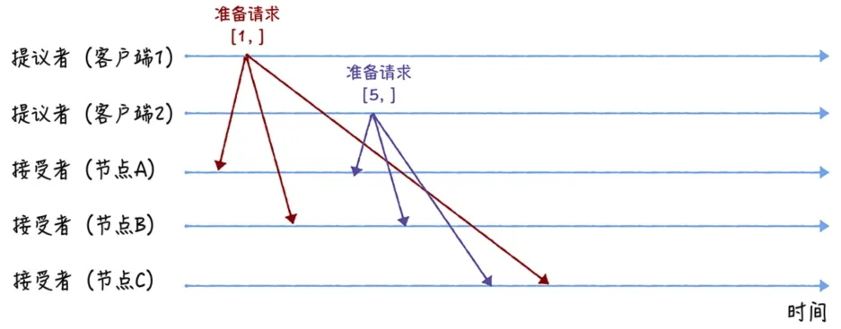
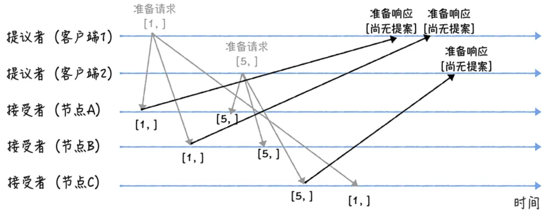
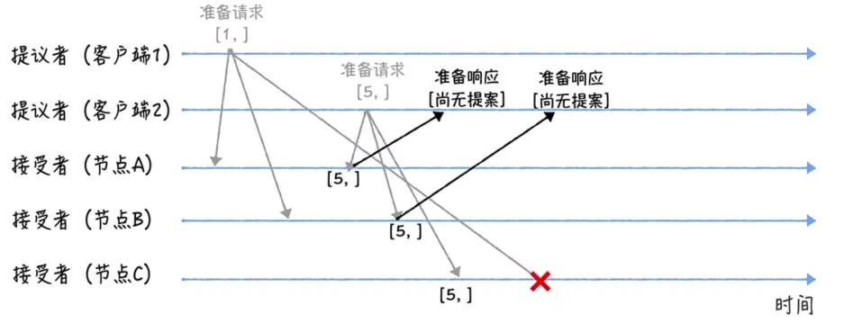
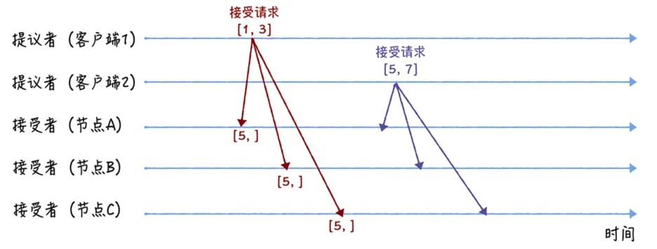
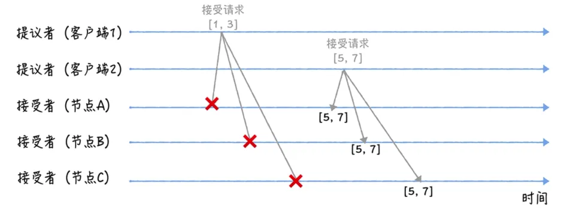
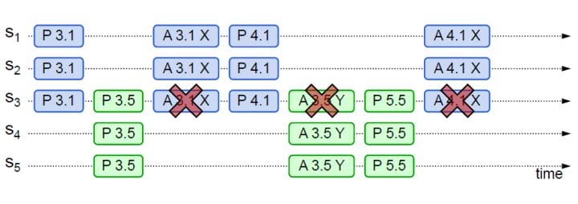
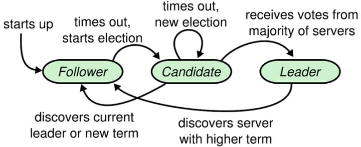
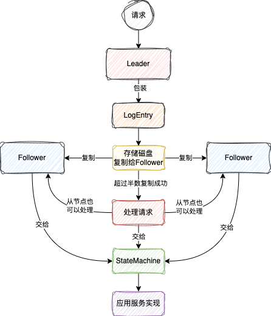
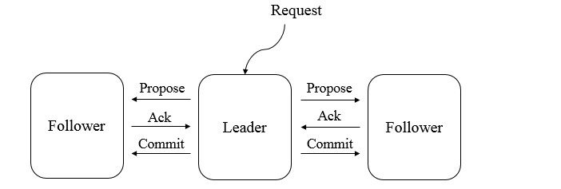

## 理论基础

### CAP理论

- Consistency（一致性 ）

> 一个写操作返回成功，那么之后的读请求都必须读到这个新数据；如果返回失败，那么所有读操作都不能读到这个数据。所有节点访问同一份最新的数据。

- Availability（可用性 ）

> 对数据更新具备高可用性，请求能够及时处理，不会一直等待，即使出现节点失效。

- Partition tolerance（分区容错性）

> 能容忍网络分区，在网络断开的情况下，被分隔的节点仍能正常对外提供服务。

不是CAP三选二，而是CA中二选一，因为P分区容错性是必选

AP：保证可用性，当节点异常时允许部分节点提供服务，从而会出现数据不一致

CP：保证一致性，当节点异常时需要等待集群达成新的一致状态再提供服务，过程中服务不可用

### BASE理论

由CAP演化而来，可理解为AP方案的一种补充，核心思想是：牺牲强一致性保证可用性，允许数据在一段时间内不一致，但最终要达到一致性状态

- Basically Available（基本可用）

> 分布式系统在出现不可预知故障的时候，允许损失部分可用性。

- Soft state（软状态）

> 也称为弱状态，和硬状态相对，是指允许系统中的数据存在中间状态，并认为该中间状态的存在不会影响系统的整体可用性，即允许系统在不同节点的数据副本之间进行数据同步的过程存在延时。

- Eventually consistent（最终一致性）

> 系统中所有的数据副本，在经过一段时间的同步后，最终能够达到一个一致的状态。因此，最终一致性的本质是需要系统保证最终数据能够达到一致，而不需要实时保证系统数据的强一致性。

## 一致性协议

### Paxos算法

#### 角色

- Proposer：发起提案Proposal
- Acceptor：对提案进行投票，决定是否接受
- Learner：学习提案结果

#### 算法过程

过程类似于二阶段提交，分为两个阶段，Prepare阶段和Accept阶段

**Prepare阶段**

- Proposer发起提案，携带提案编号n，向半数以上的Acceptor发送，用[n, v]表示一个提案，v为提议值
- Acceptor对比提案编号，若n比自己以前接受过的提案小则不响应，Acceptor回复以前接受过的最大提案的值
  - 接受到Prepare请求后，Acceptor不再接受提案编号<=n的Prepare请求（后面只接受>n的Prepare请求）
  - Acceptor不再接受提案编号<n的Accept请求（还要处理n的Accept阶段，所以是接受>=n的Accept请求）
- Acceptor若没接受过提案则返回空值

**Accept阶段**

#### 过程示例

**Prepare阶段**

假设此时为初始状态，还未通过任何提案

1）两个Proposer1、2先后发起提案，提案编号分别为1、5，prepare阶段不用指定提议值

注意这里节点C先接受到编号为5的提案

2）Acceptor回复请求，由于此前未通过任何提案，Acceptor在回复中告知Proposer尚无提案

这里节点C由于先接受到提案5，所以不再接受<=5的prepare请求，当其接受到提案1的prepare请求时丢弃不响应

**Accept阶段**

1）Proposer在接受到过半响应后，发送Accept请求，由于Acceptor回复的值为空，故Proposer自己指定提议值，Proposer 1指定提案[1, 3]，Proposer 2指定提案[5, 7]

2）Acceptor在接受到提案5的prepare请求后，不再接受<5的Accept请求，故提案[1, 3]将被Acceptor丢弃不响应，而接受提案[5, 7]，节点ABC达成共识，Proposer在收到过半回复后说明提案被接受，发送提案给Leaner

#### 活锁

多个Proposer频繁发起提案，可能导致Accept请求不断被新的Prepare打断，从而出现不断的资源抢占，无法达到接受状态

在Proposer提案失败后等待一个随机时间，减少同时出现Proposer提案的几率

#### Multi-Paxos

Basic Paxos只能对一个值形成决议，过程需要多次网络通信，且可能形成活锁，如果想连续确定多个值，Basic Paxos并不使用。因此**Basic Paxos几乎只是用来做理论研究**，并不直接应用在实际工程中。

原作者由此提出Multi-Paxos思想，对Basic Paxos作出改进：

- 选举leader，由唯一leader进行提案，避免了出现活锁
- 省略Prepare阶段，由leader统一进行提案时，直接进入Accept阶段，提升效率

> 原作者提出的Multi-Paxos只是一种思想，对其具体实现与leader选举并没有描述，有其他人对其进行了实现

Multi-Paxos允许有多个自认为是Leader的节点并发提交Proposal而不影响其安全性，这样的场景即退化为Basic Paxos

### Raft算法

#### 角色

- Leader：统一接收客户端请求，并与Follower同步日志
- Follower：负责复制Leader的数据，保证跟Leader的数据一致性
- Candidate：选举过程中的临时角色

**状态转换**

#### 日志同步

- Leader接收到请求时，会将请求数据封装成LogEntry对象，并给每个LogEntry设置一个inde，LogEntry中还包含当前Leader所在任期的term编号，日志通过追加写入，类似于Redis的AOF

> 追加式的日志写入会占用越来越大的磁盘空间，Raft通过快照对日志文件进行优化，类似于Redis的RDB

- Leader会为每个Follower创建一个Replicator（复制器），Replicator会不断地将LogEntry发送给Follower
- 当LogEntry被过半的Follower同步成功，Leader才会响应客户端，对该请求进行实际的业务处理

#### Leader选举

- 服务启动时，节点都初始化为Follower，当Follower超过一定时间没有收到Leader的心跳，Follower会开始选举，每个Follower的超时时间都不一样

> Raft中的心跳包与日志复制是同一种请求，只是携带的内容不一样，心跳包只能由Leader发出

- 每次选举称为一个任期term
- Follower转换为Candidate，自身的term+1，向其他节点发起投票，并投自身一票
- 节点接收到投票请求后，对比投票请求中的term与自身的term，决定投票决策
  - 如果对方term更大，投给对方
  - 如果自身term更大，忽略投票请求
  - 如果term一样，比较日志谁更新，如果自身的日志更新则忽略投票请求，否则投给对方
  - 先到先得，一人一票
- 如果没有candidate拿到一半以上票数，即选举失败，candidate会在自身超时时间后term+1重新发起选举

>  每个节点的选举超时时间都是随机的，很大程度上可以避免多个candidate同时发起选举导致出现僵持

- 旧leader恢复后，发现新leader term比自己大，自身转换成follower

### ZAB协议

`Zookeeper Atomic Broadcast`（Zookeeper原子消息广播协议），是专门为Zookeeper设计的一种支持崩溃恢复的协议，ZAB的核心包括**消息广播**与**崩溃恢复**

#### 消息广播

ZAB协议的消息广播，是一个类似于二阶段提交的过程

- leader接收到事务请求，生成唯一ZXID（事务ID）
- leader与每个follower之间都有一个FIFO的队列，leader将请求作为提案发送到这些队列广播给所有follower
- follower接收到请求，将事务写到本地磁盘但不提交，随后返回确认给leader
- leader收到超过半数的确认，广播commit消息给所有follower进行事务提交
- leader本地也会提交事务并返回结果给客户端

对比完整的二阶段提交，ZAB是一种简化版的模型，移除了中断逻辑（不能终止事务），意味着follower要么正常反馈leader的事务请求，要么抛弃leader服务器。同时ZAB不需要等待所有follower作出响应，只需要过半的ACK即可进行事务的提交，提升了性能。但当leader节点崩溃时，会出现集群中节点数据不一致的问题，由此ZAB引入了崩溃恢复机制

#### 崩溃恢复

##### 选举

**启动时选举**

在ZAB中，每个节点可能处于四种状态之一：

- `LEADING`，leader服务器处于领导状态
- `FOLLOWING`，follower服务器与leader保持同步状态
- `LOOKING`，选举阶段
- `OBSERVING`，observer服务器与leader保持同步状态，observer与follower一样可以提供读服务，但observer不参与选举，也不参与事务的过半写策略

集群启动时所有节点都处于LOOKING状态，此时不存在leader，随后会进入选举阶段，选举出的leader进入LEADING状态，其他节点切换为FOLLOWING并与leader保持同步。当leader崩溃或放弃领导地位时，其余的follower会切换到LOOKING状态开始新一轮选举。启动时选举的过程如下：

- 初始阶段，每个节点都会将自己作为leader来进行投票，每次投票包含推举的服务器myid与最大事务ZXID
- 每个节点都投给自己，然后将投票信息发送给其他节点
- 每个节点收到集群中的投票信息后，将其与自己的投票进行对比，并将更新后的投票信息广播出去
  - ZXID大的优先，ZXID相同的情况下myid大的优先
- 统计投票数据，拿到大于一半投票的节点当选为leader，状态改为LEADING
- 其他节点更改自身状态为FOLLOWING或OBSERVING

**运行时选举**

当leader崩溃会放弃领导地位时，follower会切换到LOOKING状态开始新一轮选举，投票过程以及比较规则与启动时选举一致

> leader选举出来后，集群内的角色一般不会发生变化，leader与follower之间通过心跳检测来感知节点的情况，如果指定时间内leader无法从过半的follower获取到心跳，leader会放弃当前周期的领导，并切换到LOOKING状态，其他follower也会放弃这个leader并切换到LOOKING状态

##### 同步

完成leader选举后，在正式开始工作（提供服务，接收客户端的请求）之前，leader会确认事务日志中的所有提案是否都已经被集群中的过半节点提交了，即是否完成数据同步

- leader会将那些没有被follower同步的事务以提案的形式发送给follower，并紧接着发送一个commit消息进行事务提交
- 等到follower完成了与leader的数据同步之后，leader才会将该节点加入到真正可用的follower列表之中
- 同步阶段确保过半的follower已经提交了leader中的所有事务，保证在下一个事务提案前，集群内已完成之前事务的提交

##### 解决问题

ZAB协议在崩溃恢复中要解决的两个问题：

**已经处理的事务请求不能丢**

写事务请求时，leader收到过半的ACK后准备广播commit给follower，但如果在发送commit消息前 leader就崩溃了，会导致剩下的节点都没有执行这条事务，ZAB的处理方式是：

- 选举ZXID最大的节点，leader收到了过半的ACK，说明有过半的节点保存了该提案，且数据最新的节点必然保存了所有已提交的事务
- 新leader也会将自己事务日志中proposal但未commit的消息进行处理

**没被处理的事务不能再次出现**

leader收到事务请求，还未将proposal广播给follower时就崩溃了，重新选举后，旧的leader重新注册为follower，他保留的这条未被处理的事务，需要将其删除

- ZXID为64位，高32位为纪元（epoch）编号，低32位是消息计数器，每次选举结束，新leader会将epoch+1，低32位则置为0
- 这样旧leader的ZXID必然小于新leader，当旧leader作为follower重新接入后，新leader会将其保留的旧epoch且未提交的proposal删除

## 分布式算法

### 一致性Hash

todo

### Gossip协议

