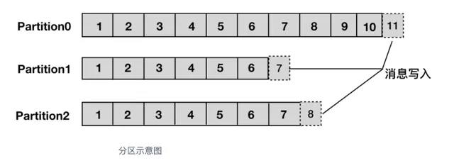
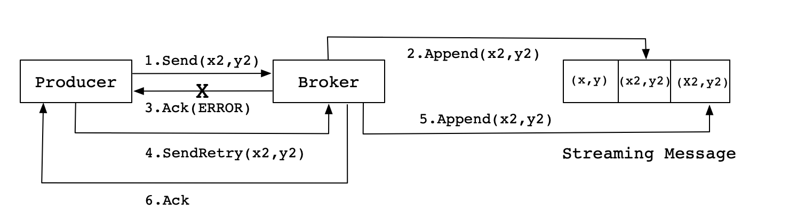
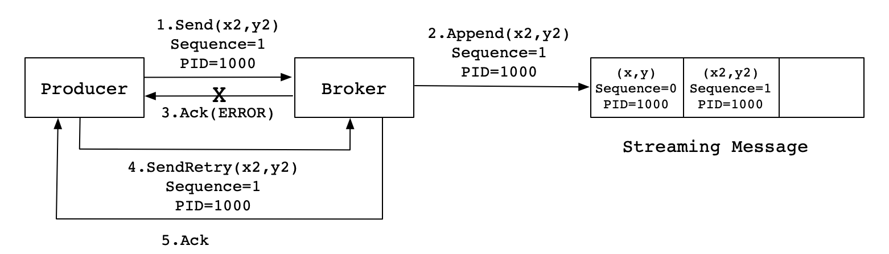
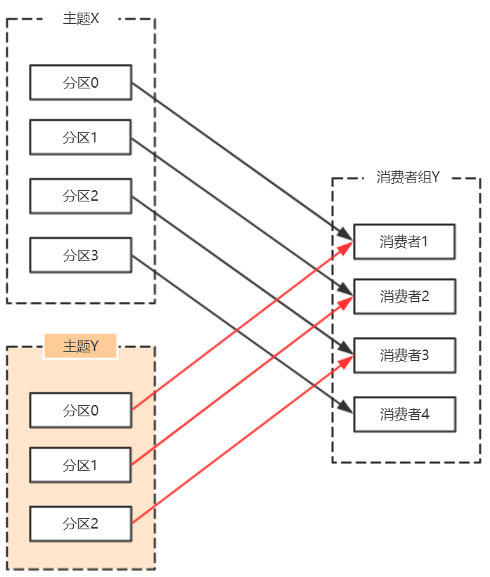
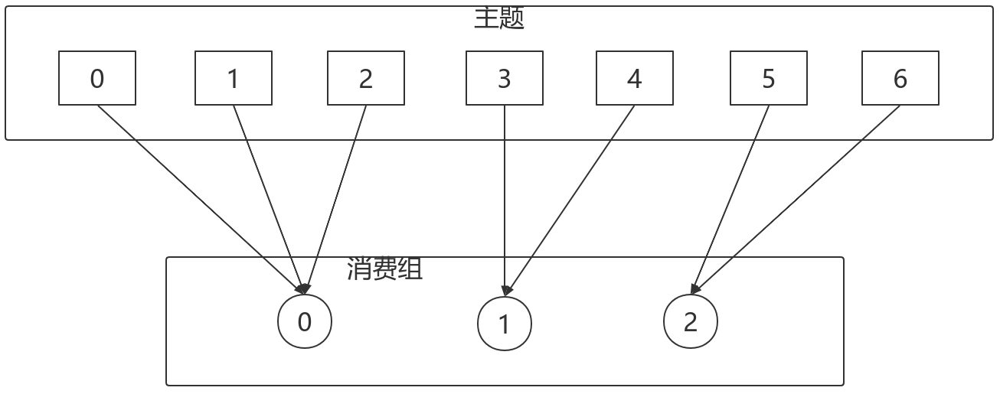
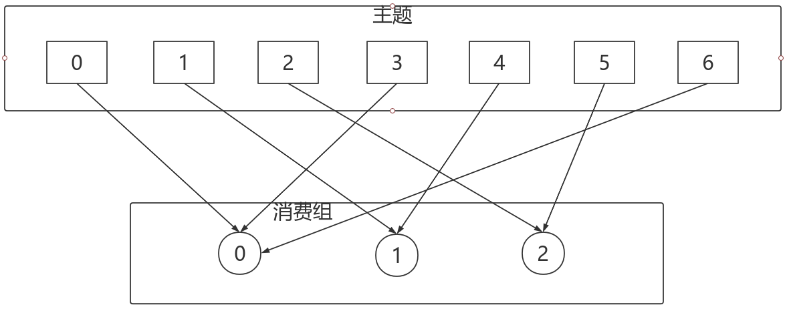
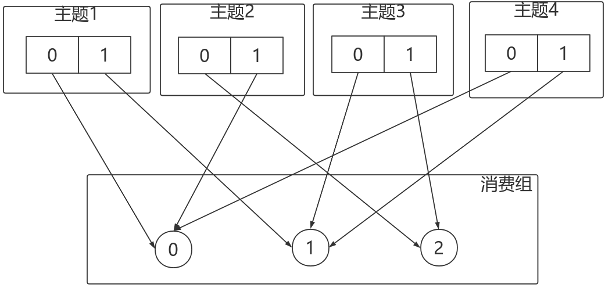
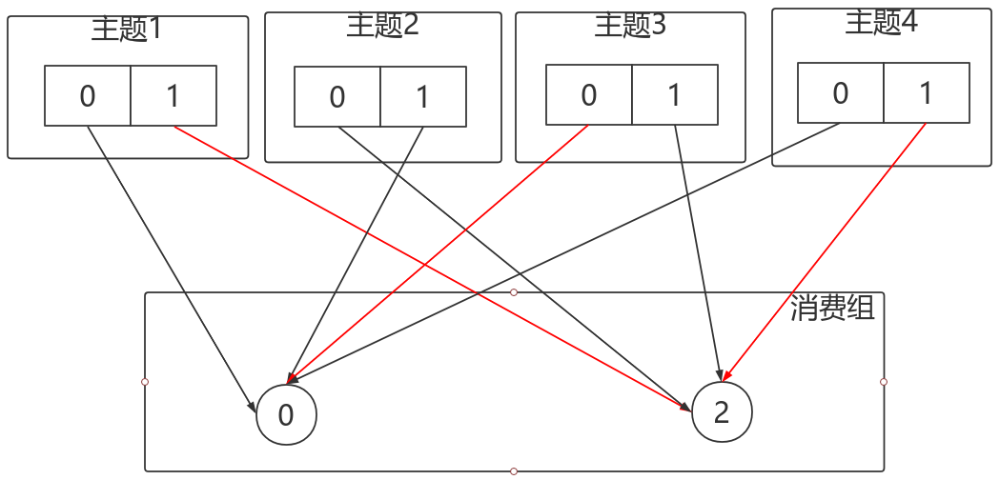
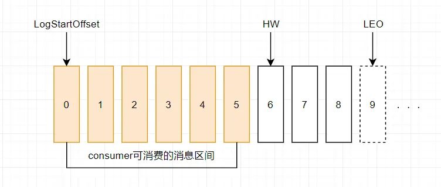
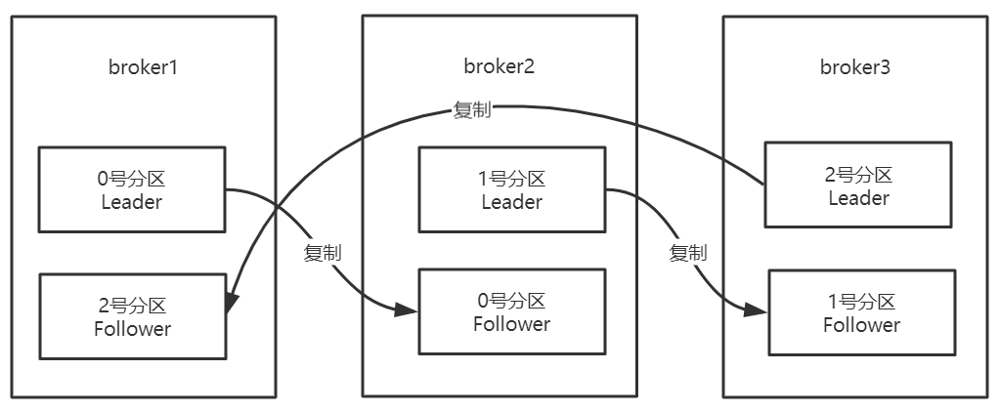

## Kafka

### 基本架构

#### Broker

一个kafka服务器就是一个Broker，多个Broker组成kafka集群

##### Controller

集群会选举出一个Broker作为Leader，这个Leader称为Controller，其主要职责为：

- 与其他Broker节点通信，检测Broker变化
- 分区副本选举
- 重新分区与副本迁移
- 处理kafka管理工具请求
- 与zookeeper交互

#### Topic

每条发布到kafka集群的消息都有一个类别，这个类别称为topic，其实就是将消息按照topic来分类

#### Partition

每个topic被物理划分为一个或多个分区，每个分区在物理上对应一个文件夹，该文件夹里面存储了这个分区的所有消息和索引文件

> 消息写入分区是顺序写磁盘，所以效率很高，这也是kafka高性能的一个原因



##### 分区策略

决定生产者将消息发送到哪个分区的算法

- 默认分区策略为轮询选择分区
- 可以为消息指定partition编号，或设置key字段，实现将消息发往同一个分区
- 支持自定义分区策略

##### 分区副本（Replicas）

- 每个partition有1个或多个分区副本，leader和follower都是副本
- 副本中有一个副本是leader，负责该分区的读写请求
- 每个partition的副本分散在broker集群里面，保证数据不丢失与高可用

#### offset

partition中的每条消息都被标记了一个序号，这个序号表示消息在partition中的偏移量，称为offset，每一条消息在partition都有唯一的offset，消息者通过指定offset来指定要消费的消息。

#### Producer

##### 消息发送

- 生产者发送数据要经过先经过拦截器 -> 序列化器 -> 分区器，然后将消息缓存在生产者缓冲区
- kafka发送消息为批次发送，当生产者缓冲区数据达到一定数量或配置的等待时间时才会发送批量发送消息
  - `batch.size` 默认16KB，当同一个分区的消息达到此数量时发送批次数据
  - `linger.ms` 默认0ms，当消息写入生产者缓冲区后等待此事件，然后发送给broker，0代表不等待
- 支持生产者配置retrires参数对发送失败的消息进行重试

##### 幂等性

`enable.idempotence`：默认为false，需要手动开启

正常情况下生产者将消息发送给broker，broker会返回Ack给生产者，但由于一些不确定因素如网络问题，可能出现Ack消息丢失，导致生产者重复发送消息。如果broker对每条消息都将其写入磁盘，则会出现重复的消息



Kafka为了实现幂等性，在底层设计架构中引入了ProducerID和SequenceNumber，当broker接收到重复的ProducerID和SequenceNumber消息时，不会重复写入topic

- `ProducerID`：在每个新的Producer初始化时，会被分配一个唯一的ProducerID，这个
  ProducerID对客户端使用者是不可见的

- `SequenceNumber`：对于每个生产者，其发送的数据对应每个分区都有一个从0开始递增的SequenceNumber
  - SequenceNumber并不是全局有序的，它只能保证单个分区上的数据不出现重复
  - SequenceNumber无法保证所有时间上的幂等，只能实现单次会话的幂等，当生产者重启，这次会话与上次会话不能保证幂等



##### 生产者确认

**`acks`配置**

- `acks=0`：生产者不等待broker的任何消息确认，只要将消息放到了生产者缓冲区，就认为消息已发送，不能保证服务器是否收到该消息， retries配置也不起作用
- `acks=1`：默认值，只要leader副本写入消息，broker就响应客户端确认消息
- `acks=all`、`acks=-1`：等待ISR中的所有副本写入该消息，broker才确认该消息

**发送模式**

- 同步等待发送结果，`kafkaTemplate.send`会返回一个Future对象，调用future.get同步等待发送结果

```java
ListenableFuture future = kafkaTemplate.send(TestTopic, message);
            // 同步等待broker的响应
SendResult<Integer, String> result = (SendResult<Integer, String>) future.get();
```

- 异步回调发送结果，为`kafkaTemplate.send`添加一个回调函数，获取发送结果

```java
ListenableFuture future = kafkaTemplate.send(TestTopic, message);
future.addCallback(result -> log.info("sendObject:{}, sendResult:{}", message, result),
                ex -> log.error("sendFail, reason:{}", ex.getMessage()));
```

#### Consumer

##### 消费者确认

消费者向broker提交自己消费的消息offset，消费者订阅的每个partition都有各种的offset数据

**自动提交**

- `enable.auto.commit`：默认为true，开启自动提交
- `auto.commit.interval.ms`：配置自动提交时间间隔，默认是5s

**手动提交**

- 同步提交

  - `KafkaConsumer.commitSync()`：kafka标准API方法，用于手动提交位移

  ```java
  KafkaConsumer<String, String> consumer = new KafkaConsumer<String, String>(configs);
  ConsumerRecords<String, String> records = consumer.poll(Duration.ofSeconds(1));
  ... // 处理消息
  consumer.commitSync();
  ```

  - `Acknowledgment.acknowledge()`：用于与@KafkaListener配合使用

  ```java
  @KafkaListener(topics = "your-topic", groupId = "your-group-id")
  public void listen(String message, Acknowledgment acknowledgment) {
      ... // 处理消息
      acknowledgment.acknowledge();
  }
  ```

- 异步提交，

  - `KafkaConsumer.commitAsync()`

#### Consumer Group

消费者组，每个consumer属于一个特定的consumer group，可为每个consumer指定consumer group，若不指定则属于默认的group。

同一topic的一条消息只能被同一个消费者组内的一个consumer消费，而同一条消息可以被不同的消费者组消费，由此kafka可以通过消费者组实现消息的广播

##### 消费者Leader

在每个消费者组中都有一个消费者Leader，其主要职责为：

- 检测消费者状态
- 执行rebalance
- 消费者组leader的选举为随机选举

##### Rebalance

topic中的partition会尽量均匀的分配给消费者组中的消费者，所以扩展消费者的数量可以提升消费能力，但不能超过partition分区的数量，否则多余的消费者就闲置浪费了



而在某些情况下，partition需要重新分配给消费者，这个过程就称为Rebalance（再均衡）

**Rebalance过程中消费者无法从kafka消费消息，而分区和消费者数量越多，可能Rebalance的耗时越长，所以要尽量避免触发Rebalance**

**Rebalance的触发条件**

- 消费者数量发生变化
- partition数量发生变化
- 消费者使用正则表达式订阅topic，出现新增topic时

**Rebalance算法**

- `RangeAssignor`：范围分配，默认配置
  - 每个topic的分区进行字典排序，消费者也进行排序，然后进行分配
  - 每个topic按分区数/消费者数进行分段，每个消费者分配一段，不能整除的情况下序号靠前的消费者会分的多一点（n = 分区数/消费者数，m = 分区数%消费者数，前m个分配n+1个，其余的分配n个）
  - RangeAssignor是**按topic维度进行分配**的，分区数不是消费者数整数倍时，会出现分配不均匀，且这样的分区越多越不均匀
  - 如：t0有p0, p1, p2三个分区，消费者c0, c1，分配结果[c0, p0, p1], [c1, p2]



- `RoundRobinAssignor`：轮询分配
  - 所有topic分区进行字典排序，消费者也进行排序，然后轮询分区分配给消费者
  - 如：t0有p0, p1, p2, p3四个分区，消费者c0, c1，分配结果[c0, p0, p2], [c1, p1, p3]
  - 一个消费者组的不同消费者订阅了不同的topic，会导致分配不均匀



- `StickyAssignor`：粘性分配
  - 分区的分配尽量均衡（初始化的具体实现没去研究）
  - 每一次重分配的结果尽量与上一次分配结果保持一致
  - 当上面两个目标发生冲突时，优先保证第一个目标
  - 如：3个消费者订阅了4个topic，每个topic有两个partition，如果消费者1宕机，其他算法会对所有分区和消费者进行重新分配，而StickyAssignor只会调整消费者1之前订阅的几个分区





- 支持自定义Rebalance算法

### 高可用

#### 分区副本

- `AR`：Assigned Replicas，某分区的所有副本（这里所说的副本包括leader和follower）统称为 AR
- `ISR`：In Sync Replicas，所有与leader副本保持"一定程度同步"的副本（包括leader副本在内）组成 ISR 

- `OSR`：Out-of-Sync Replied，相对leader滞后过多的follower将组成OSR

> AR = ISR + OSR

**伸缩性**

当ISR中的副本落后太多或超过一定时间没有向leader副本发送同步请求，leader会将其从ISR中剔除

当OSR中的副本追上了leader副本，leader会将其加入ISR

落后设定值：`server.properties`中通过`replica.lag.max.messages`配置，默认值是4000

超过时间设定值：`server.properties`中通过`replica.lag.time.max.ms`来配置，默认值是10000

**HW（High Watermark 高水位）**

- `LEO`：Log End Offset，partition副本中下一条待写入的消息的offset，分区ISR 集合中的每个副本都会维护自身的 LEO
- `HW`：标记了一个特殊偏移量offset，**消费者只能消费HW之前的消息**，ISR副本中最小的LEO即为HW

> 生产者发送消息可以配置不同的acks确认机制，如acks=1时leader副本写入消息就算发送成功，但这只是对于生产者而言消息发送成功了，并不代表发送成功了消费者就能立马消费，消息还是需要ISR中的副本都同步到以后更新了HW才能被消费
>
> 如果分区只有一个leader副本，那leader副本的LEO就是HW



**负载均衡**

**partition的副本会分散在不同的broker里面，保证数据不丢失的情况下同时保证高可用**



随着broker节点的变动，如宕机后又恢复，可能会导致某些broker承载了较多的leader副本，这种情况下可以重新分配分区以达到负载均衡

- kafka支持手动分配，将部分分区迁移到某个broker
- kafka提供了自动均衡脚本`kafka-preferred-replica-election.sh`，需要手动触发

#### Leader选举

**Controller选举**

broker在zookeeper的`/controller`节点下创建临时节点，并在该节点中写入当前broker的信息 `{“version”:1,”brokerid”:1,”timestamp”:”1512018424988”}` ，一个节点只能被一个客户端创建成功，创建成功的broker即为controller，即**先到先得**

当controller宕机或者和zookeeper失去连接时，zookeeper检测不到心跳，zookeeper上的临时节点会被删除，而其它broker会监听临时节点的变化，当节点被删除时，其它broker会收到通知，重新发起controller选举

**分区Leader选举**

分区leader的选举由 controller 负责管理和实施，按照AR集合中副本的顺序查找到**第一个存活的、并且属于ISR集合的副本**作为新的leader（只有ISR中的副本才能被选举为新的leader）

当ISR中的副本都不可用，有两种方案

- 选择ISR中第一个活过来的副本作为Leader（CP）
- 选择第一个活过来的副本（不一定是ISR中的）作为Leader（AP）

**消费者Leader选举**

- 第一个加入消费者组的consumer成为leader
- 如果leader消费者宕机，**随机**选举一个为新leader


## RabbitMQ

// todo