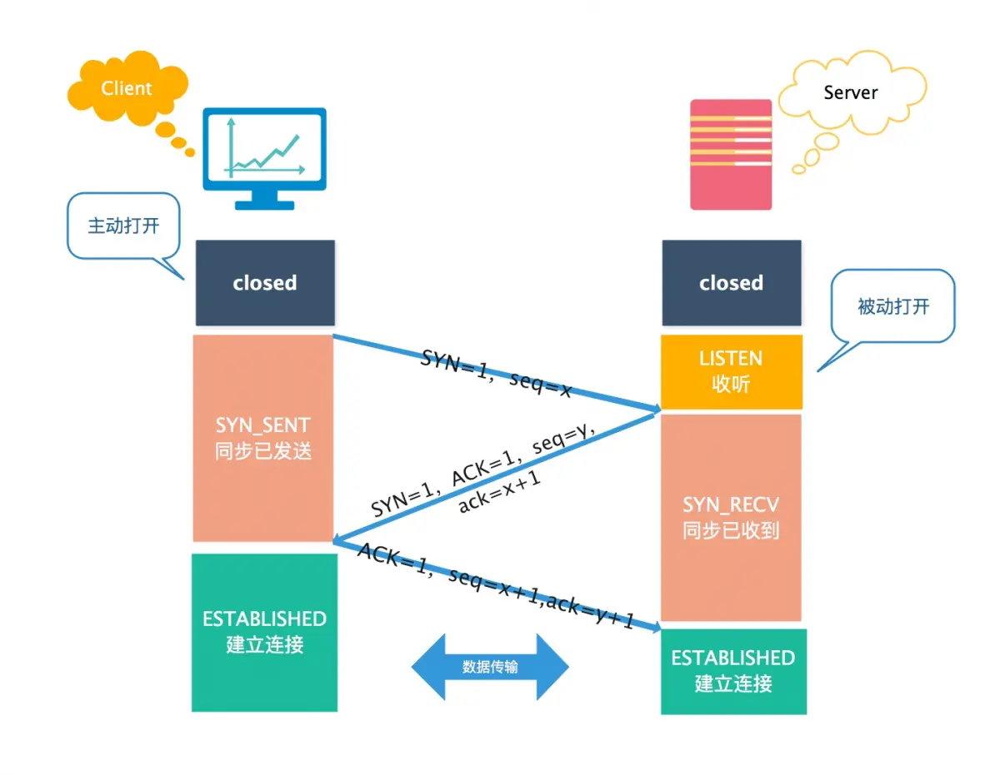

## 五层协议体系

### 应用层

**通过应用进程间的交互来完成特定网络应用。应用层协议定义的是应用进程（进程：主机中正在运行的程序）间的通信和交互的规则。对于不同的网络应用需要不同的应用层协议。**在互联网中应用层协议很多，如域名系统DNS，支持万维网应用的 **HTTP协议**，支持电子邮件的 **SMTP协议**等等。我们把应用层交互的数据单元称为报文。

### 运输层

**主要负责向两台主机进程之间的通信提供通用的数据传输服务**。应用进程利用该服务传送应用层报文。“通用的”是指并不针对某一个特定的网络应用，而是多种应用可以使用同一个运输层服务。由于一台主机可同时运行多个线程，因此运输层有复用和分用的功能。所谓复用就是指多个应用层进程可同时使用下面运输层的服务，分用和复用相反，是运输层把收到的信息分别交付上面应用层中的相应进程。

### 网络层

**在计算机网络中进行通信的两个计算机之间可能会经过很多个数据链路，也可能还要经过很多通信子网。网络层的任务就是选择合适的网间路由和交换结点， 确保数据及时传送。** 在发送数据时，网络层把运输层产生的报文段或用户数据报封装成分组和包进行传送。在 TCP/IP 体系结构中，由于网络层使用 **IP 协议**，因此分组也叫 **IP 数据报** ，简称 **数据报**。

### 数据链路层

**两台主机之间的数据传输，总是在一段一段的链路上传送的，这就需要使用专门的链路层的协议。** 在两个相邻节点之间传送数据时，**数据链路层将网络层交下来的 IP 数据报组装成帧**，在两个相邻节点间的链路上传送帧。每一帧包括数据和必要的控制信息（如同步信息，地址信息，差错控制等）。

### 物理层

**实现相邻计算机节点之间比特流的透明传送，尽可能屏蔽掉具体传输介质和物理设备的差异，** 使其上面的数据链路层不必考虑网络的具体传输介质是什么。“透明传送比特流”表示经实际电路传送后的比特流没有发生变化，对传送的比特流来说，这个电路好像是看不见的。

## TCP

### 三次握手

- 客户端–发送带有 SYN 标志的数据包–一次握手–服务端
- 服务端–发送带有 SYN/ACK 标志的数据包–二次握手–客户端
- 客户端–发送带有带有 ACK 标志的数据包–三次握手–服务端

**为什么要三次握手？**

**建立可靠的通信信道，双方确认自己与对方的发送与接收是正常的。**

第一次握手：Client 什么都不能确认；Server 确认了对方发送正常，自己接收正常

第二次握手：Client 确认了：自己发送、接收正常，对方发送、接收正常；Server 确认了：对方发送正常，自己接收正常

第三次握手：Client 确认了：自己发送、接收正常，对方发送、接收正常；Server 确认了：自己发送、接收正常，对方发送、接收正常

**为什么TCP客户端最后还要发送一次确认？**

为了防止已经失效的连接请求传输到Server，引起错误连接

如果只有两次握手，则存在这样一种场景：Client发送一次连接请求由于网络问题在网络中滞留时间太长，Client随后又发送一次连接请求，两次握手后双方建立连接，传输结束连接断开后，第一次的请求又发送给了Server，由于只有两次握手，双方又建立起了连接，由此产生不必要的错误连接和资源浪费。

### 四次挥手

- 客户端-发送一个FIN，用来关闭客户端到服务器的数据传送，Client进入**FIN-WAIT-1（终止等待1）**状态。
- 服务器-收到这个FIN，它发回一个ACK，确认序号为收到的序号加1，和SYN一样，一个FIN将占用一个序号。Server进入**CLOSE-WAIT（关闭等待）**状态，Client到Server方向的连接释放，此时进入半关闭状态，Client已经没有数据要发送了，**但Server还可以继续发送数据，Client需要继续接收**。Client收到Server发送的ACK后，进入**FIN-WAIT-2（终止等待2）**状态，等待Server发送连接释放报文，在此期间需要继续接收Server发送的数据。
- 服务器-关闭与客户端的连接，发送FIN+ACK的报文给客户端，Server进入**LAST-ACK（最后确认）状态**，等待客户端的确认。
- 客户端-发回ACK报文确认，并将确认序号设置为收到序号加1，此时Client进入**TIME-WAIT（时间等待）状态**，经过2*MSL（最长报文段寿命）的时间后，Client进入CLOSED状态。Server只要收到了Client发送的确认，立即进入CLOSED状态。

**为什么客户端要等待2*MSL才关闭？**

- Client发送的最后一个确认报文可能丢失，Server会再次发送FIN+ACK的报文，这时Client在等待期间可以收到这个重传的报文，接着给出回应报文，并重启2MSL计时器
- Client发送完最后一个确认报文后，在2*MSL这段时间内，本次连接所产生的报文都将从网络消失，这样新的连接中不会出现旧的报文，像三次握手的最后一次ACK一样，防止已经失效的报文出现在新的连接中

**为什么建立连接是三次握手，关闭连接确是四次挥手呢？**

Server收到Client的FIN报文后，只能表示Client不发送数据了，但是Server可能还有数据没发送完，Server发送数据结束后再发送FIN报文表示同意关闭连接，Client确认后才完全关闭本次TCP连接，保证双方的数据都传输完成。

**如果已经建立了连接，但是客户端突然出现故障了怎么办？**

TCP还设有一个保活计时器，显然，客户端如果出现故障，服务器不能一直等下去，白白浪费资源。服务器每收到一次客户端的请求后都会重新复位这个计时器，时间通常是设置为2小时，若两小时还没有收到客户端的任何数据，服务器就会发送一个探测报文段，以后每隔75秒发送一次。若一连发送10个探测报文仍然没反应，服务器就认为客户端出了故障，接着就关闭连接。

### TCP如何保证可靠传输

1. 应用数据被分割成 TCP 认为最适合发送的数据块。
2. TCP 给发送的每一个包进行编号，接收方对数据包进行排序，把有序数据传送给应用层。
3. **校验和：** TCP 将保持它首部和数据的检验和。这是一个端到端的检验和，目的是检测数据在传输过程中的任何变化。如果收到段的检验和有差错，TCP 将丢弃这个报文段和不确认收到此报文段。
4. TCP 的接收端会丢弃重复的数据。
5. **流量控制（滑动窗口）：** TCP 连接的每一方都有固定大小的缓冲空间，TCP的接收端只允许发送端发送接收端缓冲区能接纳的数据。当接收方来不及处理发送方的数据，能提示发送方降低发送的速率，防止包丢失。TCP 使用的流量控制协议是可变大小的滑动窗口协议。 （TCP 利用滑动窗口实现流量控制）
6. **拥塞控制：** 当网络拥塞时，减少数据的发送。
7. **ARQ协议（自动重传）：** 也是为了实现可靠传输的，它的基本原理就是每发完一个分组就停止发送，等待对方确认。在收到确认后再发下一个分组。
8. **超时重传：** 当 TCP 发出一个段后，它启动一个定时器，等待目的端确认收到这个报文段。如果不能及时收到一个确认，将重发这个报文段。

#### 滑动窗口

Client与Server各维护一个滑动窗口，Client窗口包含**已发送未确认**+**可发送未发送**两部分，Server窗口包含**允许接收**部分，二者跟各自的缓冲区配合，Client根据窗口发送数据，当有数据被ACK后才会前移，Server每次确认都会把当前可接收的窗口值发送给Client，Client据此调整自身窗口大小，防止发送数据过快导致Server处理不及时。

https://www.jianshu.com/p/a1f6bde61053

#### 拥塞控制

- **慢开始：** 慢开始算法的思路是当主机开始发送数据时，如果立即把大量数据字节注入到网络，那么可能会引起网络阻塞，因为现在还不知道网络的符合情况。经验表明，较好的方法是先探测一下，即由小到大逐渐增大发送窗口，也就是由小到大逐渐增大拥塞窗口数值。cwnd初始值为1，每经过一个传播轮次，cwnd加倍。
- **拥塞避免：** 拥塞避免算法的思路是让拥塞窗口cwnd缓慢增大，即每经过一个往返时间RTT就把发送放的cwnd加1
- **快重传与快恢复：** 在 TCP/IP 中，快速重传和恢复（fast retransmit and recovery，FRR）是一种拥塞控制算法，它能快速恢复丢失的数据包。没有 FRR，如果数据包丢失了，TCP 将会使用定时器来要求传输暂停。在暂停的这段时间内，没有新的或复制的数据包被发送。有了 FRR，如果接收机接收到一个不按顺序的数据段，它会立即给发送机发送一个重复确认。如果发送机接收到三个重复确认，它会认为被重复确认的数据段丢失了，并立即重传这些丢失的数据段。有了 FRR，就不会因为重传时要求的暂停被耽误。当有单独的数据包丢失时，快速重传和恢复（FRR）能最有效地工作。当有多个数据信息包在某一段很短的时间内丢失时，它则不能很有效地工作。

#### ARQ协议

**自动重传请求**（Automatic Repeat-reQuest，ARQ）是OSI模型中数据链路层和传输层的错误纠正协议之一。它通过使用确认和超时这两个机制，在不可靠服务的基础上实现可靠的信息传输。如果发送方在发送后一段时间之内没有收到确认帧，它通常会重新发送。ARQ包括停止等待ARQ协议和连续ARQ协议。

##### 停止等待ARQ协议

停止等待协议是为了实现可靠传输的，它的基本原理就是每发完一个分组就停止发送，等待对方确认（回复ACK）。如果过了一段时间（超时时间后），还是没有收到 ACK 确认，说明没有发送成功，需要重新发送，直到收到确认后再发下一个分组。

在停止等待协议中，若接收方收到重复分组，就丢弃该分组，但同时还要发送确认。

**优缺点：**

- **优点：** 简单
- **缺点：** 信道利用率低，等待时间长

**1) 无差错情况:**

发送方发送分组,接收方在规定时间内收到,并且回复确认.发送方再次发送。

**2) 出现差错情况（超时重传）:**

停止等待协议中超时重传是指只要超过一段时间仍然没有收到确认，就重传前面发送过的分组（认为刚才发送过的分组丢失了）。因此每发送完一个分组需要设置一个超时计时器，其重传时间应比数据在分组传输的平均往返时间更长一些。这种自动重传方式常称为 **自动重传请求 ARQ** 。另外在停止等待协议中若收到重复分组，就丢弃该分组，但同时还要发送确认。**连续 ARQ 协议** 可提高信道利用率。发送维持一个发送窗口，凡位于发送窗口内的分组可连续发送出去，而不需要等待对方确认。接收方一般采用累积确认，对按序到达的最后一个分组发送确认，表明到这个分组位置的所有分组都已经正确收到了。

**3) 确认丢失和确认迟到**

- **确认丢失** ：确认消息在传输过程丢失。当A发送M1消息，B收到后，B向A发送了一个M1确认消息，但却在传输过程中丢失。而A并不知道，在超时计时过后，A重传M1消息，B再次收到该消息后采取以下两点措施：1. 丢弃这个重复的M1消息，不向上层交付。 2. 向A发送确认消息。（不会认为已经发送过了，就不再发送。A能重传，就证明B的确认消息丢失）。
- **确认迟到** ：确认消息在传输过程中迟到。A发送M1消息，B收到并发送确认。在超时时间内没有收到确认消息，A重传M1消息，B仍然收到并继续发送确认消息（B收到了2份M1）。此时A收到了B第二次发送的确认消息。接着发送其他数据。过了一会，A收到了B第一次发送的对M1的确认消息（A也收到了2份确认消息）。处理如下：1. A收到重复的确认后，直接丢弃。2. B收到重复的M1后，也直接丢弃重复的M1。

##### 连续ARQ协议

连续 ARQ 协议可提高信道利用率。发送方维持一个发送窗口，凡位于发送窗口内的分组可以连续发送出去，而不需要等待对方确认。接收方一般采用累计确认，对按序到达的最后一个分组发送确认，表明到这个分组为止的所有分组都已经正确收到了。

**优缺点：**

- **优点：** 信道利用率高，容易实现，即使确认丢失，也不必重传。
- **缺点：** 不能向发送方反映出接收方已经正确收到的所有分组的信息。 比如：发送方发送了 5条 消息，中间第三条丢失（3号），这时接收方只能对前两个发送确认。发送方无法知道后三个分组的下落，而只好把后三个全部重传一次。这也叫 Go-Back-N（回退 N），表示需要退回来重传已经发送过的 N 个消息。

## UDP

### TCP与UDP的区别

## HTTP

### 访问一个网页的过程

总体来说分为以下几个过程:

1. DNS解析
2. TCP连接
3. 发送HTTP请求
4. 服务器处理请求并返回HTTP报文
5. 浏览器解析渲染页面
6. 连接结束

**应用层协议**

- DNS: 域名解析
- HTTP: 发送http请求

**网络层协议**

- TCP: 与服务器建立连接
- IP: 发送数据使用ip协议数据报文、报文分段、ip寻址
- OSPF: 选择路由路径

- ARP: MAC寻址

### http如何判断响应已经接收完毕

- header中有content-length，则根据content-length判断
- 没有content-length，则采用chunked编码，最后一个分段中有0\r\n\r\n，读到0\r\n\r\n表示结束

### http 1.1

**与http1.0的区别**

- **长连接**：TCP连接默认不关闭，可以被多个请求复用，不用声明`Connection: keep-alive`
- **管道机制**（pipelining）：在同一个TCP连接里面，客户端可以同时发送多个请求
- **状态码**：在HTTP1.1中新增了24个错误状态响应码
- **分块传输编码**：可以不使用`Content-Length`字段，而使用["分块传输编码"](https://zh.wikipedia.org/wiki/分块传输编码)（chunked transfer encoding）。只要请求或回应的头信息有`Transfer-Encoding`字段，就表明回应将由数量未定的数据块组成，每个数据块在发送时都会附上块的长度，最后用一个零长度的块作为消息结束的标志
- **缓存处理**：在HTTP1.0中主要使用header里的If-Modified-Since,Expires来做为缓存判断的标准，HTTP1.1则引入了更多的缓存控制策略例如Entity tag，If-Unmodified-Since, If-Match, If-None-Match等更多可供选择的缓存头来控制缓存策略
- **Host头处理**：在HTTP1.0中认为每台服务器都绑定一个唯一的IP地址，因此，请求消息中的URL并没有传递主机名（hostname）。但随着虚拟主机技术的发展，在一台物理服务器上可以存在多个虚拟主机（Multi-homed Web Servers），并且它们共享一个IP地址。HTTP1.1的请求消息和响应消息都应支持Host头域，且请求消息中如果没有Host头域会报告一个错误（400 Bad Request）

### http2

- **二进制协议**：HTTP/1.1 版的头信息肯定是文本（ASCII编码），数据体可以是文本，也可以是二进制。HTTP/2 则是一个彻底的二进制协议，头信息和数据体都是二进制，并且统称为"帧"（frame）：头信息帧和数据帧。
- **多路复用（Multiplexing）**：在一个连接里，客户端和浏览器都可以同时发送多个请求或回应，一个request对应一个id，这样一个连接上可以有多个request，每个连接的request可以随机的混杂在一起，接收方可以根据request的 id将request再归属到各自不同的服务端请求里面
- **header压缩**：一方面，头信息使用`gzip`或`compress`压缩后再发送；另一方面，客户端和服务器同时维护一张头信息表，所有字段都会存入这个表，生成一个索引号，以后就不发送同样字段了，只发送索引号，节约带宽
- **服务器推送（Server push）**：允许服务器未经请求，主动向客户端发送资源

## HTTPS

使用SSL/TLS传输层协议，TLS在SSL的基础上改进而来，目前，应用最广泛的是TLS 1.0，但是主流浏览器都已经实现了TLS 1.2的支持。

### 连接建立过程

- Client向Server发起https请求
- Server将证书发送给Client，证书中携带公钥
- Client收到证书后验证其合法性，若证书合法，Client生成一个随机数作为对称密钥，称为client key，并用证书中的公钥将client key加密发送给Server
- Server使用私钥解密报文得到client key，并用该对称密钥对通信报文进行加密发送给Client
- Client使用对称密钥解密报文，得到实际的响应报文

