## 设计原则

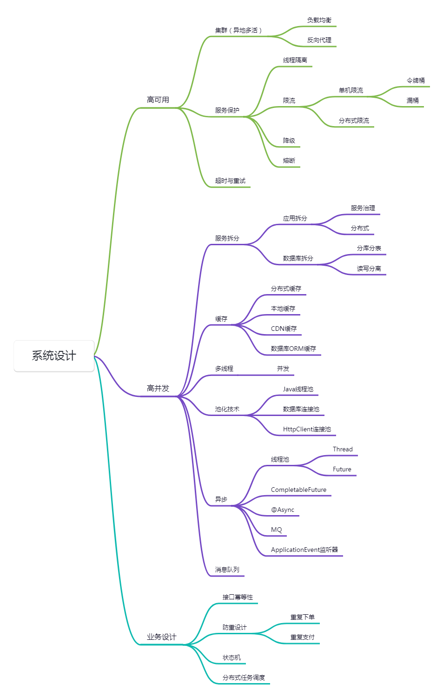

## 高可用

### 集群多活

#### 负载均衡

- 轮询

- 随机

- IP-Hash

- 加权轮询

  - 计算所有权重的和`totalWeight`
  - 初始化每个节点的当前权重`currentWeight = 0`
  - 每次选择前，更新节点的当前权重`currentWeight += weight`，这里的weight是节点自身的权重
  - 选择`currentWeight `最大的节点，选择后更新该节点`currentWeight -= totalWeight`
  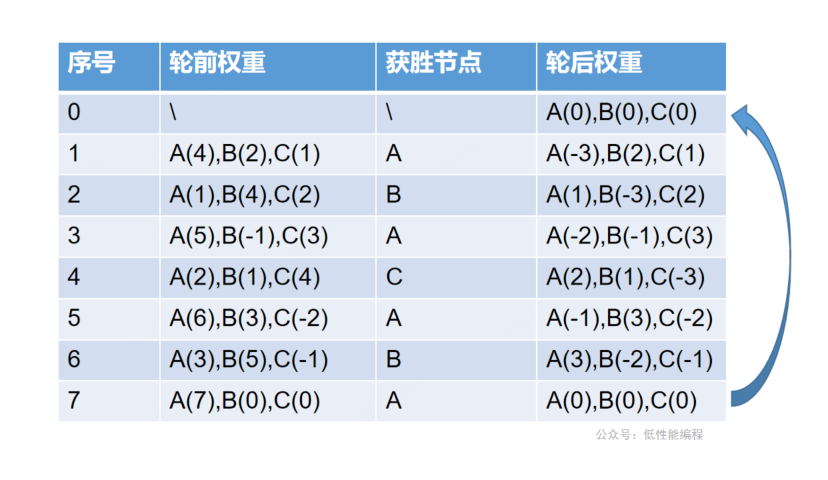
- 插件式


### 服务保护

#### 资源隔离

**线程隔离**

Hystrix实现线程隔离，通过自定义线程池，将接口请求通过线程池进行隔离

```java
@HystrixCommand(fallbackMethod = "fallback",
            groupKey = "consumer-group",
            commandKey = "hello",
            commandProperties = {
                    @HystrixProperty(name = "execution.isolation.strategy", value = "THREAD")
            },
            threadPoolKey = "threadPool-hello",
            threadPoolProperties = {
                    @HystrixProperty(name = "coreSize", value = "2"),
                    @HystrixProperty(name = "maximumSize", value = "2"),
                    @HystrixProperty(name = "maxQueueSize", value = "1"),
                    @HystrixProperty(name = "keepAliveTimeMinutes", value = "0"),
                    @HystrixProperty(name = "queueSizeRejectionThreshold", value = "10")
            }
    )
    @GetMapping("")
    public Object hello(@RequestParam("name") String name) {
        return "hello, " + name;
    }
```

**进程隔离**

即拆分系统为子系统进行物理隔离

#### 限流

##### 单机限流-RateLimiter

1）自定义限流注解

```java
@Target(ElementType.METHOD)
@Retention(RetentionPolicy.RUNTIME)
@Documented
public @interface Limit {

    // 资源的key,唯一
    // 作用：不同的接口，不同的流量控制
    String key() default "";

    // 最多的访问限制次数
    double permitsPerSecond();

    // 获取令牌最大等待时间
    long timeOut();

    // 获取令牌最大等待时间,单位(例:分钟/秒/毫秒) 默认:毫秒
    TimeUnit timeUnit() default TimeUnit.MILLISECONDS;
}
```

2）增加限流切面

```java
@Slf4j
@Aspect
@Component
public class LimitAspect {

    private static final String LIMIT_ERROR_MESSAGE = "系统繁忙，请稍后重试";

    private final Map<String, RateLimiter> limitMap = Maps.newConcurrentMap();

    @Around("@annotation(cn.net.susan.annotation.Limit)")
    public Object around(ProceedingJoinPoint joinPoint) throws Throwable {
        MethodSignature signature = (MethodSignature) joinPoint.getSignature();
        Method method = signature.getMethod();
        //拿limit的注解
        Limit limit = method.getAnnotation(Limit.class);
        if (limit != null) {
            String key = limit.key();
            RateLimiter rateLimiter = null;
            //验证缓存是否有命中key
            if (!limitMap.containsKey(key)) {
                // 创建令牌桶
                rateLimiter = RateLimiter.create(limit.permitsPerSecond());
                limitMap.put(key, rateLimiter);
                log.info("新建了令牌桶={}，容量={}", key, limit.permitsPerSecond());
            }
            rateLimiter = limitMap.get(key);
            // 拿令牌
            boolean acquire = rateLimiter.tryAcquire(limit.timeOut(), limit.timeUnit());
            // 拿不到命令，直接返回异常提示
            if (!acquire) {
                throw new BusinessException(LIMIT_ERROR_MESSAGE);
            }
        }
        return joinPoint.proceed();
    }
}
```

3）使用自定义注解

```java
@Limit(key = "test", permitsPerSecond = 1, timeOut = 500)
@GetMapping("/test")
public Object test(@RequestParam(value = "name") String name) {
    return query(name);
}
```

4）当有多个限流Key时，可以定义一个静态Map，将key-RateLimiter对象存储在Map中进行管理

##### 单机限流-Sentinel

###### 微服务场景

- 直接在sentinel控制台定义限流策略，但开源的sentinel控制台不会直接同步到nacos中，重启后配置清空
- 故一般在nacos中定义限流规则，并配置sentinel的数据源为nacos，这样修改nacos中的配置就可以实时更新

```yaml
spring:
  cloud:
    sentinel:
      transport:
        dashboard: localhost:8090
        port: 8719
        clientIp: 192.168.130.1
      http-method-specify: true # 开启请求方式前缀
      datasource: # 将sentinel配置持久化到nacos配置中心，具体配置字段需要查看源码
        ds1:
          nacos:
            username: nacos
            password: nacos
            server-addr: localhost:8848 # nacos地址
            dataId: cart-degrade.json  # nacos配置的dataId
            groupId: hmall  # nacos配置的groupId
            data-type: json # 配置文件类型
            rule-type: degrade # 规则类型
feign:
  sentinel:
    enabled: true # 开启feign对sentinel的支持
```

1）定义簇点链路（可配置规则的单元）

```java
@SentinelResource(value="queryMyCartsHandler", blockHandler = "queryMyCartsBlockHandler", blockHandlerClass = CartBlockHandler.class)
public List<CartVO> queryMyCarts() {
    ...
}
```

2）sentinel配置中开启请求方式前缀后（如上配置），可以将controller中restful风格的接口也展示在粗点链路中

3）feign开启了sentinel支持后，也可以在簇点链路中查看到相关信息

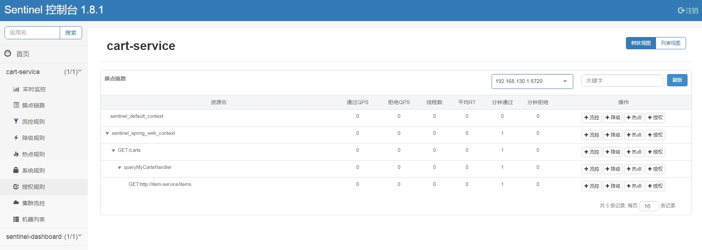

4）在nacos中定义限流策略，添加相关配置，具体配置的字段需要查看sentinel源码再去查找对应解释，sentinel官网对此并没有相关介绍

###### 单体服务场景

由于sentinel控制台本身并没有持久化机制，要使用sentinel控制台还得对其进行改造，所以我们可以在代码中定义sentinel相关规则

```java
private static void initFlowQpsRule() {
    List<FlowRule> rules = new ArrayList<FlowRule>();
    FlowRule rule1 = new FlowRule();
    rule1.setResource(KEY);
    // set limit qps to 20
    rule1.setCount(20);
    rule1.setGrade(RuleConstant.FLOW_GRADE_QPS);
    rule1.setLimitApp("default");
    rules.add(rule1);
    FlowRuleManager.loadRules(rules);
}
```

###### sentinel相关配置说明

sentinel官网：https://sentinelguard.io/zh-cn/docs/introduction.html

// todo

##### 分布式限流-Redis

通过redis实现分布式限流，主要还是通过lua脚本去redis获取一个token，不同的生成token方式代表了不同的限流算法

**实现步骤：**

1）定义Enable注解

```java
@Target(ElementType.TYPE)
@Retention(RetentionPolicy.RUNTIME)
@Documented
@Import({LimitConfig.class})
public @interface EnableLimit {
}
```

2）定义限流类型枚举类

```java
@Getter
@AllArgsConstructor
public enum LimitTypeEnum {

    // 针对访问接口的所有请求
    ALL(0, "所有"),
    
    // 针对访问接口的指定IP
    IP(1, "用户ip"),
    
    // 针对访问接口的指定用户
    USER_ID(2, "用户ID");
    
    // 枚举值
    private Integer value;
    
    // 枚举描述
    private String desc;
}
```

3）定义limit注解

```java
@Target(ElementType.METHOD)
@Retention(RetentionPolicy.RUNTIME)
@Documented
public @interface Limit {

    // 资源的key,唯一
    // 作用：不同的接口，不同的流量控制
    String key() default "";

    // 最多的访问限制次数
    int permitsPerSecond();

    // 获取令牌最大等待时间
    long timeOut();

    // 获取令牌最大等待时间,单位(例:分钟/秒/毫秒) 默认:毫秒
    TimeUnit timeUnit() default TimeUnit.MILLISECONDS;

    // 限流类型，默认是整个接口
    LimitTypeEnum limitType() default LimitTypeEnum.ALL;
}
```

4）定义限流配置，该类没有用@Configuration注解，需要在启动类上使用上面定义的@EnableLimit注解启用

```java
public class LimitConfig {

    @Bean
    public LimitAspect limitAspect() {
        return new LimitAspect();
    }

    @Bean
    public DefaultRedisScript<Long> limitScript() {
        DefaultRedisScript<Long> redisScript = new DefaultRedisScript<>();
        redisScript.setScriptText(limitScriptText());
        redisScript.setResultType(Long.class);
        return redisScript;
    }

    /**
     * 限流lua脚本
     */
    private String limitScriptText() {
        return "local key = KEYS[1]\n" +
                "local count = tonumber(ARGV[1])\n" +
                "local time = tonumber(ARGV[2])\n" +
                "local current = redis.call('get', key);\n" +
                "if current == nil then\n current = 0\n end\n" +
                "if current and tonumber(current) > count then\n" +
                "    return tonumber(current);\n" +
                "end\n" +
                "current = redis.call('incr', key)\n" +
                "if tonumber(current) == 1 then\n" +
                "    redis.call('expire', key, time)\n" +
                "end\n" +
                "return tonumber(current);";
    }
}
```

5）定义限流切面

```java
@Slf4j
@Aspect
public class LimitAspect {

    private static final String LIMIT_ERROR_MESSAGE = "系统繁忙,请稍后再试";

    @Autowired
    private StringRedisTemplate stringRedisTemplate;
    @Autowired
    private DefaultRedisScript redisScript;

    @Around("@annotation(cn.net.susan.annotation.Limit)")
    public Object around(ProceedingJoinPoint joinPoint) throws Throwable {
        MethodSignature signature = (MethodSignature) joinPoint.getSignature();
        Method method = signature.getMethod();
        //拿limit的注解
        Limit limit = method.getAnnotation(Limit.class);
        if (limit != null) {
            String limitKey = buildLimitKey(limit, method);
            int count = limit.permitsPerSecond();
            long time = limit.timeOut();
            Object number = stringRedisTemplate.execute(redisScript, Lists.newArrayList(limitKey), count, time);
            if (Objects.nonNull(number) && number instanceof Long) {
                if (((Long) number).longValue() > count) {
                    throw new BusinessException(LIMIT_ERROR_MESSAGE);
                }
            }
        }
        return joinPoint.proceed();
    }

    private String buildLimitKey(Limit limit, Method method) {
        HttpServletRequest httpServletRequest = ((ServletRequestAttributes) RequestContextHolder.getRequestAttributes())
                .getRequest();
        switch (limit.limitType()) {
            case IP:
                String ipAddr = IpUtil.getIpAddr(httpServletRequest);
                return String.format("limitRate:ip:%s_%s", method.getName(), ipAddr);
            case USER_ID:
                JwtUserEntity currentUserInfo = FillUserUtil.getCurrentUserInfo();
                if (Objects.nonNull(currentUserInfo)) {
                    throw new BusinessException("请先登录");
                }
                return String.format("limitRate:userId:%s_%s", method.getName(), currentUserInfo.getId());
            default:
                return String.format("limitRate:all:%s", method.getName());
        }
    }
}
```

6）启用限流注解

```java
@EnableLimit
@SpringBootApplication(scanBasePackages = {"cn.test"})
public class ApiApplication {

    public static void main(String[] args) {
        SpringApplication.run(ApiApplication.class, args);
    }
}
```

```java
@Limit(key = "test", permitsPerSecond = 1, timeOut = 500, limitType = LimitTypeEnum.IP)
@GetMapping("/test")
public Object test(@RequestParam(value = "name") String name) {
    return query(name);
}
```

###### 固定窗口算法

上面的lua脚本实现即是固定窗口算法，**不同的算法实现由lua脚本完成**

```lua
local key = KEYS[1]
local count = tonumber(ARGV[1])
local time = tonumber(ARGV[2])
local current = redis.call('get', key)
if current == nil then	-- redis中没有该key，初始化计数为0
    current = 0
end
if current and tonumber(current) > count then	-- key的计数已经超过设定值，返回现有的计数
    return tonumber(current)
end
current = redis.call('incr', key)	-- 计数未超过设定值，计数+1
if tonumber(current) == 1 then		-- 第一次设定key值时，设置key的超时时间，这个时间即为固定窗口
    redis.call('expire', key, time) -- 当key未过期表示在这个窗口内计数，key过期后从头开启新的窗口
end
return tonumber(current)
```

###### 滑动窗口算法

滑动窗口通过zset进行实现，核心逻辑是

- 通过zset记录每个请求的时间戳，根据时间戳则可以形成一条时间线
- 新请求过来时，根据当前时间往前倒退一个窗口，移除窗口前的请求，剩下的就是最新一个窗口的请求数，由此判断是否允许请求通过

```lua
local key = KEYS[1]
local windowSize = tonumber(ARGV[1])  -- 滑动窗口的大小，单位是秒
local maxCount = tonumber(ARGV[2])  -- 窗口内最大允许的请求数
local currentTime = tonumber(ARGV[3])  -- 当前时间的时间戳（毫秒）

-- 移除窗口外的请求记录
redis.call('zremrangebyscore', key, 0, currentTime - windowSize * 1000)

-- 获取当前窗口内的请求数
local count = redis.call('zcard', key)

if count < maxCount then
    -- 如果请求数未超限，添加当前请求记录
    redis.call('zadd', key, currentTime, currentTime)
    return count + 1
else
    -- 如果请求数超限，返回 -1 表示限流
    return -1
end

```

###### 令牌桶算法

参考RateLimiter的实现方式，根据时间差补充令牌数量，核心思想是：

- 计算当前时间与上次获取令牌的时间差，根据时间差 * 令牌生成速度计算需要补充多少令牌
- 计算桶中剩余令牌数+补充令牌数，总数不能超过桶容量，根据计算出的令牌数判断是否放行请求

```lua
local key = KEYS[1]
local capacity = tonumber(ARGV[1])   -- 桶的最大容量
local refill_rate = tonumber(ARGV[2]) -- 令牌生成速率（每秒生成的令牌数）
local current_time = tonumber(ARGV[3]) -- 当前时间（单位：秒）
local tokens = tonumber(redis.call('GET', key) or 0)
local last_refill = tonumber(redis.call('GET', key .. ':last_refill') or 0)

-- 计算补充的令牌数量
if current_time > last_refill then
    local elapsed_time = current_time - last_refill
    local new_tokens = math.floor(elapsed_time * refill_rate)
    tokens = math.min(capacity, tokens + new_tokens)
    redis.call('SET', key, tokens)
    redis.call('SET', key .. ':last_refill', current_time)
end

-- 检查是否有令牌可用
if tokens > 0 then
    redis.call('DECR', key)
    return 1  -- 允许通过
else
    return 0  -- 拒绝请求
end
```

###### 漏桶算法

漏桶算法的实现思路是

- 将请求放入漏桶，然后以固定速度减去漏桶中的计数
- 根据（当前时间 - 上次漏水的时间） * 漏水速度计算应该减去的计数，如果剩余计数+请求计数<桶容量则放行

```lua
local key = KEYS[1]            -- Redis 键名
local capacity = tonumber(ARGV[1]) -- 漏桶容量
local leakRate = tonumber(ARGV[2]) -- 漏桶漏水速率（每秒处理的请求数）
local now = tonumber(ARGV[3])  -- 当前时间戳（毫秒）
local requested = tonumber(ARGV[4]) -- 请求的数量（通常为1）

-- 获取当前漏桶中的水量和最后一次漏水时间
local bucket = redis.call('HMGET', key, 'water', 'timestamp')
local water = tonumber(bucket[1]) or 0
local lastLeak = tonumber(bucket[2]) or now

-- 计算时间差
local delta = (now - lastLeak) / 1000

-- 计算漏掉的水量
local leaked = math.floor(delta * leakRate)

-- 更新漏桶中的水量
water = math.max(0, water - leaked)
lastLeak = lastLeak + (leaked / leakRate) * 1000

-- 检查是否能处理当前请求
if water + requested > capacity then
    -- 请求被拒绝
    return 0
else
    -- 更新漏桶状态
    water = water + requested
    redis.call('HMSET', key, 'water', water, 'timestamp', lastLeak)
    -- 设置过期时间
    redis.call('EXPIRE', key, math.ceil(capacity / leakRate))
    -- 请求被接受
    return 1
end
```

###### Redis内置限流功能

// todo


##### 分布式限流-Nginx

###### 限制并发数

- 使用`$binary_remote_addr`则是对每个客户端IP进行限制

```nginx
http {
    # 定义一个限流区域，这里使用客户端的 IP 地址作为限流的键值
    # $binary_remote_addr 是客户端 IP 地址的二进制表示，用于节省空间
    # zone=connlimit:10m 定义了名为 connlimit 的限流区域，10m 表示为这个区域分配 10MB 内存
    # 这个内存区域将用于跟踪并发连接状态
    limit_conn_zone $binary_remote_addr zone=connlimit:10m;

    server {
        # ...
        location / {
            # 应用限流规则到指定的 location
            # zone=connlimit 指定使用之前定义的限流区域 connlimit
			# connections=3 表示每个客户端 IP 允许的最大并发连接数为 3
            limit_conn connlimit 3;

            # 其他 location 配置 ...
        }

        # 其他 server 配置 ...
    }
}
```

- 可以定义一个全局key，对全局连接数进行限制

```nginx
http {
    limit_conn_zone $global_key zone=global_zone:10m;  # 定义一个全局的 limit_conn 区域
    server {
        listen 80;
        location / {
            limit_conn global_zone 1000;  # 限制全局并发连接数为 1000
        }
    }
}
```

###### 限制请求数

- 对客户端IP进行限制
  - `burst`：一个缓存区，允许在超过处理速度时的请求将放入这个缓冲区，超过burst的请求返回503
  - `nodelay`：立即处理burst中的请求，如果没有配置nodelay，则burst中的请求则会被延迟处理

```nginx
http {
    # 定义限制区域
    limit_req_zone $binary_remote_addr zone=mylimit:10m rate=1r/s;

    server {
        listen 80;
        server_name example.com;

        location / {
            # 应用请求速率限制
            limit_req zone=mylimit burst=5 nodelay;

            # 正常的代理或其他配置
            proxy_pass http://my_backend;
        }
    }
}
```

- 对总请求数进行限制

```nginx
http {
    limit_req_zone $server_name zone=mylimit:10m rate=1r/s;

    server {
        listen 80;
        server_name example.com;
        location / {
            limit_req zone=mylimit burst=5 nodelay;
            proxy_pass http://my_backend;
        }
    }
}
```

##### 分布式限流-Sentinel

sentinel集群限流提供两种方式，嵌入模式与独立模式

###### 嵌入模式

- 选择一个应用实例作为token server，其他实例作为token client
- 无需单独部署server，但需要限制token server所在实例的qps，避免token server实例过载
- token server与client可以通过api接口或`ClusterStateManager.applyState(ClusterStateManager.CLUSTER_SERVER/CLIENT)`进行切换
- 适合给应用集群内部限流（k8s部署情况下，每个实例代码都一样，指定server与灵活切换server都很困难）

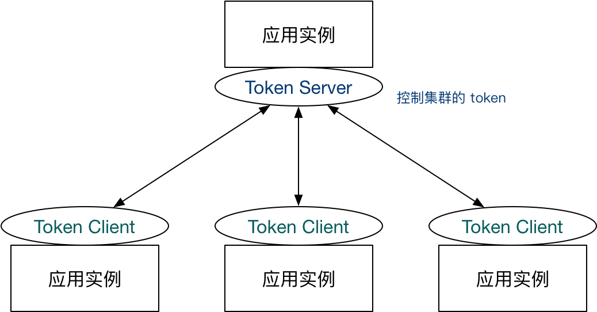

###### 独立模式

- 独立部署一个token server（实际生产需要高可用）
- 适合给应用集群提供限流服务

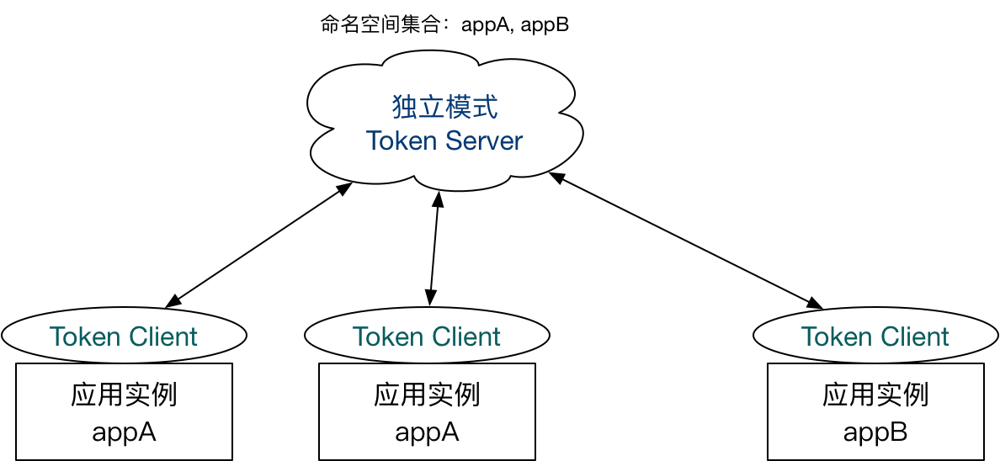

**使用流程（独立模式）**

官方github里面提供了demo示例代码，根据demo代码进行验证

- 配置中心

官方推荐将集群流控的配置通过动态规则源进行管理，即将配置放在配置中心进行维护，token server与client接入配置中心进行规则获取与更新，这里使用nacos作为配置中心和持久化手段

- sentinel控制台

sentinel控制台上有“集群流控”的页面，但是官方开源版的sentinel控制台**并不直接支持在页面上进行集群流控配置**，如果要在控制台页面上进行操作，需要对sentinel控制台进行改造，将sentinel控制台接入配置中心，在页面修改配置后，配置会推送到配置中心，再由配置中心推送给应用。

改造说明：[Sentinel 控制台（集群流控管理）](https://github.com/alibaba/Sentinel/wiki/Sentinel-%E6%8E%A7%E5%88%B6%E5%8F%B0%EF%BC%88%E9%9B%86%E7%BE%A4%E6%B5%81%E6%8E%A7%E7%AE%A1%E7%90%86%EF%BC%89)demo里给的样例是接入nacos，将ruleProvider和rulePublisher改成nacos的实现类，这两个类的代码实现在sentinel-dashboard官方项目源码的test目录下有。

这里不做相关改造验证

- 相关概念

namespace：Token Server里的概念，代表一个应用/服务，默认为project.name

flowId：集群限流规则的id，全局唯一（自己指定）

- 配置Token Server

1. 引入sentinel-cluster相关依赖

2. 复制官方demo（sentinel-demo-cluster-server-alone）相关代码，核心在`DemoClusterServerInitFunc` （使用SPI机制，resource/META-INF/services下的文件也要复制）

3. 官方token server是通过main函数启动，这里将其写入ApplicationRunner，启动后自动执行

4. token server需要接入nacos

5. 在nacos中添加相关配置，这里使用的Group为`SENTINEL_GROUP`，namespace指定为`irol-sentinel`

   1. `cluster-server-namespace-set`：namespace列表，所有的namespace都维护在里面

      ```json
      [
          "irol-sentinel"
      ]
      ```

   2. `cluster-server-transport-config`：token server通信配置，指定token server用与client通信时使用的端口与空闲时间

      ```json
      {
          "port":11111,
          "idleSeconds":600
      }
      ```

6. 启动token server，与sentinel控制台通信端口指定为9000

- 配置Token Client

1. 引入sentinel-cluster相关依赖

2. 复制官方demo（sentinel-demo-cluster-embedded）相关代码，核心在`DemoClusterInitFunc` （使用SPI机制，resource/META-INF/services下的文件也要复制）

3. 修改DemoClusterInitFunc中的init方法

   ```java
   @Override
   public void init() throws Exception {
       // Register client dynamic rule data source.
       // 注册限流规则
       initDynamicRuleProperty();
       // Register token client related data source.
       // Token client common config:
       // client通信配置
       initClientConfigProperty();
       // Token client assign config (e.g. target token server) retrieved from assign map
       // 配置token server连接地址
       initClientServerAssignProperty();
   	// 手动指定服务为token client
       ClusterStateManager.applyState(ClusterStateManager.CLUSTER_CLIENT);
   
   }
   ```

4. token client需要接入nacos

5. 在nacos中添加相关配置，前面指定了namespace为irol-sentinel，相关配置为namespace-xxx

   1. `irol-sentinel-cluster-client-config`：client通信配置

      ```json
      {
          "requestTimeout":2000
      }
      ```

   2. `irol-sentinel-flow-rules`：限流规则，这里配置限流qps为1

      ```json
      [
          {
              "resource": "consumerHello", //需要限流的资源名称
              "grade": 1, //限流阈值类型，QPS 或线程数模式，默认为QPS
              "count": 1, //限流阈值
              "strategy": 0, //调用关系限流策略：0直接、1关联、2链路,默认直接
              //流控效果（0直接拒绝 / 1Warm Up / 2匀速排队），不支持按调用关系限流，默认直接拒绝
              "controlBehavior": 0, 
              "clusterMode": true, //标识是否为集群限流配置
              "clusterConfig": {
                  "flowId": 9959231232121334, //全局唯一的规则 ID，由集群限流管控端分配
                  "thresholdType": 1, //阈值模式，默认（0）为单机均摊，1 为全局阈值
                  //在 client 连接失败或通信失败时，是否退化到本地的限流模式
                  "fallbackToLocalWhenFail": true, 
                  "strategy": 0, //调用关系限流策略：直接、链路、关联,默认直接
                  "windowIntervalMs": 1000 //滑动窗口时间，默认1s
              }
          }
      ]
      ```

   3. `irol-sentinel-cluster-map`：token server连接配置

      ```json
      [
          {
              "machineId": "192.168.130.1@9000", // token server ip@sentinel控制台通信端口
              "ip": "192.168.130.1",	// token server ip
              "port": 11111,	// token server用来与client通信的端口
              "clientSet": [	// token client ip@sentilen控制台通信端口
                  "192.168.130.1@8720",
                  "192.168.130.1@9004",
                  "192.168.130.1@9005"
              ]
          }
      ]
      ```

   4. demo中的`initClientServerAssignProperty()`在配置token server连接地址时可能失败，JSON.parseObject解析配置失败（debug才知道），有两种解决办法

      1. 手动解析配置为JSONObject并设置到ClusterGroupEntity对象中

      2. 使用其他配置方式，需要在nacos添加配置`irol-sentinel-token-server-config`

         ```json
         {
             "serverHost":"192.168.130.1",
             "serverPort":11111
         }
         ```

         然后修改`initClientServerAssignProperty()`方法

         ```java
         ReadableDataSource<String, ClusterClientAssignConfig> clientAssignDs = new NacosDataSource<>(remoteAddress, groupId, "irol-sentinel-token-server-config"
                 , source -> JSON.parseObject(source, new TypeReference<ClusterClientAssignConfig>() {
         }));
         ```

   5. 记得在需要限流的地方加上@SentinelResource，并添加降级方法

   6. 启动token client，按上面的配置这里启动三个实例，分别使用8720，9004，9005与sentinel控制台通信

- 验证

登录sentinel控制台可以看到token server 与 client的实例信息，在token server的集群流控这里能看到token server的信息，这里显示的连接数为0，不管他，不影响使用，重点看client的信息

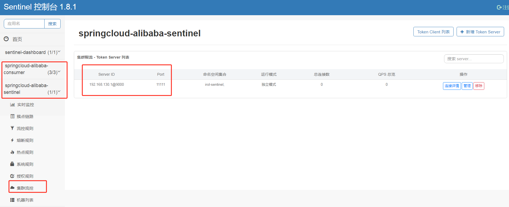

在token client的集群流控页面能看到连接的token server信息，点击管理能看到client列表，在流控规则这里能看到在nacos配置的流控规则

**注意这里不要在页面上修改规则**，因为我们的控制台没做集群流控的改造，这里修改了规则后，推送到应用的规则会变成单机限流规则，之前的集群限流规则就失效了

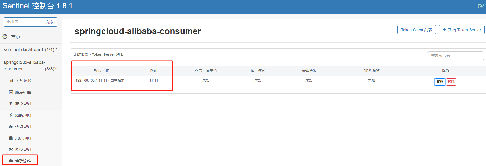

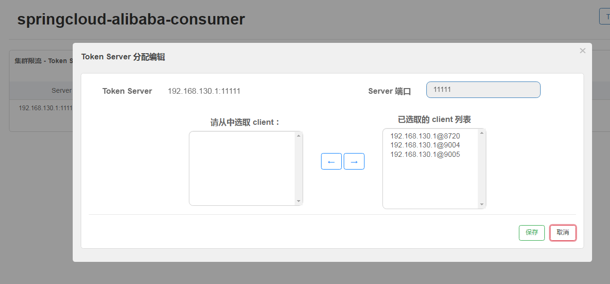

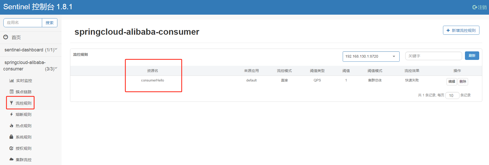

测试一下，用jmeter压一下，qps稳定在1

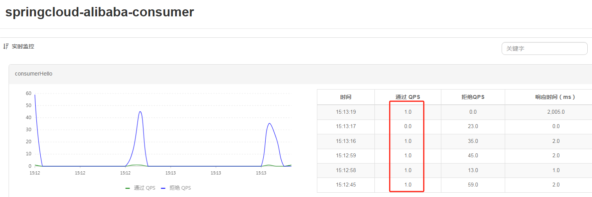

在nacos修改限流qps为5，qps变成5，显示上有时候不是5应该是跟统计的时间段有关系

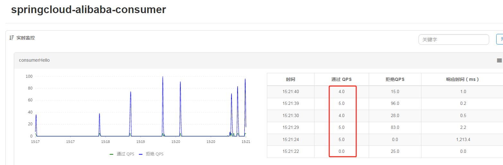

**引入的问题**

token server如何实现高可用？？

思路：使用zookeeper管理token server集群，启动时一起创建节点，谁创建的节点编号最小谁是token server，其他实例监听token server的服务状态，当token server不可用时重新选举（争抢节点或取第二小的编号）；

定时对实例进行健康探测，剔除不可用的实例，实例恢复后检测自身状态然后自动重新加入；

在token server不可用时集群会退化成单机限流，理论上选举的过程中也有托底的限流策略，但选举完成后新的token server没有记录当前限流状态，且由单机限流恢复到集群限流，是否表示新token server可用时应用会处于无限流的状态，从而当有流量进来时重新发放token？如果是这样的话，那实例之间如何做数据同步？

###### 网关限流

在微服务模式下，通过sentinel在网关处对服务进行限流，也能实现分布式限流的效果


#### 熔断


#### 降级


#### 超时与重试


## 高并发

### 服务拆分

#### 分库分表

#### 读写分离

### 缓存

#### 缓存模式

##### Cache Aside（旁路缓存）

最常用的缓存模式，适用于**读多写少**的场景

**读**

- 先读缓存，缓存命中则直接返回
- 缓存未命中则查询数据库，并将数据写入缓存

**写**

- 先更新数据库，再删除缓存


##### Read / Write Through（读写穿透）

在Read/Write Through模式中，应用程序不直接访问缓存和数据库，而是通过一个中间层（缓存服务）来进行数据访问，适用于**写操作较多且数据一致性要求较高**的场景

**Read Through**

- 先读缓存，缓存命中则直接返回
- 缓存未命中则查询数据库，并将数据写入缓存

Read Through与Cache Aside很像，区别在于当缓存失效的时候，Cache Aside是由调用方完成缓存写入，而Read Through则由缓存服务自己完成，从而简化了调用方的业务实现。

下面的流程中，虚线部分操作不再由应用程序来完成，而且由缓存服务自己处理

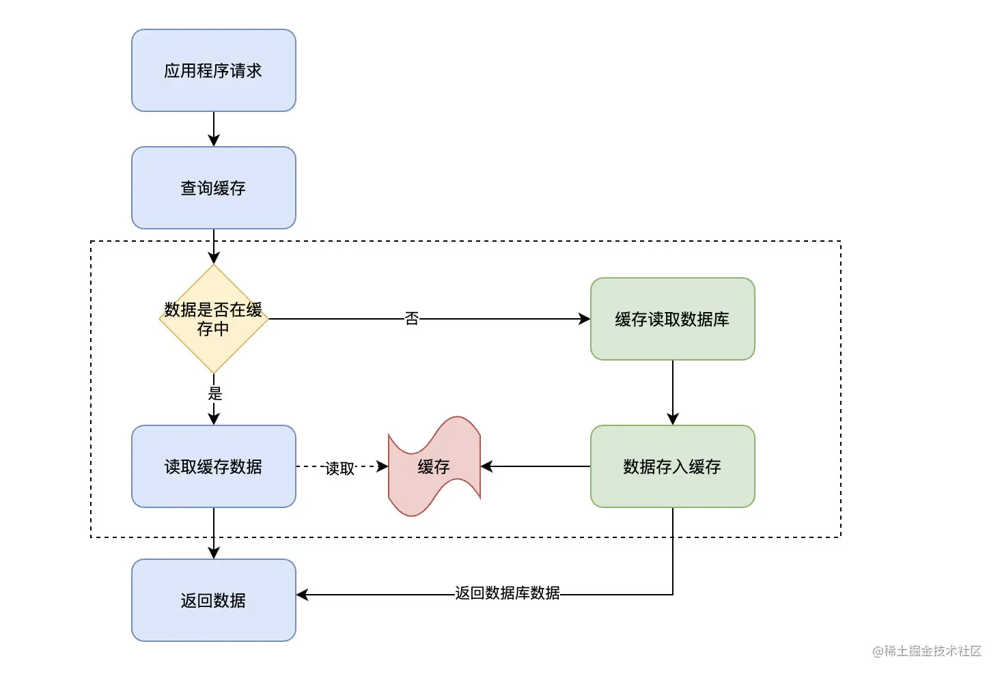

**Write Through**

- 先更新缓存，再更新数据库，两个步骤是一个原子操作

- 如果缓存没命中，则直接更新数据库

> 要保证两个写操作的原子性还是有些困难的，自己实现需要考虑写库失败补偿以及缓存回滚的问题
>
> Ehcache支持Write Through模式

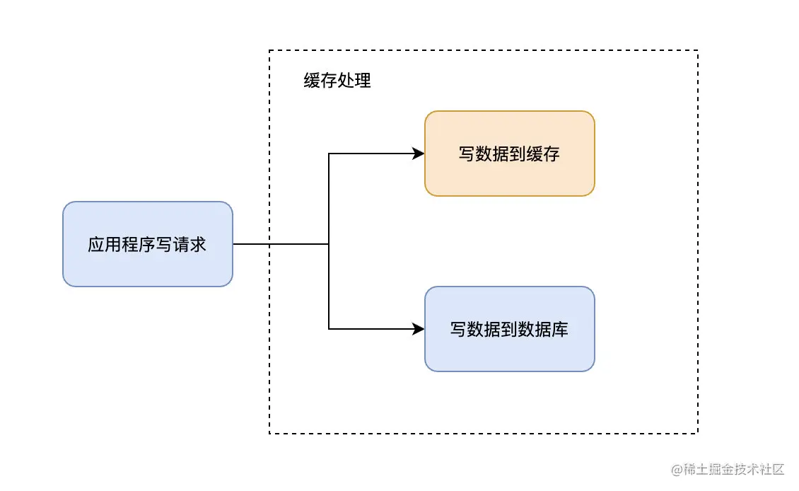

Read-Through 和 Write-Through 的共同目标是确保缓存与底层数据存储之间的一致性，并通过自动化的方式隐藏了缓存与持久化存储之间的交互细节，简化了客户端的处理逻辑。


##### Write Behind（异步写入）

Write Behind与Read / Write Through是类似的，区别在于Write Behind在进行写操作时，只更新缓存后就返回，对于数据库的更新，通过**异步**批量操作来进行

> Write Behind减轻了数据库的压力，但也放大了数据不一致的情况

Write Behind适用于**大量写操作**的场景，如秒杀场景中先在redis扣减库存，随后异步写库的逻辑，其实就与Write Behind的思想一致


#### 数据一致性问题

##### 先更新数据库，再更新缓存

- 对于较大的key，更新比删除操作更耗性能
- 写操作较多时，可能会出现刚更新的缓存还没被读取过，又再次被更新（缓存扰动），浪费了机器性能
- 最大的问题是在并发环境下，可能出现先更新数据库的请求反而后更新缓存，导致数据不一致，而后续请求读到的缓存都是旧数据

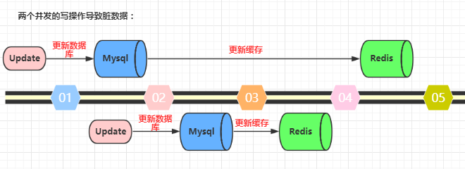

##### 先更新数据库，再删除缓存

即Cache Aside模式，实际是使用最多的解决方案

- Cache Aside存在的异常情况是，在进行并发读写时，可能出现后来的写请求先把缓存删了，先来的读请求反而后更新缓存，导致出现数据不一致
> 下图中其实只要在更新Redis过程中出现Redis删除的操作就会出现数据不一致

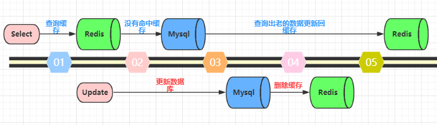

不过这种异常情况发生的概率很低，原因在于缓存操作比数据库操作快很多，在读取完数据库后写回缓存的速度是非常快的，要在这之间完成缓存操作的概率很低。

> 由于数据库操作比缓存操作耗时，所以处理数据一致性时，都是先把数据库操作放前面，缓存操作放后面，如果缓存操作先放前面，先更新/删除了缓存，然后再去操作数据库，在数据库操作完成之前有个较长的空档期，在并发情况下更容易产生数据不一致问题

**Cache Aside如何保证强一致性**

- 使用分布式锁
  - 在读请求能命中缓存时无需加锁，若缓存未命中则需要加锁，此时不能进行其他的读写操作
  - 在写请求时加锁，此时也不能进行其他的读写操作

##### 延时双删

- 先更新数据库，然后删除缓存，等待一段时间（一般0.5S-5S）后再次删除缓存
- 第二次延时删除目的是解决在高并发场景下，第一次删除缓存后，可能出现上述Cache Aside等异常情况，导致缓存中加载了旧的数据，通过第二次删除来清理过期数据
- 第二次延时删除也可以作为一次重试，当第一次删除缓存失败，第二次删除可以再删一次

> 网上说的延时双删很多都是先删缓存，再更新数据库，再延时删除，这个过程是错误的，先删缓存没多大意义，更新数据库的耗时比缓存操作长很多，删除了缓存再去更新数据库，这个过程中很容易就被其他请求重建缓存，虽然后面第二次删除会清理缓存，但这个数据不一致的时间太久了

延时双删个人认为是Cache Aside的一个补充，但实际项目中真的有人使用这种方案吗？

- 首先是延时的时间不好把握
- 在代码中Thread.sleep进行延时等待，高并发环境下容易有性能问题
- 如果使用其他方式如定时任务、MQ来进行第二次删除，编码复杂度也高

可以为Cache Aside中的缓存**增加过期时间**，作为延时双删的代替方案，且删除缓存的操作需要增加重试处理

##### 监听binlog

通过canal等中间件订阅binlog，当数据发生变化时由订阅者去删除缓存

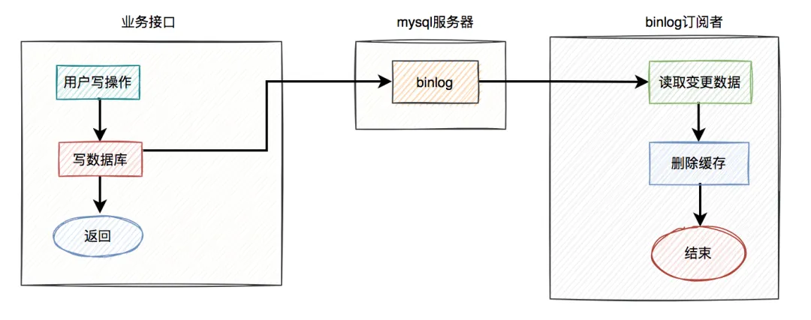

- 业务方更新完数据库后直接返回
- mysql会自动将数据更新写入binlog
- 订阅者通过获取binlog，进行缓存删除

这种方式对业务代码没有侵入性，不过实现复杂度也不低


#### 分布式缓存

[Redis相关内容](https://zhirol.github.io/database/2021-04-13-Redis/)

#### 本地缓存

#### ORM缓存

### 池化技术

### 异步解耦

### 消息队列


## 秒杀系统设计

### 前端页面设计

1、前端页面静态化+CDN

2、秒杀按钮的设计

页面是静态化的，按钮置灰，到了秒杀时间自动点亮才能点击，通过JS控制，秒杀开始时系统生成新的JS文件同步到CDN，里面携带随机参数

秒杀按钮也可以设计为N秒内只能点击一次，如用户点击后置灰，5S后按钮重新点亮才能点击第二次

### 业务流程

#### 秒杀 -> 下单 ->支付

#### 查询商品信息

将商品信息提前放入Redis，超时时间需要设置长一些，且如果redis没命中，后续查询数据库的逻辑需要加分布式锁，避免大量请求落到数据库

引出Redis缓存相关问题

- 高可用，redis需要多节点部署
- 性能，需提前做好压测，保证redis资源足够支持业务并发
- 缓存击穿：
  - 初始时如果Redis内什么也没有，正常流程下先查询商品信息，发现redis不命中，则去查询数据库，随后将查询结果放入redis并返回给前端，在秒杀场景下会造成大量查询请求落到数据库，造成缓存击穿
  - 所以需要提前将商品信息放入redis，但万一过期时间设置错误，导致缓存提前失效，或不小心删除了缓存，一样会造成缓存击穿
  - **解决方案**：将商品信息提前放入Redis，超时时间需要设置长一些，查询数据库操作需要加分布式锁
- 缓存穿透
  - 如果有大量请求所查询的商品id在缓存与数据库中都不存在（根本没有这种商品），则这些查询会直接穿透过缓存，直接落到数据库
  - **解决方案**：
    - 使用布隆过滤器，但在缓存数据更新时也要更新布隆过滤器，所以布隆过滤器主要使用在缓存数据很少更新的场景中
    - 将不存在的商品id以null值缓存起来，这类缓存设置的超时时间可以短一些

#### Redis预减库存

- 通过lua脚本保证预减库存操作的原子性
- 使用Redisson，自己实现分布式锁还需要考虑解锁、锁竞争、续期等问题，使用Redisson可以直接解决这些问题

#### 数据库扣减库存

- 先判断库存再扣减的逻辑多一次数据库操作，而且需要保证原子性和超卖问题
- 使用乐观锁一条sql扣减库存，通过stock > 0控制商品不会超卖

```sql
update product set stock = stock - 1 where id = 'x' and stock > 0;
```

#### 商品下单

mq异步下单，由于秒杀步骤是并发最大的，而成功下单与支付的请求量实际很小，所以不需要将秒杀与下单支付做在一个逻辑内，通常使用mq实现异步下单处理

> SpringBoot单服务处理的情况下，其实mq的生产者消费者都是自己

 引出mq使用相关问题

- 消息丢失
  - 使用mq本身ACK机制
  - 消息落库，秒杀成功后先insert消息记录表，随后发送mq消息，消费者处理完成后更新表记录，需要轮询检查是否有发送mq失败的记录
- 消息重复
  - 消费者在业务处理时判断是否重复下单，数据库层面增加唯一索引，避免数据重复落库
  - 如果使用了消息记录表，消费者可以在处理时先查询消息是否在记录表中已存在
- 垃圾消息过多，如果消息消费失败，导致生产者一直重复发送消息
  - 生产者设置消息重复发送上限

#### 订单支付

订单超时未支付需要取消订单

- mq延时消息（RocketMq自带），下单成功后发送mq延时消息，消费者在延时消息倒计时结束时处理业务逻辑，判断订单是否已支付
- 订单未支付，需要恢复库存，包括数据库与Regis
- *是否需要考虑订单倒计时结束时订单状态处于支付中的情况？比如最后1-2s用户才支付，但是支付花了3s，导致订单有效期结束时用户还在支付中*

### 限流

- 限制同一用户访问次数，比如一分钟只能访问5次
- 限制同一ip访问次数，但可能会有误杀
- 前端增加验证码，限制用户访问频次，但用户体验不好
- 业务分流，不同用户可参与活动的时间不一样、或提高活动门槛等
- 接口限流

### 初版方案设计

#### redis预扣库存

- redis查询商品id是否存在
- 商品不存在返回-1
  - 分布式锁查询商品id，避免大量空key查询直接落到数据库
  - redis写入空key（redis写满了怎么办？）
- 商品存在判断库存
  - 库存 > 0则-1
  - 库存 <= 0则返回0
- 扣减库存成功后将用户信息与商品编号写入redis

**通过lua脚本实现原子性操作**（实际lua脚本也无法保证真正的原子性操作，个人理解redis中并没有回滚的概念，如果lua脚本中有语法错误，脚本并不会真正执行，而如果没有语法错误，命令执行过程中出现失败，已经执行的语句并不会回滚，需要跟踪数据进行人工修正）

```lua
if (redis.call('EXISTS', KEYS[1]) == 0) then
    return -1
else
    local stock = tonumber(redis.call('GET', KEYS[1]))
    if stock <= 0 then
        return 0
    else
        redis.call('DECR', KEYS[1])
        local result = stock - 1
        local user_key = "sec_succ_"..KEYS[2]
        local success = pcall(function ()
            redis.call('HSET', user_key, 'userId', KEYS[2], 'sequence', result)
        end)
        if not success then
            redis.call('INCR', KEYS[1])
            return -2
        end
        return 1
    end
end
```

#### 发送MQ进行落库

- 消费mq进行实际的库存扣减
- mq消费失败可以增加重试机制，多次失败触发告警策略
- 消费幂等
  - 写库前先进行判断
  - 数据库增加唯一索引约束

#### 定时任务补偿

- 定期扫描redis中的订单数据与数据库中进行比对，如果数据库中缺少订单则补发mq
- 补发mq可能导致重复消费，所以要做消费幂等
- mq发送失败或丢失可以通过定时任务进行兜底
- 由于扫描订单数据比较耗性能，所以定时任务触发时间不应设置过短
  - scan扫描redis中的订单数据也可以进行分批扫描比对

### 调整方案设计

#### 初步方案设计问题

- 以redis中的订单数据为准，一旦redis服务异常或出现主从切换，导致redis中数据出现丢失，则整体订单数据会出现异常
- 库存都在一个redis实例内，集群模式下的redis使用起来跟单实例一样，集群的优势体现不出来

#### 方案调整

- 秒杀接口同步改成异步
- 最终一致性以mysql中的数据为准
- 定时任务扫描库存对redis中的库存进行恢复

#### 第二版方案

- 前端调用秒杀接口，发送用户参数
- lua脚本操作 - 查询商品id（提前进行缓存预热）
  - 商品id不存在则分布式锁查询数据库，缓存空key
- lua脚本操作 - 扣减库存
  - 库存不够则返回0
- 用户数据写入消息发送表（或lua脚本将订单写入redis）
  - 写入消息发送表失败则恢复redis库存，增加重试机制
  - 恢复库存失败则通过兜底定时任务补偿
- 发送mq消息进行异步落库与上链
  - 定时任务扫描消息发送表，对未发送或发送失败的数据进行消息补发
- 前端调用查询秒杀结果接口，查询redis中的订单信息，redis查不到则分布式锁查数据库
  - 查询设定一个时间上限如30s，超过30s未查询到结果则返回秒杀失败
- 消费mq进行数据落库与上链，消费幂等
  - 超过30s未消费的消息直接丢弃
- 数据落库后写入redis缓存
  - 写入redis增加重试机制，写入redis失败，则发送mq，或在表中增加缓存标志位通过定时任务进行补偿
- 定时任务对比mysql和redis中的库存，理论上应该mysql中的库存 >= redis库存，通过分布式锁对redis库存进行同步，同步使用增加操作，而不是直接set库存为某一个值
  - 可能出现由于mq中的消费未消费，mysql中的库存>redis库存的情况，这时候对redis库存进行增加，会多放请求进来，不过不影响最终的秒杀结果，mysql库存为0后，再来的写库请求会被拒绝，不会出现超卖的情况
- redis不可用时启用降级策略
  - 限流收紧
  - 请求通过mq进行削峰
  - 可以随机丢弃一部分请求
  - 当库存为0时启用本地缓存拦截后续请求，本地缓存过期时间可以设短一些
  - 启用其他缓存机制，如RocksDB
- redis服务恢复
  - 通过分布式锁恢复缓存

- mq不可用时启用降级策略
  - 用户信息写入消息发送表后，通过定时任务进行数据落库
  - 或降级为同步写库请求，写入消息发送表后用户订单数据落库
  - 或使用本地阻塞队列，队列满后再来请求直接丢弃
- mq服务恢复
  - 将本地阻塞队列中的请求发到消息队列
- 其他优化项
  - 引入事务消息
  - 引入布隆过滤器